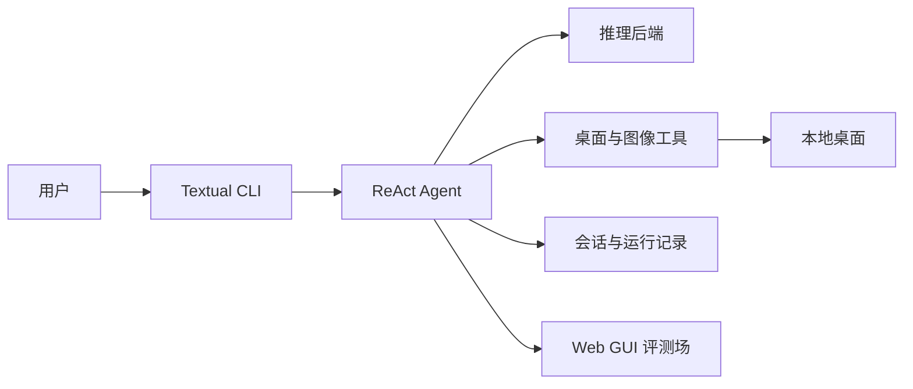

# max-gui

面向桌面任务的多模态 ReAct GUI Agent CLI 原型。

Demo / Screenshot / GIF：暂无公开演示素材。

## Overview

max-gui 通过屏幕截图理解当前桌面状态，并以键盘、鼠标和图像工具完成多步骤 GUI 任务；同时提供本地 Web GUI 评测场，用于验证任务执行能力。

## Features

- Textual 交互界面与 LangGraph ReAct 执行循环。
- 首轮先建立当前截图与 UI 快照，优先使用受控 Chrome 的 DOM／locator 或 macOS AX 结构化工具；不可用时回退到截图、OCR、控件定位和坐标键鼠。
- Ollama、ModelScope、DashScope、OpenRouter 等 OpenAI 兼容推理后端。
- 基于最新截图的桌面状态快照、动作预期与验证驱动进度。
- 会话、运行事件和截图的本地记录；无权限时前台状态明确降级为未知，不猜测输入目标。
- 可选的 10 条或 100 条本地 Web GUI 评测。

## Architecture



- `agent`：首轮建立观察基线，组织思考、动作、观察、状态快照与后置验证循环。
- `inference` 与 `provider`：统一调用模型服务。
- `tools`、`ui` 与 `desktop`：按当前 UI 快照优先分派 DOM／AX 语义操作，视觉坐标只作后备。
- `session` 与 `observability`：保存会话及运行事件。
- `benchmark` 与 `frontend/benchmark-arena`：提供本地评测服务和界面。

## Tech Stack

Python 3.12+、Textual、LangGraph、Pydantic、HTTPX、Playwright、PyAutoGUI、Pillow、FastAPI、Vue、Vite、PyTorch、Transformers、PEFT。

## Project Structure

```text
src/max_gui/              核心 CLI、Agent、推理、工具与评测逻辑
frontend/benchmark-arena/ Web GUI 评测前端
tests/                    自动化测试
scripts/                  开发与演示脚本
docs/                     项目说明与训练计划
openspec/                 需求变更记录
artifacts/                本地运行产物，不应提交
```

## Quick Start

环境要求：Python 3.12+、`uv`；macOS 桌面操作还需授予运行终端屏幕录制和辅助功能权限。

安装：

```bash
uv sync --group dev
```

模型下载：默认使用局域网 WSL Ollama 中的 `qwen3.5:9b`；请在对应 Ollama 服务中拉取该模型，或配置云端提供方。

配置：

```bash
cp .env.example .env
```

在 `.env` 中设置 `MAX_PROVIDER`；使用云端提供方时填写相应 API Key。

运行：

```bash
max-gui
max-gui --benchmark
```

## Training / Fine-tuning

训练数据使用 ScreenAgent 处理后的 GUI 操作样本；计划采用 Qwen3.5-4B、PEFT 与 Accelerate 进行 LoRA 微调。建议 LoRA 配置为 `rank=64`、`alpha=32`、`dropout=0.05`，覆盖 Qwen 的注意力与 MLP 投影层。

完整训练方案见 [LoRA 微调计划](docs/lora-finetune-plan.md)。当前尚未提供可执行的训练脚本或正式训练命令；该流程仍需在具备合适 GPU 的环境中完成端到端验证。

## Evaluation

评测场提供固定的 10 条跨难度冒烟集和 100 条任务集，模拟项目、任务、成员、活动、筛选、详情编辑、
批量确认、撤销和校验恢复等本地协作工作流。运行器按题隔离 Chrome profile、固定窗口条件，并在动作
执行前应用工具预算与禁止动作护栏；报告区分模型结果、环境错误、未启动题和未知 Token。当前已完成
代码级与构建验证；真实模型和桌面批次仍需在具备浏览器、推理服务和必要模型配置的 macOS 环境中执行，
不能用单元测试替代真实评测证据。

## Results / Demo

实际效果依赖本机权限、屏幕环境与所选模型；暂无可公开复现的端到端评测结果或公开演示素材。

## Roadmap

- 完成 LoRA 训练与真实桌面端到端验证。
- 补充评测报告和可公开演示素材。
- 持续提升桌面操作的可靠性与可观测性。

## License

当前仓库尚未声明许可证。
