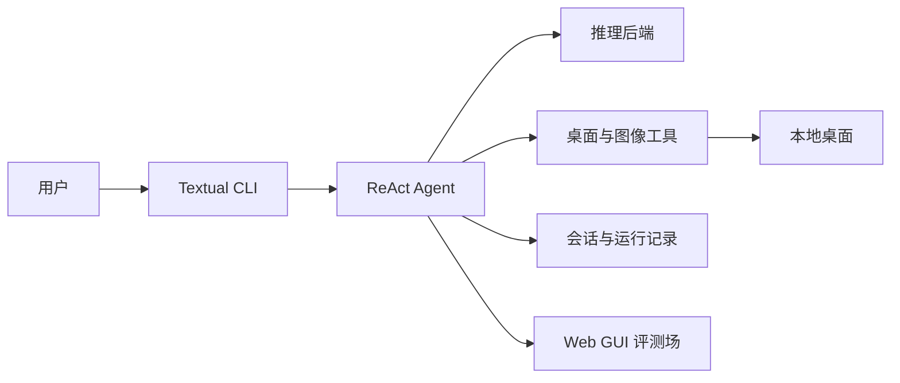

# max-gui

面向桌面任务的多模态 ReAct GUI Agent CLI 原型。

Demo / Screenshot / GIF：暂无公开演示素材。

## Overview

max-gui 通过屏幕截图理解当前桌面状态，并以键盘、鼠标和图像工具完成多步骤 GUI 任务；同时提供本地 Web GUI 评测场，用于验证任务执行能力。

## Features

- Textual 交互界面与 LangGraph ReAct 执行循环。
- 每轮以“当前状态 → 一个语义动作 → 后置观察”决策；优先使用受控 Chrome 或 macOS AX 的统一元素工具，不向模型暴露 locator、AX 或坐标后端细节。
- Ollama、ModelScope、DashScope、OpenRouter、七牛等 OpenAI 兼容推理后端。
- 基于最新截图的桌面状态快照、动作 intent、受限 expectation 与验证驱动进度；工具分派成功不等于任务成功。
- 会话、运行事件和截图的本地记录；无权限时前台状态明确降级为未知，不猜测输入目标。
- 可选的 10 条或 100 条本地 Web GUI 评测。

## Architecture



- `agent`：首轮建立观察基线，向模型提供任务、子目标、进度、环境、可见 UI、工作记忆、近期动作和上次结果，组织单步思考、动作、观察与后置验证循环。
- `inference` 与 `provider`：统一调用模型服务。
- `tools`、`ui` 与 `desktop`：`ToolRegistry` 统一分派语义动作到 DOM／AX 后端；快照覆盖目标时隐藏等价坐标动作，视觉坐标只在缺少可靠语义目标时作后备，并保留移鼠、截图与无坐标点击门禁。
- `session` 与 `observability`：保存会话及运行事件。
- `benchmark` 与 `frontend/benchmark-arena`：提供本地评测服务和界面。

## Tech Stack

Python 3.12+、Textual、LangGraph、Pydantic、HTTPX、PyAutoGUI、Pillow、FastAPI、Vue、Vite、PyTorch、Transformers、PEFT。

## Project Structure

```text
src/max_gui/              核心 CLI、Agent、推理、工具与评测逻辑
frontend/benchmark-arena/ Web GUI 评测前端
tests/                    自动化测试
scripts/                  开发与演示脚本
docs/                     项目说明与训练计划
openspec/                 需求变更记录
artifacts/                本地运行产物，不应提交
```

## Quick Start

环境要求：Python 3.12+、`uv`；macOS 桌面操作还需授予运行终端屏幕录制和辅助功能权限。

安装：

```bash
uv sync --group dev
```

模型下载：默认使用局域网 WSL Ollama 中的 `qwen3.5:9b`；请在对应 Ollama 服务中拉取该模型，或配置云端提供方。

配置：

```bash
cp .env.example .env
```

在 `.env` 中设置 `MAX_PROVIDER`；使用云端提供方时填写相应 API Key。七牛使用
`MAX_PROVIDER=qiniu` 与 `MAX_QINIU_KEY`，固定调用 `z-ai/glm-5.3-flash`。
`MAX_GUI_ENABLE_THINKING=false` 为默认值，控制上游模型是否生成思考；设为 `true` 开启。
该开关不改变服务端 reasoning 的接收与持久化；TUI 仅在流式阶段显示思考，最终记录只显示助手正文。
个别仅思考模型可能拒绝关闭请求。

运行：

```bash
max-gui
max-gui --benchmark
```

## Training / Fine-tuning

训练数据使用 ScreenAgent 处理后的 GUI 操作样本；计划采用 Qwen3.5-4B、PEFT 与 Accelerate 进行 LoRA 微调。建议 LoRA 配置为 `rank=64`、`alpha=32`、`dropout=0.05`，覆盖 Qwen 的注意力与 MLP 投影层。

当前仓库尚未提供可执行的训练脚本或正式训练命令；该流程仍需在具备合适 GPU 的环境中完成端到端验证。

## Evaluation

评测场提供固定的 10 条跨难度冒烟集和 100 条任务集，模拟项目、任务、成员、活动、筛选、详情编辑、
批量确认、撤销和校验恢复等本地协作工作流。运行器按题隔离 Chrome profile、固定窗口条件，并在动作
执行前应用工具预算与禁止动作护栏；报告区分模型结果、环境错误、未启动题和未知 Token。当前已完成
代码级与构建验证；真实模型和桌面批次仍需在具备浏览器、推理服务和必要模型配置的 macOS 环境中执行，
不能用单元测试替代真实评测证据。

另有 `max --baseline`（兼容 `max-gui --baseline`）真实桌面基线评测，固定覆盖天气检索、Terminal、
Calculator、Reminders 和微信文件传输助手五题。每题由用户确认窗口后执行，并由最终截图接受一次独立无工具评审；
每题最多执行 5 分钟或调用执行模型 20 次（以先到者为准），并开放除 `activate_app`、`click` 外的已注册工具，不执行任务专用 violation
判定；任一上限终止后都会自动进入截图评审，结果 JSON 保存调用次数和版本化总分。报告不会自动生成，可用
`max --baseline -report <json...>` 显式生成 Markdown 表格和
中文柱状图。提醒与微信属于真实个人写入，默认只运行一轮，且不会自动重试、撤回或清理。

baseline 的独立评审固定使用 Qiniu `z-ai/glm-5.3-flash`，与执行 provider/model 隔离；运行前必须配置
`MAX_QINIU_KEY`。评审按模型要求启用思考并固定为 `low` 档位，但不显示思考过程；评审请求和重试不计入每题
20 次执行模型调用额度。baseline 启动时会在首题前打印当前执行 provider 和 model 名称。

## Results / Demo

实际效果依赖本机权限、屏幕环境与所选模型；暂无可公开复现的端到端评测结果或公开演示素材。

## Roadmap

- 完成 LoRA 训练与真实桌面端到端验证。
- 补充评测报告和可公开演示素材。
- 持续提升桌面操作的可靠性与可观测性。

## License

本项目采用 [MIT License](LICENSE) 开源。
