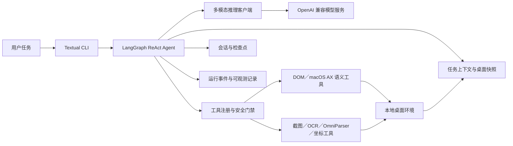
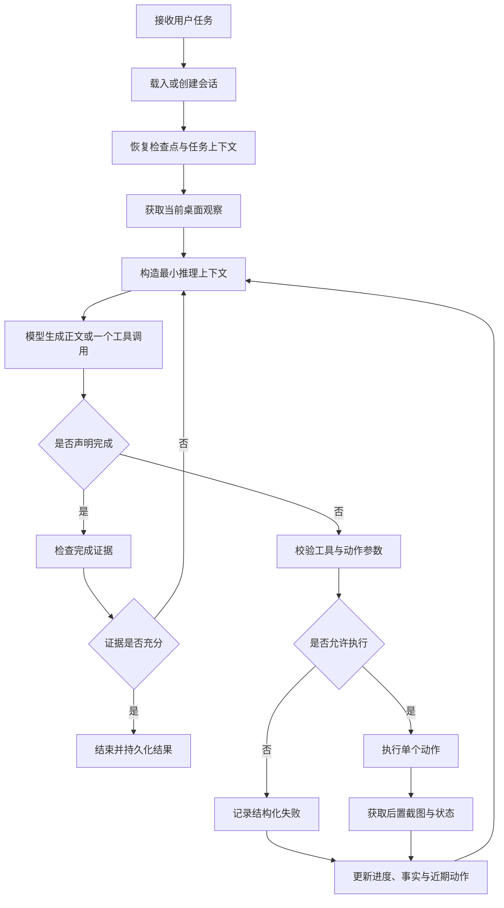

# MAX-GUI 设计大纲

## 1. 项目定位

MAX-GUI 是一个面向桌面任务的多模态 ReAct GUI Agent CLI 原型。系统接收自然语言任务，持续观察当前屏幕状态，由多模态模型生成单步语义动作，再通过受控桌面工具执行并验证结果，形成“思考—行动—观察—验证”的闭环。

项目重点不是模拟固定脚本，而是研究 GUI Agent 在真实桌面环境中的核心问题：

- 如何把截图、可访问性元素和视觉定位结果组织成可供模型决策的桌面状态。
- 如何让模型只生成一个可校验的语义动作，避免长动作序列在界面变化后整体失效。
- 如何统一语义元素操作与视觉坐标操作，同时保证坐标来源、生命周期和执行边界可靠。
- 如何记录任务进度、动作证据与失败原因，使执行过程可恢复、可审计、可评测。

## 2. 设计目标

### 2.1 核心目标

- 提供基于 Textual 的交互式命令行入口，支持创建、继续和查看本地会话。
- 使用 LangGraph 组织多模态 ReAct 循环，每轮只执行一个动作并重新观察桌面。
- 统一接入 Ollama、ModelScope、DashScope、OpenRouter 和七牛等 OpenAI 兼容推理后端。
- 优先使用受控 Chrome DOM 或 macOS Accessibility 提供的语义元素；缺少可靠语义目标时再使用视觉坐标。
- 对截图、定位编号、坐标换算和后置观察建立明确的状态约束。
- 对敏感动作、危险按键、路径访问、桌面权限和工具超时提供执行保护。
- 保存会话、运行事件、截图和评测结果，支持恢复与问题追踪。

### 2.2 非目标

- 不把工具调用成功直接等同于用户任务成功。
- 不承诺所有桌面应用、操作系统和分辨率均具备一致效果。
- 不绕过操作系统的屏幕录制、辅助功能或应用权限。
- 不将单元测试、模拟后端测试或训练损失视为真实桌面端到端能力证明。
- 不在仓库中保存 API Key、个人会话数据、截图、模型权重或本地运行数据库。

## 3. 总体架构

系统按职责分为以下层次：

| 层次 | 主要职责 | 对应目录 |
| --- | --- | --- |
| 交互层 | 命令解析、TUI 展示、用户确认与会话选择 | `src/max_gui/cli.py`、`src/max_gui/app.py`、`src/max_gui/widgets/` |
| Agent 层 | 状态组织、上下文裁剪、单步决策、动作执行与完成验证 | `src/max_gui/agent/` |
| 推理层 | Provider 注册、请求构造、流式响应、上下文预算与重试 | `src/max_gui/provider.py`、`src/max_gui/inference/` |
| 感知与执行层 | 截图、语义元素、视觉定位、键鼠动作与坐标换算 | `src/max_gui/desktop/`、`src/max_gui/tools/` |
| 持久化层 | 会话消息、任务上下文、截图引用和运行事件 | `src/max_gui/session/`、`src/max_gui/observability/` |
| 评测层 | 本地 Web GUI、Online-Mind2Web 与真实桌面基线评测 | `src/max_gui/benchmark/`、`src/max_gui/mind2web/`、`src/max_gui/baseline/` |

## 4. Agent 执行流程

每轮推理遵循以下约束：

1. 首轮先建立桌面观察基线，不允许在没有当前状态时盲目输入或点击。
2. 模型上下文包含用户目标、当前子目标、进度、可见 UI、工作记忆、近期动作和上次工具结果。
3. 模型每轮只选择一个动作；动作后重新截图，避免继续使用已经过期的界面假设。
4. 工具分派成功只表示动作已执行，任务完成仍需要当前桌面证据支持。
5. 失败结果回到 Agent 循环，由模型根据结构化原因调整下一步，而不是静默重放动作。

## 5. 状态与上下文设计

### 5.1 Agent 状态

`AgentState` 维护消息、用户任务、会话标识、任务上下文、桌面状态、调用次数、Token 使用量、终止原因和运行摘要。状态既服务于当前 LangGraph 循环，也用于异常中断后的恢复。

### 5.2 任务上下文

任务上下文不是完整聊天记录的重复，而是执行当前任务所需的最小状态：

- 当前目标与子目标。
- 已完成、进行中和受阻的进度项。
- 当前桌面身份、前台应用和窗口信息。
- 当前可见 UI 元素与最近一次观察事实。
- 与任务直接相关的工作记忆。
- 近期动作、动作结果和后置验证结论。

上下文按模型容量进行预算和裁剪，优先保留当前截图、当前目标、未完成进度和最近失败，避免历史信息无限增长。

### 5.3 截图坐标帧

每次成功截图都会生成当前 `ViewFrame`，记录视图尺寸、桌面逻辑尺寸和区域原点。模型输出的视觉坐标解释为当前视图像素，执行前转换为桌面逻辑坐标。

关键约束如下：

- 坐标必须位于当前视图范围内，超界时拒绝执行，不自动夹紧成一个看似成功的动作。
- 新截图产生后，旧截图上的定位编号和定位事实立即失效。
- 只有针对当前活动截图生成的定位结果可以转化为可执行 `target_id`。
- 区域截图需要把局部坐标与区域原点一起换算到桌面坐标。
- 会话恢复后继续使用持久化的最新有效坐标帧，避免跨回合坐标语义漂移。

## 6. 感知与定位设计

### 6.1 桌面观察

系统通过 PyAutoGUI 获取桌面截图，并读取前台应用、窗口和权限状态。截图会按尺寸和字节预算处理后回注模型，同时保存本地路径供会话与评测引用。

### 6.2 语义元素优先

当受控 Chrome DOM 或 macOS Accessibility 能提供稳定元素时，系统向模型暴露统一的语义元素标识和动作，不暴露底层 selector、Accessibility 属性或后端差异。语义动作执行后必须重新获取界面状态，旧元素版本不得继续使用。

### 6.3 视觉定位后备

当语义快照无法覆盖目标时，系统可使用 OCR、文本定位、模板匹配或 OmniParser 获取候选区域。定位结果主要用于辅助观察；只有绑定当前截图并通过校验的结果才能用于后续移动或点击。

## 7. 工具与安全设计

### 7.1 工具注册与分派

`ToolRegistry` 统一维护工具协议、参数校验、执行分派和结果格式。模型只能调用已经注册的工具，未知工具或非法参数会返回中文错误并进入下一轮推理。

### 7.2 桌面动作

系统提供截图、屏幕信息、鼠标移动、点击、拖拽、滚动、文本输入和按键操作。变异动作成功后附带新截图，使动作结果与观察处于同一个工具回合。

### 7.3 安全边界

- 点击等高风险动作经过确认门禁或受控后端约束。
- 文本输入与按键操作使用不同协议，组合键必须使用键名数组。
- 关机、退出登录等危险按键组合直接拒绝。
- macOS 不接受 Windows 键，并给出可执行的中文提示。
- 没有有效截图时拒绝键盘输入，降低向未知前台窗口写入内容的风险。
- 桌面同步调用放入工作线程并设置超时，避免阻塞 TUI。
- 屏幕录制或辅助功能权限缺失时返回中文授权步骤，不猜测动作已经成功。

## 8. 推理与 Provider 设计

Provider 注册表集中定义后端名称、默认模型、OpenAI 兼容端点、密钥环境变量、上下文容量和错误提示。配置层、客户端和 CLI 共同读取该注册表，避免分别维护不同的 Provider 名单。

当前支持：

- `ollama`：局域网 Ollama 服务，无 API Key。
- `modelscope`：ModelScope OpenAI 兼容服务。
- `dashscope`：阿里云百炼兼容服务。
- `openrouter`：OpenRouter API。
- `qiniu`：七牛大模型推理服务。

推理客户端负责：

- 构造文本、截图和工具协议组成的多模态请求。
- 解析流式正文、思考字段、工具调用、结束原因和 Token 使用量。
- 在上下文超限前按预算裁剪输入。
- 对可重试的瞬时故障采用受限指数退避；已经开始返回内容或工具调用后不重放请求。
- 对错误正文中的认证信息和密钥字段进行遮蔽，再写入日志或会话。

真实密钥只从仓库根目录未跟踪的 `.env` 或进程环境读取，`.env.example` 只保留空值和配置说明。

## 9. 会话与可观测性设计

会话存储记录用户消息、模型回复、工具结果、任务上下文、最新视图帧和运行摘要。运行事件单独记录模型调用、工具执行、重试、Token、耗时和终止原因。

设计要求包括：

- 每个任务使用稳定的会话标识和时间戳目录。
- 中断后可以从最近检查点恢复，不重复已经完成的动作。
- 日志保留原始失败类型和可诊断摘要，但遮蔽认证头、API Key 和 Token 值。
- 本地会话、截图和运行日志默认位于 `artifacts/`，不得提交到 Git。
- `done`、工具成功和评测成功是不同状态，报告时必须分别判断。

## 10. 评测设计

### 10.1 本地 Web GUI 评测

本地评测场提供固定任务、受控网页状态和浏览器隔离环境，用于验证筛选、编辑、批量操作、撤销和状态恢复等交互能力。报告区分模型结果、环境错误、未启动任务和未知 Token。

### 10.2 Online-Mind2Web

Online-Mind2Web 路径负责读取任务与安全标注、执行浏览器轨迹、保存过程证据，并可调用独立 WebJudge 进行结果判断。执行模型与评审模型的职责和凭据相互隔离。

### 10.3 真实桌面基线

真实桌面基线覆盖多个 macOS 应用场景，按题保存最终截图、工具轨迹、耗时、模型调用次数和独立评审结果。涉及提醒、消息等个人写入时，需要在执行前明确风险，不自动重试、撤回或清理。

### 10.4 证据分层

评测结果按以下层次表述：

1. 单元测试和契约测试：证明模块行为符合代码契约。
2. 组件验证：证明推理、工具、浏览器或评审组件可独立运行。
3. 模拟任务验证：证明受控环境中的任务链路可执行。
4. 真实端到端验证：证明指定模型、桌面环境和任务在完整链路中取得结果。

低层证据不能替代高层证据；没有真实运行记录时，不声明真实桌面任务已经成功。

## 11. 配置与运行环境

- Python 版本：3.12 及以上。
- 依赖与命令管理：`uv`。
- Agent 与界面：LangGraph、Textual、Pydantic。
- 网络与服务：HTTPX、FastAPI、Uvicorn。
- 桌面与图像：PyAutoGUI、Pillow、macOS Accessibility、OmniParser。
- 模型与训练组件：PyTorch、Transformers、PEFT、Accelerate、bitsandbytes。
- 评测前端：Vue、Vite。

仓库根目录 `.env` 是可调运行参数的主要来源，但不会覆盖已经显式导出的进程环境变量。主推理模型与端点由 Provider 注册表定义；OCR 和 OmniParser 使用独立配置，避免与主推理后端混用。

## 12. 代码质量与验证

- Python 模块、类、函数和方法使用中文 docstring 说明职责、参数、返回值、异常与副作用。
- Ruff 统一负责格式化、导入排序和静态检查，行宽为 100。
- 桌面测试注入假后端，不在自动化测试中操作真实鼠标、键盘或屏幕。
- 跨模块与用户可见流程需要行为测试；测试重点覆盖状态恢复、参数拒绝、坐标换算、后置观察和错误脱敏。
- OpenSpec 记录功能、行为和架构变更，规格、任务、代码、测试与对外文档保持同步。

## 13. 当前边界

- 桌面 Agent 的实际效果依赖模型能力、操作系统权限、窗口布局、分辨率和应用可访问性。
- 纯视觉定位仍可能受到缩放、相似元素、遮挡、动画和界面变化影响。
- 长任务中的小错误会沿轨迹累积，需要依靠单步执行、后置观察和进度校验降低影响。
- LoRA 相关设计与训练组件不等于已经获得可复现的真实桌面能力，模型效果必须由独立评测证明。
- 当前公开材料应把已实现机制、组件验证、真实端到端证据和未验证能力明确分开。

更完整的实现现状、技术难点和验证边界见[项目最终报告](项目最终报告.md)。
