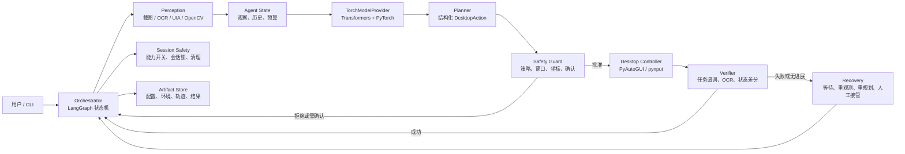
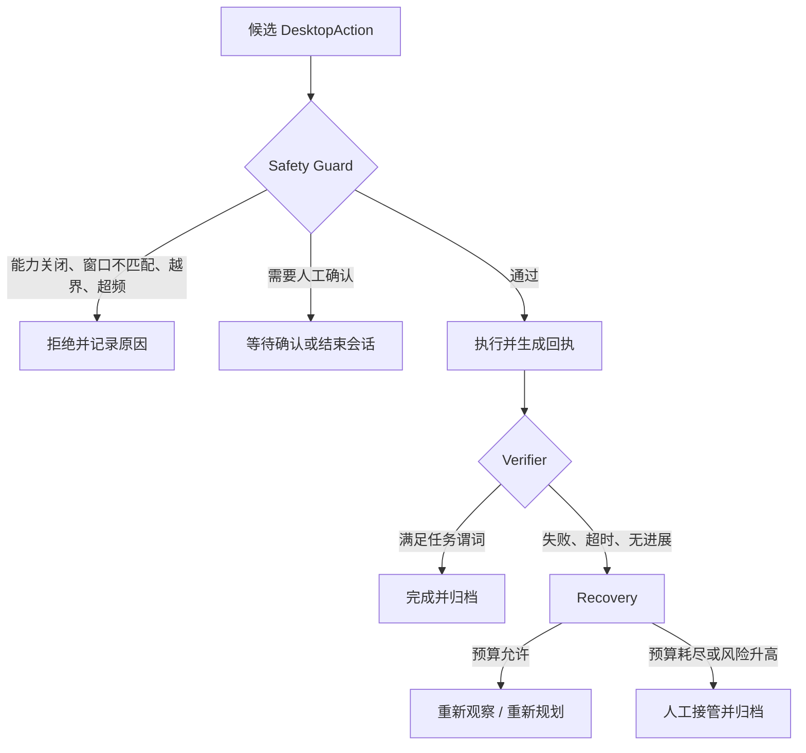

# GUI 智能体系统架构报告

## 1. 设计目标与边界

系统面向授权的 Windows 本地测试环境，通过命令行接收任务，在单进程内完成多模态推理、受控桌面操作和审计归档。设计目标是让每一步都具备可观察状态、结构化动作、可解释审批与可复核结果。

系统不负责桌面前端、长期记忆、多 Agent 协作、在线训练、向量数据库或常驻网络服务；数据库与 Redis 仅在出现跨进程共享状态、并发写入或队列需求时再评估引入。

## 2. 总体架构

## 3. 模块职责

| 模块 | 主要输入 | 主要输出 | 职责边界 |
| --- | --- | --- | --- |
| CLI | 用户目标、运行参数 | 任务启动、最终结果 | 不直接访问鼠标键盘 |
| Orchestrator | Agent State、各模块结果 | 下一状态与循环控制 | 不实现 OCR、坐标换算或模型加载细节 |
| Perception | 截图源、窗口与显示器信息 | `Observation`、元素集合、状态指纹 | 不执行动作、不决定任务策略 |
| TorchModelProvider | 图像、提示词、上下文 | 模型推理结果 | 单例加载本地模型，不负责下载和桌面控制 |
| Planner | 用户目标、观察、历史 | `DesktopAction` 候选 | 不具有执行权限 |
| Safety Guard | 候选动作、当前状态、策略 | `ApprovedAction` 或拒绝原因 | 不依赖模型主观判断放行 |
| Desktop Controller | 已批准动作 | `ExecutionReceipt` | 不判断任务是否成功 |
| Verifier | 执行前后观察、预期结果 | 成功证据、失败证据 | 不自行重试或绕过 Guard |
| Recovery | 失败证据、轮次与预算 | 等待、重观测、重规划或人工接管策略 | 不直接执行高风险动作 |
| Session Safety | 配置、进程和窗口信息 | 能力状态、会话锁、清理状态 | 不参与模型决策 |
| Artifact Store | 配置、环境、轨迹、结果 | 可审计文件集合 | 不保存密钥、个人数据或未经许可的截图 |

## 4. 核心数据契约

| 对象 | 关键字段 | 语义 |
| --- | --- | --- |
| `ScreenMeta` | `virtual_rect`、`width_px`、`height_px`、`dpi_scale`、`active_window_rect` | 描述目标显示器和活动窗口；虚拟桌面原点可为负值 |
| `UIElement` | `text`、`confidence`、`bbox`、`element_id`、`source` | 来自 UIA、OCR、模板或模型的界面元素证据 |
| `Observation` | `screenshot_ref`、`screen`、`elements`、`changed_regions`、`state_fingerprint` | 一次可追溯的屏幕观察 |
| `DesktopAction` | `kind`、目标元素或归一化坐标、文本、预期观察、确认要求 | Planner 提出的单个原子动作 |
| `ApprovedAction` | 原动作、窗口句柄、进程 ID、物理坐标、审批哈希 | Guard 绑定窗口和物理坐标后生成的唯一可执行动作 |
| `ExecutionReceipt` | 开始/结束时间、前后截图、光标位置、结果、错误码 | Controller 对一次动作的执行回执 |
| `StepRecord` | 观察、候选动作、审批决定、回执、验证证据 | 审计单步“为什么做、是否执行、结果如何” |

坐标分为两层：模型与感知层使用相对于目标显示器捕获区域的 `[0.0, 1.0]` 坐标；执行层使用 Windows 物理像素。进程在第一次截图或输入前建立 DPI awareness，只有 Guard 能进行坐标转换。

## 5. 安全与异常处理

Guard 至少检查总开关、单任务会话锁、目标窗口白名单、进程匹配、坐标范围、动作间隔、最大轮次和确认策略。任何异常都应释放输入状态、保留结构化错误与上下文，并阻止未审批动作继续传播。模型不可用、CUDA/BF16 不可用或本地模型不完整时，系统进入不可执行状态而非降级为无约束控制。

## 6. 前四周能力映射

| 必须完成的工作 | 架构落点 | 可验收结果 |
| --- | --- | --- |
| 环境与技术基础 | CLI、TorchModelProvider、Artifact Store、Session Safety | 可复现安装、CUDA/BF16 诊断、本地模型目录、离线单图基准和证据文件 |
| 桌面感知与控制 | Perception、Safety Guard、Desktop Controller | 截图、OCR、UIA、图像处理；在受控窗口中点击、输入、滚动、拖拽；支持急停和日志 |
| 数据与基础 Agent | Agent State、Planner、ModelProvider、接口契约 | 统一指令/观察/动作/结果格式；结构化计划；本地模型与可选 API 适配层 |
| 端到端系统集成 | Orchestrator、Verifier、Recovery、CLI | 完整闭环、步骤级状态记录、超时和失败退出、五项基础任务测试与统计 |

## 7. 运行与部署策略

运行平台固定为 Windows 11、Conda `max`、Python 3.12 和 NVIDIA GPU。模型权重置于项目根目录 `model/` 并被 Git 忽略；推理使用 `local_files_only`，不允许在离线基准中触发隐式下载。每次运行在 `artifacts/` 下归档 `config.yaml`、`environment.json`、`trajectory.jsonl` 和 `result.json`，使性能、配置和失败原因可回溯。

系统优先采用一轮一张截图、单一原子动作、有限轮次和单并发推理。发生多候选、跨应用、连续无进展或验证证据冲突时，Orchestrator 进入审慎路径，携带失败证据重新规划。该架构将复杂性集中在明确模块边界中，支持在不突破安全边界的前提下逐步扩展。
