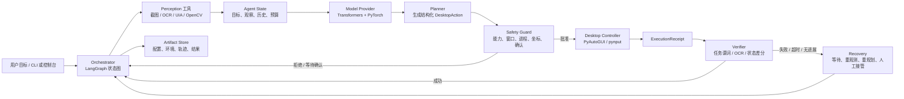
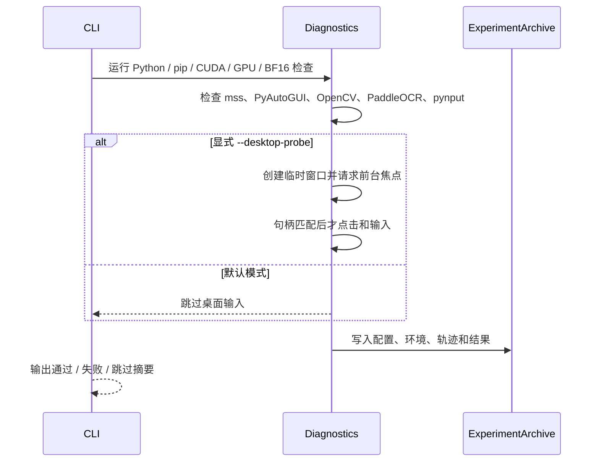

# MAX GUI 智能体系统架构报告

## 1. 报告定位

本报告说明 MAX 当前实现基线、技术选型、目标能力与总体架构。报告把“当前已经可以运行的基础设施”和“后续要实现的 GUI 智能体闭环”分开描述，避免将设计中的模块误认为已经交付。

当前仓库的可运行基线是一个 Windows 本地原型：通过 CLI 启动 Doctor、模型管理和单图离线基准，也可以启动一个尚未接入模型后端的聊天控制台。当前系统不会默认操作真实桌面，不会隐式下载模型，也不会把模型身份写入 Doctor 证据。

目标系统是在此基础上逐步实现以下闭环：

```text
用户目标 → 屏幕感知 → 任务规划 → 安全审批 → 桌面执行 → 结果验证 → 重试/恢复 → 审计归档
```

## 2. 设计目标与边界

### 2.1 目标

- 面向授权的 Windows 本地测试环境，优先支持单用户、单进程、单模型和单并发推理。
- 将观察、动作、审批、执行回执和验证结果结构化，保证每一步可追踪、可解释、可复核。
- 通过显式的安全 Guard 限制窗口、进程、坐标、动作频率、会话能力和人工确认。
- 使用本地模型和本地证据目录建立可重复的实验闭环。
- 先交付稳定的工具契约，再逐步替换模型、OCR 或桌面控制实现。

### 2.2 非目标

当前阶段不实现或不默认引入：

- 面向真实业务软件的无约束自动化；
- 桌面前端、浏览器扩展、长期记忆和多 Agent 协作；
- 在线训练、向量数据库、常驻网络服务、vLLM 推理服务；
- PostgreSQL、Redis、消息队列等跨进程基础设施。

只有出现跨进程共享状态、并发写入、任务队列或长期运行的明确需求时，才重新评估这些组件。

## 3. 技术栈：用什么实现什么

| 技术/组件 | 计划承担的职责 | 当前状态 |
| --- | --- | --- |
| Windows 11 | 目标桌面、窗口、DPI 和输入环境 | 已确定；当前 Doctor 支持基础环境核验和显式桌面探针 |
| Conda `max` + Python 3.12 | 统一运行时和依赖隔离 | 已使用；项目要求 Python `>=3.12,<3.13` |
| Typer | CLI 命令入口、参数解析和退出码 | 已实现 `doctor`、`download-model`、`validate-model`、`benchmark` |
| Textual | 默认聊天控制台和后续状态展示入口 | 已实现控制台壳；尚未连接 Agent 后端 |
| Prompt Toolkit + Rich | 轻量交互式 fallback 控制台和终端渲染 | 已实现 fallback 控制台 |
| LangGraph | 编排器的显式状态图、循环、预算和终止条件 | 依赖已锁定；Orchestrator 尚未实现 |
| LangChain | 提示词、模型与工具的适配层 | 依赖已锁定；不承载高风险执行逻辑 |
| PyTorch CUDA 13.0 | GPU 推理和 BF16 张量运算 | 已验证 CUDA/BF16；版本由 `requirements/torch-cu130.txt` 约束 |
| Transformers | 本地多模态模型加载、Processor 和单图推理 | 已实现离线 Qwen3.5-4B 加载路径和基准接口 |
| ModelScope | 模型元数据校验和显式权重下载 | 已实现；下载目标必须位于仓库 `model/` 目录 |
| `mss` | 屏幕捕获 | 已接入 Doctor 检查；未来由 Perception 工具封装 |
| OpenCV + NumPy | 图像转换、裁剪、差分和基础视觉处理 | 已接入基础检查；未来由 Perception 工具使用 |
| PaddleOCR | 屏幕文字识别 | 当前仅做依赖可用性检查；OCR 工具尚未进入 Agent 闭环 |
| UI Automation / `pywinauto` | 获取标准 Windows 控件树和窗口属性 | 作为后续感知增强方案；当前未形成完整工具契约 |
| PyAutoGUI / `pynput` | 受 Guard 审批后的鼠标、键盘和滚动输入 | 当前仅在显式桌面探针中验证基础输入；不得绕过 Guard |
| Pydantic / Protocol | 数据契约校验、序列化和模型 Provider 接口 | 目标采用 Pydantic 约束 Observation/Action/Receipt；`ModelProvider` 接口已定义，完整 schema 待实现 |
| JSONL Artifact Store | 运行配置、环境、轨迹和结果归档 | 已实现于 `artifacts/`，适合单用户单进程审计 |
| `unittest` + `pip check` | 单元测试和依赖一致性验证 | 当前 31 项测试通过，依赖检查通过 |

### 3.1 关键选型理由

第一版采用“Python 单进程 + LangGraph 编排 + 本地 PyTorch/Transformers 推理 + 工具契约”的组合。这样可以减少服务拆分、HTTP 序列化和跨进程状态带来的不确定性，同时保留替换感知、模型和执行器的接口边界。

LangGraph 只负责显式状态图，不把高风险动作藏在自由循环或通用 Agent Executor 中。LangChain 只承担提示词和模型/工具适配。真正的桌面输入必须经过独立 Guard，模型输出只能产生候选动作，不能直接获得鼠标键盘权限。

## 4. 当前实现基线

当前代码位于 `src/max_agent/`，已经实现以下能力：

1. `max-agent doctor`：检查 Python、依赖、CUDA、GPU、BF16，以及 `mss`、PyAutoGUI、OpenCV、PaddleOCR、`pynput` 等基础工具。
2. `--desktop-probe`：显式创建临时 Tk 测试窗口；只有窗口取得前台焦点并通过句柄校验后，才发送受控点击和文本输入。
3. 模型路径约束：模型只能位于仓库根目录 `model/` 树下，避免权重散落到源码或系统缓存目录。
4. 模型管理：通过 ModelScope 显式下载 Qwen3.5-4B，并支持只校验 `config.json` 的元数据检查。
5. 离线基准：通过 Transformers 使用 `local_files_only=True` 加载本地模型，执行单图推理并记录加载耗时、推理耗时、峰值显存和输出。
6. 控制台：Textual 是默认界面，Prompt Toolkit 是 fallback；当前普通聊天输入只返回“AI backend is not configured”，不会伪装成已完成推理。
7. 实验归档：每次运行在 `artifacts/` 下写入 `config.yaml`、`environment.json`、`trajectory.jsonl` 和 `result.json`。

当前尚未实现的目标模块包括 `Orchestrator`、`Perception`、`Planner`、`Safety Guard`、`Desktop Controller`、`Verifier`、`Recovery` 和完整的 `Session Safety`。新增感知实现时，应放在 `src/max_agent/tools/perception/`，并通过工具注册表接入编排器；不能创建顶层 `perception` 包或绕过工具入口。

## 5. 总体架构



编排器是唯一可以推进任务状态的核心组件。感知、模型、审批、桌面执行、验证、恢复和归档都通过显式工具契约接入；工具不能自行推进全局循环，不能触发另一个高风险工具，也不能绕过 Guard。

## 6. 模块职责与实现边界

| 模块 | 主要输入 | 主要输出 | 实现方式与边界 |
| --- | --- | --- | --- |
| CLI / Console | 用户目标、命令参数 | 任务请求、状态展示、退出码 | Typer + Textual/Prompt Toolkit；不直接访问鼠标键盘 |
| Orchestrator | Agent State、工具回执 | 下一状态、轮次控制、终止原因 | LangGraph 状态图；不实现 OCR、坐标换算或模型加载 |
| Perception | 屏幕、窗口、显示器信息 | Observation、UIElement、状态指纹 | `mss`、OCR、UIA、OpenCV；只观察，不执行动作 |
| Model Provider | 图像、提示词、上下文 | 结构化模型输出 | Transformers/PyTorch 本地推理；不下载模型、不执行桌面动作 |
| Planner | 用户目标、Observation、历史 | `DesktopAction` 候选 | 只生成单个原子动作，不具有执行权限 |
| Safety Guard | 候选动作、窗口状态、策略 | `ApprovedAction` 或拒绝原因 | 纯规则和运行时状态检查；不以模型自信度代替安全审批 |
| Desktop Controller | `ApprovedAction` | `ExecutionReceipt` | 仅执行已绑定窗口和物理坐标的动作；不判断任务成功 |
| Verifier | 执行前后 Observation、预期谓词 | 成功/失败证据 | OCR、控件状态和图像差分；不自行重试或绕过 Guard |
| Recovery | 失败证据、轮次、预算 | 等待、重观测、重规划或人工接管 | 只能提出恢复策略，不能直接执行高风险动作 |
| Session Safety | 配置、进程、窗口、能力开关 | 会话锁、清理状态 | 管理一次任务的生命周期和输入状态释放 |
| Artifact Store | 配置、环境、轨迹、结果 | 可审计文件集合 | 使用 JSON/JSONL；不写入密钥、真实个人数据或未经授权截图 |

## 7. 核心数据契约

目标闭环采用稳定、可序列化的数据对象。第一版直接使用 Pydantic 定义并校验数据契约，统一约束模型输出、工具输入输出、状态流转和归档记录；禁止以未经校验的自由字典作为模块间接口。

| 对象 | 关键字段 | 语义 |
| --- | --- | --- |
| `ScreenMeta` | `virtual_rect`、`width_px`、`height_px`、`dpi_scale`、`active_window_rect` | 描述显示器、虚拟桌面原点和活动窗口 |
| `UIElement` | `text`、`confidence`、`bbox`、`element_id`、`source` | 来自 UIA、OCR、模板或模型的界面证据 |
| `Observation` | `screenshot_ref`、`screen`、`elements`、`changed_regions`、`state_fingerprint` | 一次可追溯的屏幕观察 |
| `DesktopAction` | `kind`、目标元素或归一化坐标、文本、预期观察、确认要求 | Planner 提出的单个原子动作 |
| `ApprovedAction` | 原动作、窗口句柄、进程 ID、物理坐标、审批哈希 | Guard 绑定运行时上下文后生成的唯一可执行动作 |
| `ExecutionReceipt` | 开始/结束时间、前后观察、光标位置、结果、错误码 | Controller 对一次动作的执行回执 |
| `StepRecord` | 观察、候选动作、审批决定、回执、验证证据 | 审计单步“为什么做、是否执行、结果如何” |

坐标分为两层：感知和模型层使用相对于目标捕获区域的 `[0.0, 1.0]` 归一化坐标；执行层使用 Windows 物理像素。进程在第一次截图或输入前建立 DPI awareness，只有 Guard 可以完成坐标转换和最终越界检查。Pydantic schema 同时负责枚举动作类型、限制坐标范围、校验必填字段、拒绝额外字段，并在工具边界生成可追踪的校验错误。

## 8. 运行流程与安全策略

### 8.1 当前 Doctor 流程



### 8.2 目标 Agent 流程

每轮遵循“一次观察、一个原子动作、一次验证”的最小闭环。Guard 至少检查：

- 总能力开关和单任务会话锁；
- 目标窗口白名单、窗口句柄和进程匹配；
- 归一化坐标转换后的物理像素是否越界；
- 动作间隔、最大轮次、超时和确认策略；
- 输入动作结束后鼠标按键、键盘按键等状态是否已释放。

任何异常都必须停止后续未审批动作，释放输入状态，保留结构化错误和上下文。模型不可用、CUDA/BF16 不可用、本地权重不完整、窗口焦点丢失或验证证据冲突时，系统进入不可执行或人工接管状态，不能降级为无约束控制。

## 9. 存储、部署与可复现性

- 运行环境：Windows 11、Conda `max`、Python 3.12、NVIDIA GPU。
- 安装方式：先执行 `python -m pip install -e .`，再按 `requirements/torch-cu130.txt` 安装匹配 CUDA 13.0 的 PyTorch 构建。
- 模型位置：模型权重只能放在仓库根目录 `model/`；路径由代码校验并使用 `local_files_only=True` 进行离线加载。
- 运行产物：诊断和基准证据写入 Git 忽略的 `artifacts/`，至少包括 `config.yaml`、`environment.json`、`trajectory.jsonl`、`result.json`。
- 缓存隔离：Transformers 动态模块缓存写入 `artifacts/hf_modules`；模型、缓存、截图和令牌不提交 Git。
- 并发策略：第一版单进程、单模型、单并发；不启动 PostgreSQL、Redis 或消息队列。

这种部署方式的重点不是追求服务化，而是保证本地实验可以复现：同一模型目录、同一输入图像、同一提示词和同一运行配置应能还原一次基准记录。

## 10. 分阶段落地路线

| 阶段 | 主要实现 | 验收重点 |
| --- | --- | --- |
| 当前基线 | Doctor、控制台壳、模型路径约束、模型下载/校验、离线单图基准、归档 | 31 项单元测试通过，`pip check` 通过，命令和证据可复现 |
| 感知与控制 | 截图、OCR、UIA、窗口元数据、受控点击/输入/滚动/拖拽、急停 | 只在测试窗口中运行；窗口和坐标校验失败时不输入 |
| 基础 Agent | Agent State、Observation/Action schema、Model Provider、Planner | 模型只产生结构化候选动作，动作不具备执行权限 |
| 端到端闭环 | Orchestrator、Guard、Verifier、Recovery、Session Safety | 完成若干受控任务，记录每一步状态、证据、失败和退出原因 |
| 评测与优化 | 固定任务集、成功率、步骤数、延迟、显存、失败类型统计 | 以归档证据和重复实验比较优化，而不是只看模型输出 |

后续如需 LoRA、更多模型、跨应用任务或服务化部署，应在核心闭环稳定并出现明确指标收益后再引入。所有扩展都不能削弱 Guard、会话锁、离线加载和审计归档这四项基础约束。

## 11. 当前核验结论

截至本报告更新时，仓库验证结果为：

- `python -m unittest discover -s tests -v`：31 项测试全部通过；
- `python -m pip check`：`No broken requirements found`；
- 已实现的代码边界与本报告的“当前实现基线”一致；
- 感知、规划、审批、执行、验证和恢复仍属于后续设计，不应在 README 或演示中表述为当前已交付能力。

## 12. 结论

MAX 采用“轻量本地运行时 + 显式状态编排 + 能力工具契约 + 独立安全审批 + 证据归档”的架构。当前先把 Windows、CUDA/BF16、本地模型、基础桌面工具和可复现实验打牢，再将这些能力组装为受控 GUI Agent 闭环。

该架构的核心取舍是：用单进程降低原型复杂度，用 LangGraph 保持状态和终止条件显式，用工具边界隔离模型与执行权限，用 Artifact Store 支撑复核。这样既能逐步实现“用模型完成桌面任务”的目标，又不会因为模型输出异常、窗口焦点变化或环境不完整而失去安全控制。
