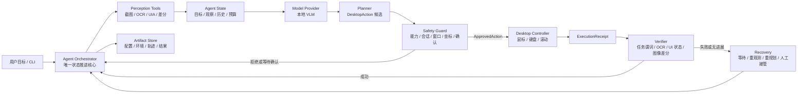

# GUI 智能体技术调研报告

## 摘要

MAX-AGENT 是面向 Windows 本地 GUI 任务智能代理，目标是把自然语言目标转化为可审计、可中止、可复现的操作闭环。调研表明，GUI Agent 的主要难点不是让视觉语言模型给出一个看似合理的点击坐标，而是持续解决五个相互耦合的问题：界面感知、目标定位、多步决策、安全执行和结果验证。模型能力再强，也不能替代确定性的窗口绑定、权限控制、异常清理和功能性验收。

四类参考方案分别提供了不同层面的启示：ScreenAgent 验证了“规划—执行—反思”的连续交互闭环；UI-TARS 将 GUI Agent 能力拆分为感知、统一动作建模、System-2 推理和经验学习；WebArena 强调可恢复环境、不可完成任务和功能性结果验证；Claude Computer Use 的社区源码分析则展示了成熟桌面能力应具备的闸门、宿主适配、会话锁和状态清理。MAX 不直接复刻其中任一方案，而是采用“Agent Orchestrator 唯一推进状态，模型只提出候选动作，感知、审批、执行、验证、恢复和归档均通过显式工具契约接入”的组合路线。

## 1. 调研目标

### 1.1 调研问题

本次调研围绕以下问题展开：

1. GUI Agent 如何表示屏幕状态，并在动态界面中稳定定位目标？
2. 模型输出应采用什么动作空间，如何从候选动作转化为可安全执行的系统操作？
3. 多步任务如何规划、验证、恢复和终止，避免无进展循环？
4. 如何构造可重复的测试环境，并以功能结果而非固定轨迹评价成功？
5. 在 MAX 的 Windows、本地模型、单进程和有限周期约束下，哪些能力应优先落地？

## 2. 问题定义：GUI Agent 是受约束的交互系统

桌面 GUI 智能体需要连续完成以下闭环：

```text
用户目标 → 屏幕感知 → 任务规划 → 安全审批 → 桌面执行
        ↑                                      ↓
        └──── 恢复 / 重规划 ← 结果验证 ← 新屏幕状态
```

这个闭环包含三类不确定性：

- **感知不确定性：** 小字号、遮挡、主题变化、非标准控件、DPI 和多显示器会导致文字或位置识别错误。
- **决策不确定性：** 模型可能误解目标、遗漏前置条件、产生非法动作或在相似状态间循环。
- **环境不确定性：** 窗口焦点、加载延迟、弹窗和外部状态变化会使原本正确的动作失效。

因此，模型的职责应被限制为理解观察、推理和提出候选动作；最终坐标换算、窗口/进程绑定、能力检查、输入发送、结果判断和异常清理应由确定性组件承担。MAX 的目标不是“让模型拥有鼠标”，而是建立一个能够证明“谁在什么状态下批准并执行了什么动作，结果为何被判定成功或失败”的系统。

## 3. 代表性方案分析

### 3.1 ScreenAgent：显式规划、执行与反思闭环

ScreenAgent 构造了可由视觉语言模型观察截图并通过鼠标、键盘动作交互的真实计算机环境。其内部流水线分为 Planning、Acting 和 Reflecting 三个阶段：先把任务拆成步骤，再输出可解析的函数调用，执行后根据新截图判断继续、重试或调整计划。其动作空间覆盖移动、单击、双击、滚动、拖拽、按键、文本输入、等待、计划和状态评价。

ScreenAgent Dataset 覆盖 Linux 与 Windows 的多类日常任务，并以完整会话、截图和动作序列组织数据。CC-Score 不只检查输出格式，还对动作类型、鼠标按钮、点击是否落入可行边界框、键盘文本和动作序列对齐分别评分。这说明 GUI 能力至少应拆成“格式遵循、动作选择、目标定位、文本生成和状态判断”几个维度，不能只看端到端成功率。

对 MAX 的直接启示是：

- 使用显式 `Observe → Decide → Guard → Act → Verify → Recover` 状态图；
- 每轮只执行一个可审计的原子动作，执行后必须重新观察；
- 将等待和终止建模为正式动作/状态，避免用隐式休眠或异常退出表达；
- 同时记录动作格式有效率、定位正确率和最终任务成功率。

需要修正之处是，ScreenAgent 的研究环境允许模型生成动作后由环境解析执行，而 MAX 的安全边界更严格：任何模型动作都必须先进入独立 Guard，不能由模型调用结果直接驱动桌面输入。

### 3.2 UI-TARS：能力分解与统一动作建模

UI-TARS 将原生 GUI Agent 的核心能力归纳为四类：感知、动作、System-1/System-2 推理和记忆。其运行形式是持续接收当前截图与历史交互，在预定义动作空间中输出下一动作；复杂场景中还在动作前生成显式思考，以支持任务分解、里程碑识别、试错和反思。

UI-TARS 对 MAX 最有价值的不是模型规模或公开榜单成绩，而是以下方法：

- **增强感知：** 同时训练元素描述、密集描述、状态转移描述、问答和 Set-of-Mark 等任务，说明“看见文字”和“理解控件状态变化”是不同能力。
- **统一动作空间：** 将不同平台语义相近的动作标准化，并保留平台特有动作；同时定义 `Finished()` 与 `CallUser()` 作为正式终止动作。
- **轨迹级学习：** 单步 grounding 数据负责准确定位，多步轨迹数据负责动作序列和长程一致性，两者不能相互替代。
- **经验迭代：** 在线轨迹需要经过规则、模型评分和人工复核等多阶段过滤，失败轨迹不能未经筛选直接回流训练。

MAX 当前不开展在线训练或长期记忆，但可以先在接口层吸收这些设计：使用统一的 `DesktopAction` 枚举，区分 `finish`、`request_user` 和普通输入动作；在 `Observation` 中保留来源、置信度、状态指纹和变更区域；将“候选动作质量”和“执行系统安全性”分开评估。未来如开展 LoRA，应固定基座模型、数据划分、提示词和任务夹具，再比较收益。

### 3.3 WebArena：可恢复环境与功能性验收

WebArena 提供可自托管的真实功能网站、预置用户数据和确定性重置脚本。它支持截图、DOM 和 accessibility tree 等观察形式，并允许使用屏幕坐标或元素 ID 选择目标。其 812 个任务由高层自然语言意图构成，评价重点不是动作序列是否与人工轨迹一致，而是最终页面、数据库或文本答案是否满足任务谓词。

WebArena 还显式加入不可完成任务，并要求 Agent 在证据不足、权限不够或功能缺失时停止。这一点对桌面 Agent 尤其重要：系统既要避免对可完成任务过早放弃，也要避免在不可完成任务上幻觉、重复无效动作或超过步数预算。

对 MAX 的启示是：

- 基础任务必须具有可恢复初始状态、固定测试数据和明确的成功谓词；
- 验证器优先检查功能结果，例如目标文件是否生成、控件状态是否改变、指定文本是否出现，而不是要求复现固定坐标轨迹；
- 测试集中保留不可完成任务，并分别报告可完成任务成功率和不可完成任务正确拒绝率；
- 截图、OCR 和 UIA 是互补观察源，UIA 元素 ID 可提升标准控件定位，但不能成为非标准 Windows 界面的唯一依赖。

MAX 不直接采用 WebArena 的 Docker 网站栈。当前原型是 Windows 单机桌面系统，首版应使用专用测试窗口、模拟应用或可重置文件夹实现等价的可恢复夹具；只有出现明确的数据库或跨服务需求后才考虑 Compose 基础设施。

### 3.4 Claude Computer Use 社区分析：能力治理与生命周期安全

社区材料描述的 Computer Use 子系统将桌面能力分为执行器、能力闸门、宿主适配、MCP 暴露、安全清理和会话锁。其关键问题不是“能不能点”，而是“谁能点、在哪里点、出了问题如何恢复”。材料还强调终端代理模式中的宿主感知：执行桌面任务时必须排除自身终端窗口，避免 Agent 截到或误点自己的控制界面。

对 MAX 可迁移的工程模式包括：

- 能力启用与单次动作审批分层；总开关开启不意味着任意动作自动获准；
- CLI、未来 GUI 或外部工具入口通过宿主适配层复用同一执行内核；
- 一次只能存在一个拥有桌面输入权限的会话；
- 正常完成、中断、异常退出和进程崩溃路径都必须释放鼠标按键、键盘按键及会话锁；
- 如果未来通过 MCP 或其他插件协议暴露桌面能力，外部调用仍必须经过同一 Guard 和会话治理。

MAX 当前明确不引入 MCP 服务，也不会照搬订阅或远程特性闸门。但 `Session Safety`、终端窗口排除、统一 `finally` 清理和入口无关的权限链应进入第一版安全设计。

## 4. 横向比较与 MAX 取舍

| 维度       | ScreenAgent                  | UI-TARS                        | WebArena                          | Computer Use 社区分析          | MAX 决策                                              |
| ---------- | ---------------------------- | ------------------------------ | --------------------------------- | ------------------------------ | ----------------------------------------------------- |
| 核心定位   | 真实计算机上的 VLM 连续控制  | 原生 GUI Agent 模型与数据方法  | 真实、可复现的网页环境与评测      | 桌面能力的工程治理             | 受控 Windows 本地 GUI Agent 原型                      |
| 观察       | 截图                         | 截图与历史轨迹                 | 截图、DOM、可访问性树、URL/标签页 | 屏幕截图与宿主上下文           | `mss` 截图 + OCR + OpenCV + 可选 UIA                  |
| 决策闭环   | Planning/Acting/Reflecting   | 感知、动作、System-2、经验学习 | Agent 自由选择路径，环境负责反馈  | 执行能力嵌入更大 Agent 流程    | LangGraph 显式状态图，编排器唯一推进状态              |
| 动作表示   | 鼠标、键盘、等待、计划、评价 | 跨平台统一动作与终止动作       | 元素或坐标操作、标签页和导航      | 原生执行器封装输入动作         | Pydantic `DesktopAction`，每轮一个原子动作            |
| 安全控制   | 研究环境侧重可交互性         | 主要关注模型能力               | 受控自托管环境                    | 闸门、权限、沙箱、会话锁、清理 | 独立 Guard + 会话锁 + 窗口/进程绑定 + 急停            |
| 验证       | 反思阶段和 CC-Score          | 在线任务反馈与轨迹筛选         | 功能性验证器、不可完成任务        | 侧重能力生命周期               | 独立 Verifier，以任务谓词和证据判断                   |
| 可复现性   | 数据集与动作序列             | 数据/训练/在线轨迹             | 环境镜像、预置数据和重置          | 代码路径与治理层次             | 本地模型固定路径 + `artifacts/` 证据归档 + 可重置夹具 |
| 不直接采用 | 模型动作直接进入环境         | 大规模在线训练、长期记忆       | 完整网站/Docker 基础设施          | 订阅、远程闸门、MCP 暴露       | 仅吸收与当前范围匹配的结构性设计                      |

## 5. MAX 架构映射

### 5.1 当前已实现基线

根据当前代码与架构报告，仓库已具备以下基础能力：

1. `max-agent doctor` 检查 Python、依赖一致性、CUDA、GPU、BF16 以及基础桌面工具。
2. `--desktop-probe` 只在显式启用时创建临时 Tk 测试窗口；只有前台窗口句柄匹配后才执行有限点击和文本输入。
3. 本地模型只能位于仓库 `model/`，模型下载与基准路径相互隔离，离线加载使用 `local_files_only=True`。
4. 已有 `ModelProvider` 接口、本地 Qwen3.5-4B 管理与单图基准路径，但尚未接入完整 Agent 闭环。
5. Typer、Rich 和 Prompt Toolkit 构成首要 CLI/交互入口；Textual 是显式选择的可选界面。普通聊天不会伪装成已接入模型后端。
6. `ExperimentArchive` 在 Git 忽略的 `artifacts/` 下记录配置、环境、轨迹和结果。

这部分能力对应“环境可用性和证据底座”，不能据此宣称 MAX 已能自主执行通用桌面任务。

### 5.2 目标架构



该架构对参考方案的吸收关系如下：

- ScreenAgent 的 Planning/Acting/Reflecting 被拆成 Planner、Controller、Verifier 与 Recovery，便于独立测试和限权。
- UI-TARS 的统一动作空间落到 `DesktopAction`，感知增强落到多源 `Observation`；System-2 推理只影响候选动作，不扩大执行权限。
- WebArena 的功能性验证落到任务谓词和可重置测试夹具。
- Computer Use 的闸门、宿主感知和清理机制落到 Guard 与 Session Safety。

### 5.3 核心数据契约

| 数据对象             | 关键内容                                                 | 设计目的                         |
| -------------------- | -------------------------------------------------------- | -------------------------------- |
| `ScreenMeta`         | 虚拟桌面矩形、物理尺寸、DPI、目标显示器、活动窗口边界    | 建立坐标和窗口上下文             |
| `UIElement`          | 文本、置信度、边界框、来源、元素标识                     | 合并 OCR、UIA、模板或模型证据    |
| `Observation`        | 截图引用、屏幕元数据、元素、变化区域、状态指纹           | 为规划和验证提供可追溯观察       |
| `DesktopAction`      | 动作类型、目标元素或归一化坐标、文本、预期观察、确认要求 | 表示模型提出的单个候选动作       |
| `ApprovedAction`     | 原动作、窗口句柄、进程 ID、物理坐标、审批依据/哈希       | 将候选动作绑定到唯一运行时上下文 |
| `ExecutionReceipt`   | 时间、执行前后状态、光标位置、结果和错误码               | 证明控制器实际做了什么           |
| `VerificationResult` | 任务谓词、证据、置信等级、成功/失败/不确定               | 将结果判断与模型自述分离         |
| `StepRecord`         | 观察、候选、审批、回执、验证、恢复决定                   | 形成完整审计链                   |

数据契约应使用 Pydantic 严格校验枚举、坐标范围、必填字段和额外字段。工具只消费和返回结构化对象；未经校验的模型文本不得进入 Controller。

## 6. 关键技术取舍

### 6.1 编排器核心与工具边界

`Agent Orchestrator` 是唯一可以推进任务状态的组件。感知、模型、安全、执行、验证、恢复和归档都是被调用工具，不能自行发起下一轮，也不能在工具内部串联高风险操作。LangGraph 用于表达可见状态、轮次预算、超时和终止条件；LangChain 只承担提示词与模型/工具适配，不承载桌面安全逻辑。

### 6.2 多源感知而非单一 OCR 或纯视觉

截图是跨应用通用底座；OCR 提供文字和边界框；UIA 为标准 Windows 控件提供角色、状态与元素边界；OpenCV 用于裁剪、预处理、模板匹配和状态差分。多源结果应保留来源与置信度，而不是过早合并为不可追踪的字符串。冲突时允许返回“不确定”，由编排器重新观察或请求人工接管。

未来感知实现统一放在 `src/max_agent/tools/perception/`，并通过 `tools/registry.py` 接入。当前没有实现时不创建空包或占位工具。

### 6.3 统一坐标与目标绑定

模型和感知层使用相对于目标捕获区域的 `[0.0, 1.0]` 归一化坐标，执行层使用 Windows 物理像素。Guard 在 DPI awareness 已建立后完成转换，并再次检查目标窗口、进程、窗口矩形和坐标边界。仅有坐标合法还不够：审批必须绑定窗口句柄与进程 ID，防止窗口切换后把旧坐标作用于新应用。

### 6.4 单进程、单模型、单并发

首版采用 Windows Conda `max`、Python 3.12、PyTorch/Transformers 本地推理，在 RTX 5070 Ti 上以 BF16 运行。单进程减少 HTTP、队列、跨进程状态和服务生命周期的复杂度；单并发与会话锁共同保证只有一个任务拥有桌面输入权限。vLLM、数据库、Redis、消息队列和多 Agent 协作只有在出现明确的吞吐或复用指标后才考虑。

### 6.5 安全审批独立于模型自信度

Guard 至少检查总能力开关、会话锁、动作 schema、允许进程/窗口、坐标边界、动作间隔、轮次与时间预算、敏感动作确认。模型“很有把握”不能放宽规则；模型“认为已经成功”也不能替代 Verifier。消息发送、删除、覆盖、安装等存在外部副作用的动作默认需要更高等级确认，并且只能面向测试对象。

### 6.6 结果验证优先于轨迹复现

相同目标可能有多条有效路径，固定坐标轨迹会随窗口布局和动态内容失效。Verifier 应根据任务类型选择证据：OCR 文本、UIA 控件状态、文件系统结果、截图变化、窗口标题或专用测试应用提供的状态接口。若证据冲突，结果应为“不确定”而不是乐观成功。Recovery 只能选择等待、重观测、有限重规划或人工接管，不能绕过 Guard 重复执行。

### 6.7 生命周期清理是安全功能

正常结束、用户急停、超时、异常和进程退出都必须进入统一清理路径：释放鼠标/键盘状态、撤销会话锁、停止后续动作并写入最终结果。CLI 终端和 MAX 自身窗口应默认排除为控制目标。该能力应有单元测试和受控窗口集成测试，而不能只依赖人工约定。

## 7. 评测设计

### 7.1 分层指标

| 层级         | 建议指标                                                      | 目的                        |
| ------------ | ------------------------------------------------------------- | --------------------------- |
| 环境         | Doctor 通过/失败/跳过、依赖一致性、BF16 可用性                | 证明运行底座有效            |
| 感知         | OCR 字符/词准确率、元素召回率、边界框命中率、状态变化检出率   | 区分看不见与决策错误        |
| 动作         | schema 有效率、动作类型准确率、目标区域命中率、Guard 拒绝原因 | 衡量候选动作和审批质量      |
| 单步闭环     | 执行成功率、验证一致率、单步延迟、显存峰值                    | 衡量一次 Observe–Act–Verify |
| 端到端       | 任务成功率、平均/中位耗时、平均步数、恢复次数                 | 衡量完整任务价值            |
| 安全         | 越界拒绝率、错误窗口阻止率、敏感动作确认率、急停后残留输入数  | 验证安全边界                |
| 不可完成任务 | 正确拒绝率、误拒绝率、停止理由完整性                          | 防止幻觉与过早停止          |

ScreenAgent 的细粒度评分说明必须拆分动作属性，WebArena 则说明最终仍要以功能结果为主。因此 MAX 应同时保留离线动作指标和在线任务指标，不能用其中一个替代另一个。

### 7.2 基础任务夹具

前四周建议至少准备五类可重复任务：

1. 在专用测试窗口中点击指定按钮，并验证状态文本变化；
2. 在指定输入框写入固定文本，并验证最终值；
3. 滚动到目标区域后选择指定元素；
4. 在可重置文件夹中完成无副作用的文件操作，并验证文件系统结果；
5. 一个因权限或信息不足而不可完成的任务，验证系统正确停止并说明原因。

每个夹具应声明允许窗口/进程、初始状态、测试数据、成功谓词、最大步数、清理和 `reset()` 方法。每项任务至少重复 5 次，并记录失败码分布，而不是只保留成功演示。

### 7.3 证据归档

每次运行至少归档配置、环境、逐步轨迹和最终结果。未来完整闭环还应记录关键截图引用、模型/提示词版本、任务夹具版本、分辨率、DPI、审批决定和验证证据。日志必须脱敏，禁止写入令牌、密钥、真实个人数据或未经授权截图。

## 8. 分阶段落地建议

| 阶段           | 重点                                                                        | 可验收产物                                              |
| -------------- | --------------------------------------------------------------------------- | ------------------------------------------------------- |
| 当前第一周基线 | Doctor、CUDA/BF16、基础桌面工具、本地模型管理、单图基准、归档               | 当前命令可复现；调研与架构报告明确实现边界              |
| 感知与控制     | `Observation`、截图/OCR/UIA、坐标转换、Guard、会话锁、受控 Controller、急停 | 专用窗口上的单步任务；错误窗口和越界动作全部被拒绝      |
| 基础 Agent     | `ModelProvider`、Planner、结构化 `DesktopAction`、工具注册表、Agent State   | mock 与本地模型均能产生可校验候选动作，且无直接执行权限 |
| 端到端闭环     | Orchestrator、Verifier、Recovery、统一清理、CLI 状态反馈                    | 五类任务重复实验、不可完成任务、完整轨迹和失败样例      |
| 后续训练与评测 | 固定数据许可与划分、LoRA 对照实验、20 任务分层评测                          | 基线/提示词/LoRA 对比、置信区间、性能和安全指标         |

实现顺序应遵循“先契约和拒绝路径，再接真实输入；先受控单步，再多步闭环；先功能验证，再优化模型”。任何训练或更大模型都不能越过 Guard/Controller 边界。

## 9. 主要风险与缓解措施

| 风险                       | 可能后果           | 缓解措施                                                  |
| -------------------------- | ------------------ | --------------------------------------------------------- |
| DPI、多显示器或窗口移动    | 点击偏移到错误目标 | 记录虚拟桌面原点和 DPI；Guard 绑定窗口并在执行前重检      |
| OCR 小字、主题或遮挡误识别 | 规划错误           | OCR/UIA/视觉多源证据；置信度阈值；低置信度拒绝猜测        |
| 模型输出非法或幻觉         | 无效或危险动作     | Pydantic 严格 schema；额外字段拒绝；模型无执行权限        |
| 焦点在审批后变化           | 旧动作作用于新窗口 | `ApprovedAction` 绑定句柄、PID 和审批哈希；执行前二次校验 |
| 页面加载或无进展循环       | 重复动作、超时     | 正式 `wait`、状态指纹、重复动作检测、最大步数和时间预算   |
| 过早判断不可完成           | 可行任务被放弃     | 要求可审计证据；分别衡量正确拒绝率与误拒绝率              |
| 外部副作用                 | 数据损坏或隐私风险 | 测试账户/窗口、敏感动作确认、白名单、默认不上传截图       |
| 异常退出残留输入状态       | 鼠标或按键持续按下 | 会话锁、统一 `finally` 清理、退出钩子和急停测试           |
| 本地模型显存或延迟超预算   | 交互不可用、OOM    | 固定图像尺寸和上下文；记录加载/推理/显存；以实测选择模型  |
| 训练数据许可或泄漏         | 结论失真、合规问题 | 数据清单、许可审核、按模板去重、固定训练/验证/测试划分    |

## 10. 调研结论

MAX 的合理路线不是追求端到端模型直接控制，而是将模型置于受约束的决策位置，并围绕它建立确定性的执行系统。四类参考方案共同指向六条结论：

1. GUI Agent 必须是“观察—动作—再观察”的显式闭环，而不是一次性生成长动作脚本。
2. 感知、定位、动作选择、结果验证和安全审批是不同能力，必须分别建模和测试。
3. 元素 ID、归一化坐标和物理像素各有用途，最终执行必须绑定当时的窗口和进程上下文。
4. 功能性结果比固定轨迹更能反映真实成功，可恢复夹具和不可完成任务是评测的必要组成。
5. 会话锁、能力闸门、宿主排除和异常清理不是外围工程，而是桌面 Agent 的核心安全能力。
6. 在 MAX 当前阶段，单进程、单模型、单并发和 JSONL 归档足以支撑原型；服务化、在线学习、长期记忆和多 Agent 应由后续指标驱动，而非提前引入。

据此，MAX 应继续沿用“Orchestrator 为唯一状态核心、工具/插件为能力边界”的技术架构：先完成可观察、可拒绝、可验证、可恢复的最小闭环，再以稳定契约替换模型、感知实现或训练策略。这条路线既吸收了现有研究的有效经验，也与 Windows 本地原型的安全边界、硬件资源和交付周期相匹配。
