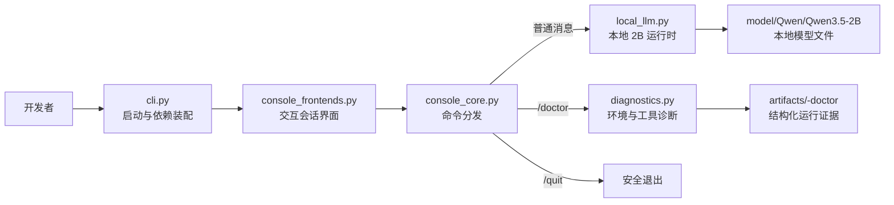

# 第一周周报

**周期：** 2026-08-04 至 2026-08-09
**结论：** 第一周计划已按期完成。技术调研、架构设计、Windows/Python/GPU 环境、依赖清单、基础桌面工具验证、受控输入探针、Qwen3.5-2B 简单对话和自动化测试均已具备可复核证据。

## 本周目标

完成技术路线调研和系统初步架构设计，建立可复现的 Windows 开发环境与基础工具核验方式，并为第二周桌面感知和受控控制模块明确接口、安全边界及验证前置条件。

## 完成情况

| 工作项                       | 状态   | 产出与说明                                                                                                                                                  |
| ---------------------------- | ------ | ----------------------------------------------------------------------------------------------------------------------------------------------------------- |
| 代表性方案调研               | 已完成 | [技术调研报告](research-report.md) 对比了 ScreenAgent、UI-TARS、WebArena 与 Claude Computer Use 的架构、动作空间、安全机制、适用边界和风险。                |
| 系统架构与模块边界           | 已完成 | [技术架构报告](architecture-report.md) 给出当前已实现基线、目标架构图、数据契约、工具边界和分阶段路线；架构图 PDF 为 `GUI-AGENT技术架构.pdf`。              |
| Windows 开发环境与依赖复现   | 已完成 | [README](../../README.md) 提供 venv、uv、Conda 三种安装路径；根目录 `requirements.txt` 固定 Python 依赖、CUDA 13.0 PyTorch wheel 索引及 editable 安装入口。 |
| GPU 与基础运行时核验         | 已完成 | 当前 Conda `max` 环境识别到 Python 3.12.13、CUDA 13.0、NVIDIA GeForce RTX 5070 Ti 和 BF16 CUDA 张量运算。                                                   |
| 基础工具无副作用诊断         | 已完成 | 已实现 `max-agent doctor`；默认检查 mss、PyAutoGUI、OpenCV、PaddleOCR、pynput，输出通过、失败、跳过三类结果，并将证据归档到 Git 忽略的 `artifacts/`。       |
| 截图、OCR 与受控桌面输入验证 | 已完成 | 已在交互式 Windows 桌面完成 mss 截图、PaddleOCR 最小文字识别和 `--desktop-probe` 验证；探针仅在临时 Tk 测试窗口中完成点击与文本输入，且先校验前台窗口句柄。 |
| Qwen3.5-2B 本地简单对话      | 已完成 | 昨日已通过交互式本地会话完成 Qwen3.5-2B 离线加载与简单对话验证；普通文本按需加载本地模型，不下载缺失资源，也不回退到网络。                                  |
| 代码质量与持续集成           | 已完成 | 新增 Windows / Python 3.12 GitHub Actions 质量门禁，依次执行 Ruff 格式检查、静态检查、单元测试和 `pip check`；CI 不加载模型、不运行基准，也不执行桌面控制。 |
| 第一周代码与文档记录         | 已完成 | 相关提交包括 `656979a`（统一依赖清单）、`81f45dd`（文档更新）、`6d0ade0`（CLI 交互层重构）等；本周交付可由 Git 历史追溯。                                   |

## 当前代码架构

当前实现是“本地会话 + 离线模型运行时 + 基础诊断 + 结构化归档”的轻量分层架构，尚未实现端到端桌面任务编排。入口只组装依赖并启动会话；命令分发、模型推理、诊断和归档相互独立，便于测试和后续替换。

| 层级         | 当前模块                                                                                                 | 职责与边界                                                                                                                                                                                                          |
| ------------ | -------------------------------------------------------------------------------------------------------- | ------------------------------------------------------------------------------------------------------------------------------------------------------------------------------------------------------------------- |
| 启动与界面层 | `cli.py`、`console_frontends.py`                                                                         | 提供 `max-agent` 与 `max-agent --chat` 启动入口，负责会话展示和异步生成状态；不直接执行模型推理、桌面操作或诊断逻辑。                                                                                               |
| 会话分发层   | `console_core.py`                                                                                        | 将普通消息、`/doctor`、`/quit` 和不支持的斜杠命令转换为统一的 `OperationResult`；该层不依赖界面运行时，便于单元测试。                                                                                               |
| 本地模型层   | `local_llm.py`                                                                                           | 校验 Qwen3.5-2B 配置、分词器和全部权重分片；首次消息时以 BF16/CUDA 懒加载本地模型，后续消息复用模型、处理器和会话历史。仅允许本地文件解析，不触发下载或远程推理；加载、显存或生成失败后仍可继续使用诊断和退出命令。 |
| 诊断层       | `diagnostics.py`                                                                                         | 核验 Python、依赖、CUDA、GPU、BF16 与基础工具状态，并按通过、失败、跳过分组输出。默认不发送鼠标或键盘事件。                                                                                                         |
| 证据归档层   | `artifacts.py`                                                                                           | 以 `ExperimentArchive` 在 Git 忽略的 `artifacts/` 中写入配置、环境、轨迹和最终结果，供 Doctor 与后续实验复核。                                                                                                      |
| 辅助能力层   | `model_download.py`、`model_runtime.py`、`benchmark.py`、`providers.py`、`config.py`、`runtime_paths.py` | 承担模型文件校验、离线运行与基准等辅助职责；当前不属于公开的会话操作流程。                                                                                                                                          |

## 验证结果

- 自动化测试：38 项全部通过，耗时 44.638 秒；覆盖 Doctor 命令分发、诊断摘要、基础工具探测、显式桌面探针开关、模型路径约束、归档及依赖清单等。
- 依赖一致性：`pip check` 输出 `No broken requirements found`。
- Doctor 通过项：Python 3.12.13、依赖一致性、CUDA 13.0、BF16、RTX 5070 Ti、PyAutoGUI（1920×1080）、OpenCV、PaddleOCR 3.7.0 和 pynput。
- 交互式桌面验证：mss 成功获取真实桌面截图；PaddleOCR 成功识别测试画面中的文字并返回结构化结果；`desktop_probe` 成功在临时测试窗口完成点击和文本输入。
- 本地对话验证：Qwen3.5-2B 已在交互式本地会话完成离线加载和简单对话；模型不可用时界面给出本地修复提示，不触发下载或网络回退。

运行证据写入 Git 忽略的 `artifacts/`，不包含模型身份、真实截图、个人数据或密钥。

## 验收对照与遗留项

| 第一周验收标准                                       | 结论 | 依据或后续动作                                                                                                     |
| ---------------------------------------------------- | ---- | ------------------------------------------------------------------------------------------------------------------ |
| 调研报告说明方案差异、边界与风险                     | 达成 | `research-report.md` 与 `architecture-report.md`。                                                                 |
| Windows、RTX 5070 Ti、Python、PyTorch、CUDA 信息完整 | 达成 | Doctor 当前运行结果及技术设计报告的环境核验记录。                                                                  |
| 截图、OCR、基础鼠标键盘控制最小示例在受控环境运行    | 达成 | 已在交互式 Windows 桌面完成 mss 截图、PaddleOCR 最小识别和受控临时窗口中的点击、输入验证。                         |
| 本地模型简单对话                                     | 达成 | Qwen3.5-2B 已完成本地离线加载和简单对话验证。                                                                      |
| 环境文档可用于重新搭建                               | 达成 | `README.md` 的安装、Doctor、证据与常见问题章节；`requirements.txt` 为唯一安装清单。                                |
| 失败项有日志、原因与替代方案                         | 达成 | Doctor 和交互式验证均将结构化结果归档到 `artifacts/`；异常场景保持失败即停止、保留错误信息并由人工分析的处理方式。 |
| 代码、文档、周报一致且无敏感/无关文件                | 达成 | 文档明确区分已实现与路线图；模型和诊断产物均位于 Git 忽略目录。                                                    |

## 问题与分析

- 当前基础验证已覆盖单显示器、固定分辨率和受控临时窗口；多显示器、不同 Windows 缩放比例和复杂应用窗口仍属于第二周感知与控制模块的扩展测试范围。
- PaddleOCR 最小识别已验证文字识别链路可用；后续需将文字、置信度和边界框统一为稳定的数据结构，并针对小字号、遮挡和主题变化补充测试样例。
- 输入探针采用显式开关和窗口句柄校验，确保测试输入只投递到临时测试窗口；这一约束将作为后续控制模块的安全基线。

## 风险与调整

- **桌面权限与焦点风险：** 所有输入测试仅在专用临时窗口、模拟应用或测试账户中进行；默认 Doctor 保持无输入。
- **DPI 与多显示器风险：** 第二周统一记录显示器矩形、分辨率、缩放与物理像素坐标，并加入越界检查。
- **OCR 运行时风险：** 固定模型资源获取方式和测试样例，避免运行时隐式下载；低置信度结果不直接驱动控制动作。

## 下周计划

1. 使用langchain，langgraph搭建基础编排器。
2. 实现 `src/max_agent/tools/perception/` 下的截图、OCR 坐标输出和 OpenCV 图像预处理能力，并通过工具注册表接入后续编排器。
3. 建立专用受控窗口测试夹具，覆盖点击、输入、滚动、拖拽、坐标越界、焦点丢失和中止场景。
4. 统一记录显示器、缩放、窗口和坐标数据，验证多分辨率及多 DPI 条件下的截图与定位结果。
5. 编写第二周单元测试和集成测试报告，明确成功案例、失败案例、已知限制及可复现步骤。
