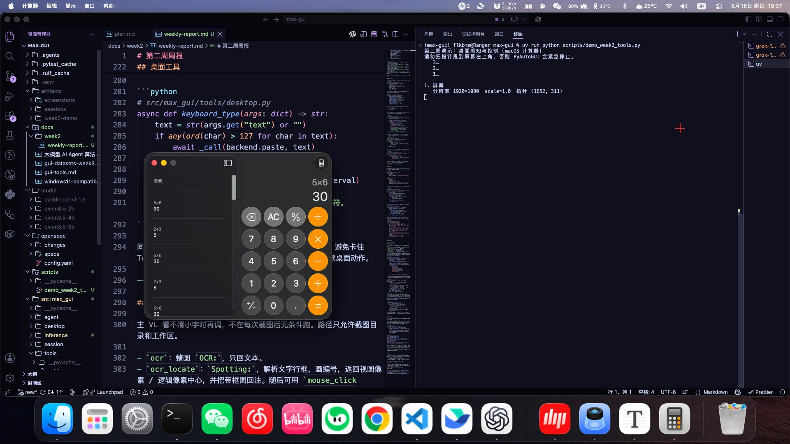
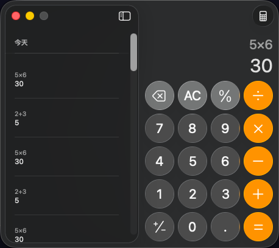
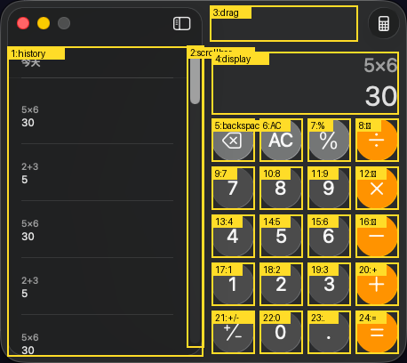

# 第二周交付：桌面感知与控制模块

**日期：** 2026-08-16  
**对照大纲：** 「桌面感知与控制核心模块开发」——跨平台截图与多分辨率、OCR、键鼠控制、UI 坐标定位与边界框。  

---

## 1. 交付对照

| 大纲任务               | 落地位置                                                   | 演示里怎么看                              |
| ---------------------- | ---------------------------------------------------------- | ----------------------------------------- |
| 跨平台截图、多分辨率   | `screenshot`、`screen_info`；逻辑像素 + `scale` + 视图像素 | 全屏图、窗口区域图                        |
| 屏幕文字 / UI 识别     | `ocr`（整图）、`ocr_locate`（文字行）                      | 对计算器区域图做整图 OCR                  |
| 点击、输入、滚动、拖拽 | `mouse_*`、`keyboard_*`                                    | 点 `12+34=`、键盘 `5*6`、滚历史栏、拖窗口 |
| 坐标定位与画框         | `ocr_locate` 画文字行；演示另用辅助功能读按钮真框          | `*-boxes.png`                             |

工具挂在同一套 `Tool` 协议上，Agent 与演示脚本走同一条 `invoke` 路径。测试用假后端，不真动鼠标、不加载 GPU。

---

## 2. 模块怎么分层

```
用户 / 演示脚本
        │
        ▼
 ToolRegistry.invoke          解析参数、确认门、收异常
        │
        ├─ desktop_tools      截图、屏信息、键鼠
        │       │
        │       ▼
        │   DesktopBackend    逻辑像素契约
        │       ├─ PyAutoGUIBackend     真机
        │       └─ FakeDesktopBackend   单测
        │
        └─ ocr / ocr_locate
                │
                ▼
            OcrRuntime        首次调用再拉独立 vLLM；失败回退 transformers
```

| 文件                           | 职责                                                  |
| ------------------------------ | ----------------------------------------------------- |
| `tools/protocol.py`            | `Tool`、`ToolResult`（可带图）、`ToolError`、确认范围 |
| `tools/registry.py`            | 按名调用；`build_default_registry` 一次装齐           |
| `desktop/backend.py`           | 后端协议；权限错误分屏幕录制 / 辅助功能               |
| `desktop/pyautogui_backend.py` | 真机实现；失败转成中文指引                            |
| `desktop/fake.py`              | 记录调用、可注入全黑图或键鼠失败                      |
| `tools/desktop.py`             | 工具函数：截图落盘、视图像素换算、确认门              |
| `tools/ocr.py`                 | `ocr` / `ocr_locate`；画编号框、记下可点中心          |
| `inference/ocr.py`             | 独立 OCR 进程、健康检查、`--max-model-len`            |
| `inference/spotting.py`        | 解析 `Spotting:` 文本为框                             |
| `scripts/demo_week2_tools.py`  | 打开计算器，按真实控件走完上述工具                    |

后端只认**逻辑像素**。模型看见的是预处理后的**视图像素**。换算发生在 `tools/desktop.py`，不让模型或 PyAutoGUI 各自猜坐标系。

---

## 3. 工具协议

每个工具四件事：名字、中文说明、JSON Schema、异步 `invoke`。可以回纯文本，也可以回 `ToolResult(text, images=...)`。截图和带框图必须把路径放进 `images`，推理层才会编成 `image_url`；只回路径字符串，多模态模型看不见屏。

```python
# src/max_gui/tools/protocol.py
@dataclass(slots=True)
class ToolResult:
    """可回注图像的工具结果。

    字段：
        text: 给模型的文本摘要。
        images: 本地图像路径，推理层会编成 `image_url`。
    """

    text: str
    images: list[Path] = field(default_factory=list)


@dataclass(slots=True)
class Tool:
    """单个可调用工具及其 JSON Schema。

    字段：
        name / description / parameters: 暴露给模型的 function 定义。
        invoke: 异步实现，入参为参数字典。
        confirmation_scope: 非 `none` 时走确认门。
    """

    name: str
    description: str
    parameters: dict[str, Any]
    invoke: Callable[[dict[str, Any]], Awaitable[str | ToolResult]]
    confirmation_scope: ConfirmationScope = "none"

    @property
    def requires_confirmation(self) -> bool:
        """是否需要在调用前经过确认门。"""
        return self.confirmation_scope != "none"
```

`confirmation_scope="desktop"` 的动作（点、拖、滚、打字、按键）不受工作区自动批准影响。注册表把未知工具、拒绝确认、`ToolError` 收成中文字符串，不把异常甩出 ReAct 图。

```python
# src/max_gui/tools/registry.py
async def invoke(self, name: str, arguments: dict[str, Any] | str | None) -> str | ToolResult:
    """解析参数、走确认门并调用。

    未知工具、拒绝确认或异常都返回错误字符串，不向外抛。
    """
    tool = self._tools.get(name)
    if tool is None:
        return f"工具错误：未知工具 {name}"
    parsed = _coerce_args(arguments)
    if tool.requires_confirmation:
        allowed = await self.gate.confirm(name, parsed, scope=tool.confirmation_scope)
        if not allowed:
            return "已取消：用户拒绝执行"
    try:
        return await tool.invoke(parsed)
    except ToolError as exc:
        return str(exc)
    except Exception as exc:
        return f"工具错误：{exc}"
```

同步的 PyAutoGUI 一律 `asyncio.to_thread`，避免卡住 Textual。`FAILSAFE=True`：指针甩到屏幕左上角会中止后续桌面动作。

```python
# src/max_gui/tools/desktop.py
async def _call(fn, *args, **kwargs):
    """在线程中跑同步后端，权限错误转成 `ToolError`。"""
    try:
        return await asyncio.to_thread(fn, *args, **kwargs)
    except DesktopPermissionError as exc:
        raise ToolError(
            str(exc)
            if str(exc).startswith("截图失败") or str(exc).startswith("键鼠")
            else (
                SCREEN_RECORDING_HELP if exc.kind == "screen_recording" else ACCESSIBILITY_HELP
            )
        ) from exc
```

---

## 4. 各工具实现

### 4.1 `screen_info`

读主屏逻辑宽高、截一张图算 `scale = 图像宽度 / 逻辑宽度`、读当前指针。摘要用逻辑坐标系。全黑或过小图视为没有屏幕录制权限。演示里用来打印 `1920×1080`、`scale=1.0`。

```python
# src/max_gui/tools/desktop.py
async def screen_info(_args: dict) -> str:
    """返回逻辑分辨率、scale 与鼠标坐标的 JSON。"""
    width, height = await _call(backend.size)
    mouse_x, mouse_y = await _call(backend.position)
    shot = await _call(backend.screenshot)
    scale = shot.width / width if width else 1.0
    if _is_black_or_tiny(shot):
        raise ToolError(SCREEN_RECORDING_HELP)
    return json.dumps(
        {
            "screen_width": width,
            "screen_height": height,
            "scale": scale,
            "mouse_x": mouse_x,
            "mouse_y": mouse_y,
            "coordinate_space": "logical",
        },
        ensure_ascii=False,
    )
```

后端截图：

```python
# src/max_gui/desktop/pyautogui_backend.py
def screenshot(self, region: tuple[int, int, int, int] | None = None) -> Image.Image:
    """截主屏或区域并转为 RGB。"""
    try:
        image = _pyautogui().screenshot(region=region)
    except Exception as exc:
        raise DesktopPermissionError("screen_recording", SCREEN_RECORDING_HELP) from exc
    return image.convert("RGB")
```

### 4.2 `screenshot`

参数：`region`（逻辑像素，缺省全屏）、`show_cursor`（默认在图上画红十字）。落盘后 `prepare_image`，把这一帧存成 `ViewFrame`，摘要里的光标改成视图像素，图像放进 `ToolResult.images`。

```python
# src/max_gui/tools/desktop.py
async def screenshot(args: dict) -> ToolResult:
    """截主屏或 `region`，落盘 PNG 并把图像回注给模型。"""
    width, height = await _call(backend.size)
    mouse_x, mouse_y = await _call(backend.position)
    region = args.get("region")
    region_tuple = None
    if isinstance(region, dict):
        region_tuple = (
            int(region.get("x") or 0),
            int(region.get("y") or 0),
            int(region.get("width") or width),
            int(region.get("height") or height),
        )
    image = await _call(backend.screenshot, region_tuple)
    if _is_black_or_tiny(image):
        raise ToolError(SCREEN_RECORDING_HELP)
    logical_w = region_tuple[2] if region_tuple else width
    logical_h = region_tuple[3] if region_tuple else height
    scale = image.width / logical_w if logical_w else 1.0
    show_cursor = args.get("show_cursor", True)
    if show_cursor is not False:
        cursor_x, cursor_y = mouse_x, mouse_y
        if region_tuple:
            cursor_x -= region_tuple[0]
            cursor_y -= region_tuple[1]
        _draw_cursor(image, cursor_x, cursor_y, scale)
    stamp = datetime.now().strftime("%Y%m%d-%H%M%S-%f")
    path = screenshots_dir / f"{current_session_id.get()}-{stamp}.png"
    image.save(path)
    prepared = prepare_image(
        path, max_edge=settings.max_image_edge, max_bytes=settings.max_image_bytes
    )
    origin_x = region_tuple[0] if region_tuple else 0
    origin_y = region_tuple[1] if region_tuple else 0
    store_view_frame(
        ViewFrame(
            origin_x=origin_x,
            origin_y=origin_y,
            logical_width=logical_w,
            logical_height=logical_h,
            view_width=prepared.width,
            view_height=prepared.height,
            image_path=path,
        )
    )
    cursor_vx, cursor_vy = logical_to_view(
        mouse_x,
        mouse_y,
        origin_x=origin_x,
        origin_y=origin_y,
        logical_width=logical_w,
        logical_height=logical_h,
        view_width=prepared.width,
        view_height=prepared.height,
    )
    summary = json.dumps(
        {
            "path": str(path),
            "width": logical_w,
            "height": logical_h,
            "view_width": prepared.width,
            "view_height": prepared.height,
            "origin": {"x": origin_x, "y": origin_y},
            "scale": scale,
            "cursor": {"x": cursor_vx, "y": cursor_vy},
            "coordinate_space": "view",
        },
        ensure_ascii=False,
    )
    return ToolResult(text=summary, images=[path])
```

区域截图的 `origin` 不是 `(0,0)`。Retina 上 `scale` 常为 2，执行仍用逻辑像素。

### 4.3 视图像素换算

无截图时把传入值当逻辑像素。越界夹到屏内。`mouse_*` 共用 `_resolve_point`：有 `target_id` 用定位中心，否则把 `x,y` 当视图像素。

```python
# src/max_gui/tools/desktop.py
def view_to_logical(
    x: int,
    y: int,
    frame: ViewFrame | None,
    screen_width: int,
    screen_height: int,
) -> tuple[int, int, bool, bool]:
    """把视图像素换成逻辑像素并夹紧。"""
    if (
        frame is None
        or frame.view_width <= 0
        or frame.view_height <= 0
        or frame.logical_width <= 0
        or frame.logical_height <= 0
    ):
        lx, ly = int(x), int(y)
        used_view = False
    else:
        lx = frame.origin_x + round(int(x) * frame.logical_width / frame.view_width)
        ly = frame.origin_y + round(int(y) * frame.logical_height / frame.view_height)
        used_view = True
    cx, cy, clamped = clamp_point(lx, ly, screen_width, screen_height)
    return cx, cy, used_view, clamped


async def _resolve_point(
    args: dict,
    width: int,
    height: int,
    *,
    x_key: str = "x",
    y_key: str = "y",
    require: bool = False,
) -> tuple[int, int, bool, bool] | None:
    """从 `target_id` 或视图像素解析一个逻辑点。"""
    if args.get("target_id") is not None:
        hit = lookup_locate_hit(int(args["target_id"]))
        cx, cy, clamped = clamp_point(hit[0], hit[1], width, height)
        return cx, cy, False, clamped
    if args.get(x_key) is None or args.get(y_key) is None:
        if require:
            raise ToolError(f"需要 {x_key}/{y_key} 或 target_id")
        return None
    return view_to_logical(
        int(args.get(x_key) or 0),
        int(args.get(y_key) or 0),
        active_view_frame(),
        width,
        height,
    )
```

### 4.4 鼠标

| 工具           | 行为                           | 确认 |
| -------------- | ------------------------------ | ---- |
| `mouse_move`   | `moveTo`，可带 duration        | 否   |
| `mouse_click`  | 可选先移动；单击 / 双击 / 右键 | 是   |
| `mouse_drag`   | `moveTo` 起点再 `dragTo` 终点  | 是   |
| `mouse_scroll` | 正数向上；可先移到 `(x,y)`     | 是   |

```python
# src/max_gui/tools/desktop.py
async def mouse_move(args: dict) -> str:
    """移到视图像素对应的逻辑坐标，或按定位编号。"""
    width, height = await _call(backend.size)
    resolved = await _resolve_point(args, width, height, require=True)
    assert resolved is not None
    x, y, used_view, clamped = resolved
    used_id = args.get("target_id") is not None
    duration = float(args.get("duration") if args.get("duration") is not None else 0.2)
    await _call(backend.move_to, x, y, duration)
    return f"指针已移到逻辑坐标 ({x}, {y}){_coord_note(used_view=used_view, used_id=used_id, clamped=clamped)}"


async def mouse_click(args: dict) -> str:
    """单击或双击；可先按视图像素或定位编号移动。"""
    width, height = await _call(backend.size)
    button = str(args.get("button") or "left")
    clicks = int(args.get("clicks") or 1)
    duration = float(args.get("duration") if args.get("duration") is not None else 0.2)
    resolved = await _resolve_point(args, width, height, require=False)
    used_id = args.get("target_id") is not None
    used_view = False
    clamped = False
    target_x = target_y = None
    if resolved is not None:
        target_x, target_y, used_view, clamped = resolved
    await _call(
        backend.click, button=button, clicks=clicks, x=target_x, y=target_y, duration=duration
    )
    where = f"({target_x}, {target_y})" if target_x is not None else "当前位置"
    note = (
        _coord_note(used_view=used_view, used_id=used_id, clamped=clamped)
        if target_x is not None
        else ""
    )
    return f"已{('双击' if clicks == 2 else '单击')}{button} {where}{note}"


async def mouse_drag(args: dict) -> str:
    """从视图像素 `(x1, y1)` 拖到 `(x2, y2)`。"""
    width, height = await _call(backend.size)
    start = await _resolve_point(args, width, height, x_key="x1", y_key="y1", require=True)
    end = await _resolve_point(args, width, height, x_key="x2", y_key="y2", require=True)
    assert start is not None and end is not None
    x1, y1, v1, c1 = start
    x2, y2, v2, c2 = end
    duration = float(args.get("duration") if args.get("duration") is not None else 0.2)
    button = str(args.get("button") or "left")
    await _call(backend.drag_to, x1, y1, x2, y2, duration=duration, button=button)
    note = _coord_note(used_view=v1 or v2, used_id=False, clamped=c1 or c2)
    return f"已从 ({x1}, {y1}) 拖到 ({x2}, {y2}){note}"


async def mouse_scroll(args: dict) -> str:
    """按视图像素可选先移动，再滚动。"""
    clicks = args.get("clicks")
    if clicks is None:
        raise ToolError("mouse_scroll 需要 clicks")
    width, height = await _call(backend.size)
    resolved = await _resolve_point(args, width, height, require=False)
    used_id = args.get("target_id") is not None
    x = y = None
    used_view = False
    clamped = False
    if resolved is not None:
        x, y, used_view, clamped = resolved
    await _call(backend.scroll, int(clicks), x, y)
    where = f"在 ({x}, {y}) " if x is not None else ""
    direction = "向上" if int(clicks) > 0 else "向下" if int(clicks) < 0 else ""
    note = (
        _coord_note(used_view=used_view, used_id=used_id, clamped=clamped)
        if x is not None
        else ""
    )
    return f"已{where}{direction}滚动 {abs(int(clicks))} 格{note}"
```

真机后端对应：

```python
# src/max_gui/desktop/pyautogui_backend.py
def click(self, *, button="left", clicks=1, x=None, y=None, duration=0.2) -> None:
    def _run(gui: Any) -> None:
        if x is not None and y is not None:
            gui.moveTo(x, y, duration=duration)
        gui.click(button=button, clicks=clicks)
    self._input(_run)

def drag_to(self, x1, y1, x2, y2, *, duration=0.2, button="left") -> None:
    def _run(gui: Any) -> None:
        gui.moveTo(x1, y1, duration=min(duration, 0.2))
        gui.dragTo(x2, y2, duration=duration, button=button)
    self._input(_run)

def scroll(self, clicks: int, x: int | None = None, y: int | None = None) -> None:
    def _run(gui: Any) -> None:
        if x is not None and y is not None:
            gui.moveTo(x, y)
        gui.scroll(clicks)
    self._input(_run)
```

演示里点按用辅助功能读到的按钮中心，再经 `logical_to_view` 交给 `mouse_click`。拖拽点选标题栏无控件空白；滚动点在左侧历史列表中心。

### 4.5 键盘

拆成两个工具，避免「打字」和「回车」混在一个参数里。ASCII 走 `write`；中文走剪贴板。`keyboard_press` 只接受白名单，拒绝 `command+q` 一类组合。输入打到当前前台窗口。

```python
# src/max_gui/tools/desktop.py
async def keyboard_type(args: dict) -> str:
    """ASCII 走 `write`，非 ASCII 走剪贴板粘贴。"""
    text = str(args.get("text") or "")
    if not text:
        raise ToolError("keyboard_type 需要 text")
    interval = float(args.get("interval") or 0)
    delay_ms = int(args.get("delay_ms") or 0)
    if delay_ms > 0:
        await asyncio.sleep(delay_ms / 1000)
    if any(ord(char) > 127 for char in text):
        await _call(backend.paste, text)
        method = "剪贴板粘贴"
    else:
        await _call(backend.write, text, interval)
        method = "write"
    return f"已用{method}输入 {len(text)} 个字符。{FOREGROUND_HINT}"


async def keyboard_press(args: dict) -> str:
    """按白名单单键或组合键。"""
    keys = _parse_keys(args.get("keys"))
    interval = float(args.get("interval") or 0)
    delay_ms = int(args.get("delay_ms") or 0)
    if delay_ms > 0:
        await asyncio.sleep(delay_ms / 1000)
    if len(keys) == 1:
        await _call(backend.press, keys[0])
    else:
        await _call(backend.hotkey, *keys)
        if interval:
            await asyncio.sleep(interval)
    return f"已按下 {'+'.join(keys)}。{FOREGROUND_HINT}"


def _parse_keys(raw: Any) -> list[str]:
    """解析 `keys` 字符串或列表，拒绝未知键与危险热键。"""
    if raw is None:
        raise ToolError("keyboard_press 需要 keys")
    if isinstance(raw, str):
        parts = [item for item in raw.replace("+", " ").split() if item]
    elif isinstance(raw, list):
        parts = [str(item) for item in raw]
    else:
        raise ToolError("keys 必须是字符串或字符串数组")
    keys = [_normalize_key(item) for item in parts]
    if not keys:
        raise ToolError("keys 不能为空")
    unknown = [key for key in keys if not _allowed_key(key)]
    if unknown:
        raise ToolError(f"拒绝未知键名：{', '.join(unknown)}")
    if frozenset(keys) in DANGEROUS_HOTKEYS:
        raise ToolError(f"拒绝危险热键：{'+'.join(keys)}")
    return keys
```

```python
# src/max_gui/desktop/pyautogui_backend.py
def write(self, text: str, interval: float = 0.0) -> None:
    self._input(lambda gui: gui.write(text, interval=interval))

def press(self, key: str) -> None:
    self._input(lambda gui: gui.press(key))

def hotkey(self, *keys: str) -> None:
    self._input(lambda gui: gui.hotkey(*keys))

def paste(self, text: str) -> None:
    def _run(gui: Any) -> None:
        import pyperclip
        pyperclip.copy(text)
        gui.hotkey("command", "v")
    self._input(_run)
```

### 4.6 `ocr`

路径必须落在截图目录或工作区。提示词固定 `OCR:`。主模型与 OCR 分进程；第一次合法调用再拉 `vllm serve`。必须带 `--max-model-len`，否则 PaddleOCR-VL 默认 131072 在 Metal 上 KV 不够。vLLM 失败则回退 transformers，再失败返回可跳过文案。

```python
# src/max_gui/tools/ocr.py
async def recognize(args: dict) -> str:
    path = resolve_ocr_path(
        settings.workspace, settings.screenshots_dir, str(args.get("path") or "")
    )
    if not path.is_file():
        raise ToolError(f"图像不存在：{path}")
    try:
        prepared = prepare_image(
            path, max_edge=settings.max_image_edge, max_bytes=settings.max_image_bytes
        )
    except ImagePrepError as exc:
        raise ToolError(str(exc)) from exc
    return await engine.recognize(path, prepared.part, prompt=OCR_PROMPT)
```

```python
# src/max_gui/inference/ocr.py
async def recognize(self, path, image_part, *, prompt=OCR_PROMPT, max_new_tokens=None,
                    skip_message=OCR_SKIP_MESSAGE) -> str:
    try:
        await self.ensure_server()
        return await self._complete(image_part, prompt=prompt, max_new_tokens=max_new_tokens)
    except Exception:
        pass
    try:
        text = await self._transformers(path, prompt=prompt, max_new_tokens=max_new_tokens)
        note = "" if OCR_FALLBACK_NOTE in text else f"\n{OCR_FALLBACK_NOTE}"
        return f"{text}{note}"
    except Exception:
        return skip_message


def ocr_serve_command(settings: Settings, *, vllm_bin: Path | None = None) -> list[str]:
    binary = vllm_bin or resolve_vllm_bin()
    host, port = ocr_host_port(settings)
    return [
        str(binary), "serve", str(settings.ocr_model_path),
        "--host", host, "--port", str(port),
        "--trust-remote-code",
        "--max-model-len", str(settings.max_model_len),
        "--max-num-batched-tokens", str(max(2048, settings.max_model_len)),
        "--no-enable-prefix-caching",
        "--mm-processor-cache-gb", "0",
        "--gpu-memory-utilization", str(settings.ocr_gpu_memory_utilization),
        "--dtype", settings.dtype,
        "--served-model-name", DEFAULT_OCR_MODEL,
    ]
```

### 4.7 `ocr_locate` 与画框

提示词 `Spotting:`。解析文字行后映到当前 `ViewFrame`，画编号框，记下逻辑中心，保存 `*-boxes.png` 并回注。之后可用 `mouse_click(target_id=n)`。框的是有字的行，不是无文字图标。

```python
# src/max_gui/tools/ocr.py
async def locate(args: dict) -> ToolResult | str:
    path = resolve_ocr_path(
        settings.workspace, settings.screenshots_dir, str(args.get("path") or "")
    )
    if not path.is_file():
        raise ToolError(f"图像不存在：{path}")
    send_path, cleanup = _spotting_source(path)
    try:
        prepared = prepare_image(
            send_path,
            max_edge=settings.max_image_edge,
            max_bytes=settings.max_image_bytes,
        )
        raw = await engine.recognize(
            send_path,
            prepared.part,
            prompt=SPOTTING_PROMPT,
            max_new_tokens=SPOTTING_MAX_NEW_TOKENS,
            skip_message=OCR_LOCATE_SKIP_MESSAGE,
        )
    finally:
        if cleanup is not None:
            cleanup.unlink(missing_ok=True)
    if raw == OCR_LOCATE_SKIP_MESSAGE:
        return raw
    try:
        boxes = parse_spotting(_strip_fallback_note(raw))
    except SpottingParseError:
        return OCR_LOCATE_PARSE_MESSAGE
    items, hits, overlay = _project_and_draw(
        path, boxes, ocr_width=prepared.width, ocr_height=prepared.height, settings=settings
    )
    if not items:
        return OCR_LOCATE_PARSE_MESSAGE
    store_locate_hits(hits)
    out = Path(settings.screenshots_dir) / f"{path.stem}-boxes.png"
    overlay.save(out)
    payload = {"items": items, "path": str(out), "coordinate_space": "view"}
    return ToolResult(text=json.dumps(payload, ensure_ascii=False), images=[out])
```

```python
# src/max_gui/tools/ocr.py  _project_and_draw
for index, box in enumerate(boxes, start=1):
    sx1 = box.x1 / ocr_width * src_w if ocr_width else box.x1
    sy1 = box.y1 / ocr_height * src_h if ocr_height else box.y1
    sx2 = box.x2 / ocr_width * src_w if ocr_width else box.x2
    sy2 = box.y2 / ocr_height * src_h if ocr_height else box.y2
    vx1 = sx1 / src_w * view_w if src_w else sx1
    vy1 = sy1 / src_h * view_h if src_h else sy1
    vx2 = sx2 / src_w * view_w if src_w else sx2
    vy2 = sy2 / src_h * view_h if src_h else sy2
    lx1 = origin_x + sx1 / src_w * logical_w if src_w else sx1
    ly1 = origin_y + sy1 / src_h * logical_h if src_h else sy1
    lx2 = origin_x + sx2 / src_w * logical_w if src_w else sx2
    ly2 = origin_y + sy2 / src_h * logical_h if src_h else sy2
    vcx, vcy = (vx1 + vx2) / 2, (vy1 + vy2) / 2
    lcx, lcy = (lx1 + lx2) / 2, (ly1 + ly2) / 2
    item = {
        "id": index,
        "text": box.text,
        "view": _rect(vx1, vy1, vx2, vy2, vcx, vcy),
        "logical": _rect(lx1, ly1, lx2, ly2, lcx, lcy),
    }
    items.append(item)
    hits[index] = (round(lcx), round(lcy))
    draw.rectangle((vx1, vy1, vx2, vy2), outline=(255, 220, 40), width=2)
    label = str(index)
    tx, ty = int(vx1) + 2, max(0, int(vy1) - 12)
    draw.rectangle((tx, ty, tx + 8 * len(label) + 4, ty + 12), fill=(255, 220, 40))
    draw.text((tx + 2, ty), label, fill=(0, 0, 0), font=font)
```

计算器圆钮没有文字，演示里的按键框走系统辅助功能，不走 spotting。

---

## 5. 单元测试报告

命令：

```bash
uv run pytest tests/test_tools.py tests/test_ocr.py tests/test_demo_week2_tools.py -q
```

**结果（2026-08-16）：38 passed，约 1.3s。** 全部走 `FakeDesktopBackend` 或注入的 OCR 假运行时，CI / 本机无显示器也可跑。

### 5.1 桌面与注册表（`tests/test_tools.py`）

| 用例                                               | 在验什么                                      |
| -------------------------------------------------- | --------------------------------------------- |
| `test_screenshot_returns_image_and_info`           | 摘要含路径 / 宽高 / scale，并带上图像回注     |
| `test_black_screenshot_is_permission_error`        | 全黑图当成未授权屏幕录制                      |
| `test_view_coords_convert_after_screenshot`        | 截图后视图像素能换成逻辑像素                  |
| `test_region_view_coords_include_origin`           | 区域截图的原点参与换算                        |
| `test_screenshot_cursor_is_view_pixels`            | 摘要里的光标是视图像素                        |
| `test_view_frame_survives_context_reset`           | 坐标系能按会话恢复                            |
| `test_mouse_move_without_screenshot_is_logical`    | 尚未截图时按逻辑像素                          |
| `test_mouse_move_clamps`                           | 越界夹紧                                      |
| `test_keyboard_type_ascii_and_paste`               | ASCII `write`、中文走粘贴                     |
| `test_keyboard_rejects_unknown_and_dangerous`      | 未知键、危险热键被拒                          |
| `test_desktop_closed_loop_fake_backend`            | 截图 → 移动 → 点击在假后端上闭环              |
| `test_workspace_auto_approve_still_confirms_click` | 只批准工作区时点击仍要确认                    |
| `test_desktop_auto_approve_skips_press`            | 打开桌面自动批准后按键直接执行                |
| `test_desktop_deny_does_not_execute`               | 拒绝确认则后端无调用                          |
| `test_mouse_scroll_requires_desktop_confirm`       | 滚轮走桌面确认门                              |
| `test_locate_hits_survive_context_reset`           | 定位表跨回合还在                              |
| `test_target_id_clicks_locate_center`              | `target_id` 点到定位中心                      |
| 工作区若干用例                                     | 读文件、搜索、未知工具、已删除的 `run_python` |

### 5.2 OCR（`tests/test_ocr.py`）

| 用例                                               | 在验什么                                                                         |
| -------------------------------------------------- | -------------------------------------------------------------------------------- |
| `test_parse_spotting_json_and_lines`               | JSON / 行列式都能抽出框                                                          |
| `test_ocr_registered_and_no_confirmation`          | `ocr` 无需确认                                                                   |
| `test_ocr_reads_workspace_and_rejects_escape`      | 工作区可读，逃出根被拒且不启动服务                                               |
| `test_ocr_vllm_success_skips_transformers`         | vLLM 成功则不回退                                                                |
| `test_ocr_falls_back_then_skips`                   | vLLM 失败走 transformers，再失败返回跳过文案                                     |
| `test_ocr_reuses_started_server`                   | 同进程只启动一次                                                                 |
| `test_main_serve_does_not_start_ocr`               | `max-gui serve` 不含 OCR 权重；OCR 命令带 `--max-model-len`、无 Qwen tool parser |
| `test_shutdown_only_kills_owned`                   | 只杀本运行时拉起的进程                                                           |
| `test_ocr_locate_draws_boxes_and_records_hits`     | 画框图 + 命中表                                                                  |
| `test_ocr_locate_rejects_escape_and_parse_failure` | 路径与解析失败                                                                   |
| `test_ocr_locate_skips_when_both_fail`             | 双失败可跳过                                                                     |

### 5.3 演示布局（`tests/test_demo_week2_tools.py`）

| 用例                                                          | 在验什么                                         |
| ------------------------------------------------------------- | ------------------------------------------------ |
| `test_narrow_layout_uses_four_equal_bottom_keys`              | 无历史栏时底行四键等宽，顶行是 AC                |
| `test_wide_layout_puts_keypad_right_of_history`               | 宽窗口按键在右侧                                 |
| `test_measured_wide_window_places_one_and_four_on_right_pane` | 458×408 上 1 / 4 中心约 `(611, …)`，不落在侧栏缝 |
| `test_parse_ax_report_maps_button_order`                      | 辅助功能行协议 1–20 对上按键名                   |
| `test_format_ocr_text_strips_latex`                           | OCR 原文去掉 `\(` `\)`、`\times`                 |
| `test_region_matches_window`                                  | 区域截图参数与窗口外框一致                       |

这些用例不启动计算器、不调辅助功能。真机路径靠演示脚本和录屏。

---

## 6. 上一次运行的图像

### 6.1 全屏截图与多分辨率



`screenshot` 无 `region` 时截主屏。图上红十字是 `show_cursor`。本次主屏 `1920×1080`、`scale=1.0`（逻辑像素与截图像素一致）。计算器已展开左侧历史栏，浮在 VS Code 之上。这一帧写入 `ViewFrame`，后续若按全屏坐标点，会按这张图的视图像素换算。

### 6.2 窗口区域截图



按 System Events 读到的窗口矩形再截一次。`ViewFrame.origin` 变为窗口左上角，后面的点击坐标相对这张图，而不是整块桌面。此时显示区仍是上一轮留下的 `5×6 = 30`。

### 6.3 边界框（辅助功能）



编号框与圆钮对齐：5–8 行是退格 / AC / % / ÷，9–24 是数字与运算符。`1:history` 只罩历史列表，`3:drag` 在右侧标题栏空白（计算器图标左侧），`4:display` 罩表达式和结果。这不是 `ocr_locate` 的文字行框，而是辅助功能给出的控件框；点 1、点 4 用的就是这些框的中心。
