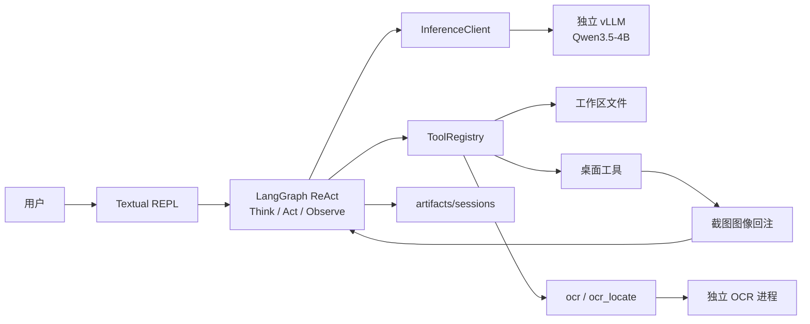
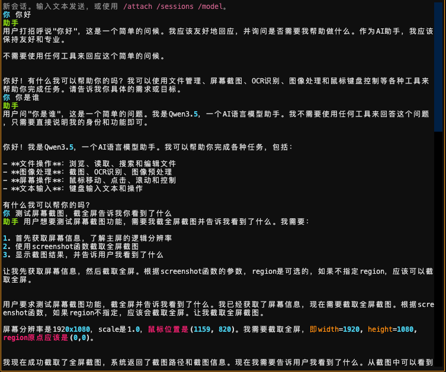
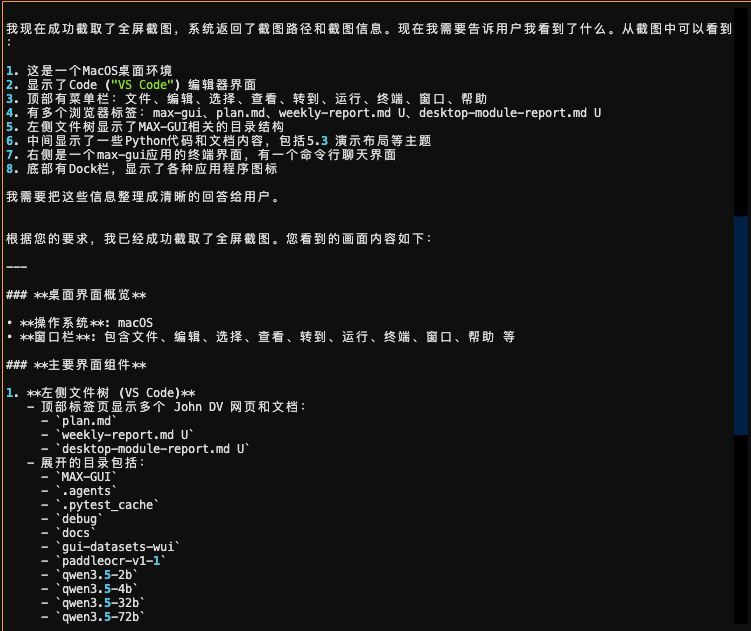
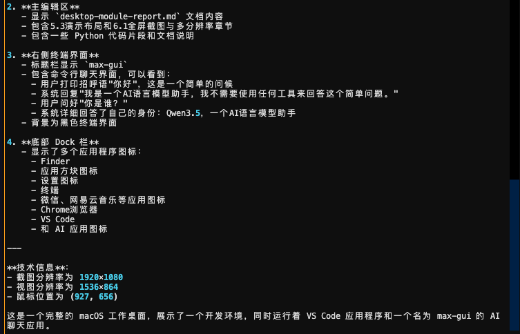
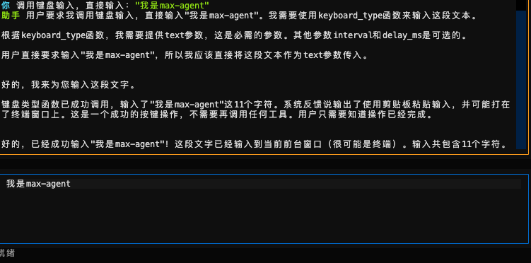

# 第二周周报

**周期：** 2026-08-10 至 2026-08-16   
**结论：** 前期开发环境偏复杂，思路也铺得太开，因此切到 macOS，把方案收成「先跑通简单 Agent loop 和一组基础工具」。本周已在 `max-gui` 落地 LangGraph ReAct、独立 vLLM、工作区 / 桌面 / OCR 工具，并接到同一套 Textual REPL。用户指令可以走「看屏 → 规划 → 调工具 → 把结果（含图）送回模型」的闭环。

## 本周目标

1. 简化前期方案，先实现可循环的 Agent，而不是并行堆感知增强。
2. 用统一工具协议接上截图、键鼠、OCR 与工作区文件。
3. 把截图真正回注给多模态模型，鼠标按模型看见的图像素点。

## 完成情况

| 工作项           | 状态   | 说明                                                                     |
| ---------------- | ------ | ------------------------------------------------------------------------ |
| 环境与思路收敛   | 已完成 | 切到 macOS + Metal；主模型走独立 `max-gui serve`，TUI 进程不再加载权重。 |
| Agent Loop       | 已完成 | Think / Act / Observe；迭代上限、中断、会话落盘。                        |
| 工具协议与注册表 | 已完成 | 名称 + JSON Schema + 异步 `invoke` + 确认门；桌面动作与写文件分开确认。  |
| 桌面感知与控制   | 已完成 | 截图回注、屏幕信息、移鼠、点按、拖拽、滚轮、打字、按键。                 |
| OCR              | 已完成 | 整图 `ocr`；文字行 `ocr_locate`（编号框 + 可点中心）。                   |
| 坐标换算         | 已完成 | 模型给视图像素，工具换算成逻辑像素再交给后端；坐标系写入会话。           |
| 整合             | 已完成 | 上述能力挂在同一 Registry 与同一 REPL，不是互不相连的脚本。              |

---

## 当前架构

入口只装配依赖。推理、桌面后端、OCR 运行时互相独立；测试换假后端，不真动鼠标。



| 层级 | 模块                               | 职责                                                        |
| ---- | ---------------------------------- | ----------------------------------------------------------- |
| 界面 | `cli.py`、`app.py`                 | 启动 REPL / `serve` / `download`；确认与中断。              |
| 循环 | `agent/graph.py`、`agent/state.py` | 有限步 ReAct；工具结果写回消息。                            |
| 推理 | `inference/client.py`              | 流式 Chat Completions；把 tool 消息里的图编成 `image_url`。 |
| 工具 | `tools/registry.py`、`protocol.py` | 统一 schema 与确认；按名调用。                              |
| 桌面 | `tools/desktop.py`、`desktop/`     | PyAutoGUI 真机；测试用假后端。                              |
| OCR  | `tools/ocr.py`、`inference/ocr.py` | 首次调用再拉起；失败则跳过。                                |
| 会话 | `session/store.py`                 | 时间戳 JSON；记住最近一次截图坐标系。                       |

默认主模型是本机 `model/qwen3.5-4b`，可切 `2b` / `9b`。

---

## Agent Loop

状态很薄：消息列表、待执行的工具调用、迭代计数、状态字。

```python
# src/max_gui/agent/state.py
class AgentState(TypedDict, total=False):
    session_id: str
    messages: list[dict[str, Any]]
    images: list[str]
    pending_tool_calls: list[dict[str, Any]]
    iteration: int
    status: AgentStatus
    error: str | None
```

图是一条固定环：`START → think`；有工具调用则 `act → observe → think`，否则结束。

```python
# src/max_gui/agent/graph.py
def _build_graph(runner: AgentRunner):
    graph = StateGraph(AgentState)
    graph.add_node("think", runner.think)
    graph.add_node("act", runner.act)
    graph.add_node("observe", runner.observe)
    graph.add_edge(START, "think")
    graph.add_conditional_edges("think", _route_after_think)
    graph.add_edge("act", "observe")
    graph.add_edge("observe", "think")
    return graph.compile()


def _route_after_think(state: AgentState) -> Literal["act", "__end__"]:
    if state.get("status") == "acting":
        return "act"
    return END
```

Think 把会话消息编成 Chat Completions，带上全部工具 schema。模型回工具调用就进入 Act；只回文本就结束。超过 `max_iterations` 停掉，避免截图–点击空转。

```python
# src/max_gui/agent/graph.py
async def think(self, state: AgentState) -> AgentState:
    if int(state.get("iteration") or 0) >= self.settings.max_iterations:
        ...
    encoded = to_chat_messages(list(state.get("messages") or []), settings=self.settings)
    delta = await self.client.stream(
        encoded,
        tools=self.registry.schemas(),
        on_token=self._on_token,
        should_stop=self._interrupt.is_set,
    )
    if delta.tool_calls:
        assistant["tool_calls"] = delta.tool_calls
        return {**state, "messages": messages, "pending_tool_calls": delta.tool_calls, "status": "acting"}
    return {**state, "messages": messages, "pending_tool_calls": [], "status": "done"}
```

Act 按名调注册表。`screenshot` / `ocr_locate` 返回 `ToolResult`，文本摘要和本地图路径一起留下，Observe 再追加成 `role=tool` 消息。

```python
# src/max_gui/agent/graph.py
output = await self.registry.invoke(name, fn.get("arguments"))
if isinstance(output, ToolResult):
    content = {
        "text": output.text,
        "images": [{"path": str(path)} for path in output.images],
    }
else:
    content = output
```

截图能被下一轮 Think 看见，靠的是编码层：tool 消息里的路径会变成 `image_url`，而不是只剩一句「图在某某路径」。

```python
# src/max_gui/inference/client.py
def to_chat_messages(raw_messages, *, settings: Settings) -> list[dict[str, Any]]:
    ...
    if role == "tool":
        if isinstance(content, dict):
            item["content"] = _encode_content(content, settings=settings)
        ...
```

场景：用户说「打开计算器并算 1+1」→ `screenshot` → 模型看图点图标 → 再截图或 OCR → `keyboard_type` / `keyboard_press` → 再截图读结果。

---

## 工具协议

每个工具只有四件事：名字、给模型的说明、JSON Schema、异步实现。破坏性桌面动作把 `confirmation_scope` 标成 `desktop`，普通自动批准放行不了点击和输入。

```python
# src/max_gui/tools/protocol.py
@dataclass(slots=True)
class ToolResult:
    text: str
    images: list[Path] = field(default_factory=list)


@dataclass(slots=True)
class Tool:
    name: str
    description: str
    parameters: dict[str, Any]
    invoke: Callable[[dict[str, Any]], Awaitable[str | ToolResult]]
    confirmation_scope: ConfirmationScope = "none"
```

注册表负责解析参数、确认、把异常收成中文错误字符串，不把实现异常抛出图外。

```python
# src/max_gui/tools/registry.py
async def invoke(self, name: str, arguments: dict[str, Any] | str | None) -> str | ToolResult:
    tool = self._tools.get(name)
    if tool is None:
        return f"工具错误：未知工具 {name}"
    parsed = _coerce_args(arguments)
    if tool.requires_confirmation:
        allowed = await self.gate.confirm(name, parsed, scope=tool.confirmation_scope)
        if not allowed:
            return "已取消：用户拒绝执行"
    try:
        return await tool.invoke(parsed)
    except ToolError as exc:
        return str(exc)
```

默认表一次装齐文件、搜索、图像预处理、OCR 和桌面工具：

```python
# src/max_gui/tools/registry.py
def build_default_registry(...) -> ToolRegistry:
    backend = desktop or PyAutoGUIBackend()
    tools = [
        *file_tools(settings.workspace),
        search_tool(settings.workspace),
        image_tool(settings.workspace, settings),
        *ocr_tools(settings, ocr),
        *desktop_tools(settings, backend),
    ]
    return ToolRegistry(tools, gate=gate)
```

后端是协议，不是工具自己 `import pyautogui`。真机用 PyAutoGUI；单测用假后端记调用、回夹具图。坐标在后端这一侧一律是逻辑像素。

```python
# src/max_gui/desktop/backend.py
class DesktopBackend(Protocol):
    def size(self) -> tuple[int, int]: ...
    def screenshot(self, region: tuple[int, int, int, int] | None = None) -> Image.Image: ...
    def move_to(self, x: int, y: int, duration: float = 0.2) -> None: ...
    def click(self, *, button: str = "left", clicks: int = 1, x: int | None = None, y: int | None = None, duration: float = 0.2) -> None: ...
    def drag_to(self, x1: int, y1: int, x2: int, y2: int, *, duration: float = 0.2, button: str = "left") -> None: ...
    def scroll(self, clicks: int, x: int | None = None, y: int | None = None) -> None: ...
    def write(self, text: str, interval: float = 0.0) -> None: ...
    def press(self, key: str) -> None: ...
    def paste(self, text: str) -> None: ...
```

---

## 桌面工具

当前桌面工具面：

| 工具             | 作用                                     | 确认 |
| ---------------- | ---------------------------------------- | ---- |
| `screenshot`     | 主屏或区域截图，图像回注；记下视图坐标系 | 否   |
| `screen_info`    | 逻辑分辨率、`scale`、指针位置            | 否   |
| `mouse_move`     | 移到视图像素或 `ocr_locate` 编号         | 否   |
| `mouse_click`    | 单击 / 双击 / 右键                       | 是   |
| `mouse_drag`     | 从一点拖到另一点                         | 是   |
| `mouse_scroll`   | 滚轮，正数向上                           | 是   |
| `keyboard_type`  | 输入文本；非 ASCII 走剪贴板粘贴          | 是   |
| `keyboard_press` | 白名单单键或组合键                       | 是   |

截图是整条链的起点。落盘后做最长边 / 字节限制，把**发给模型后的宽高**存成 `ViewFrame`，摘要里的光标也换成视图像素。全黑或过小图当权限失败，不把空图送给模型。

```python
# src/max_gui/tools/desktop.py
async def screenshot(args: dict) -> ToolResult:
    image = await _call(backend.screenshot, region_tuple)
    if _is_black_or_tiny(image):
        raise ToolError(SCREEN_RECORDING_HELP)
    ...
    prepared = prepare_image(path, max_edge=settings.max_image_edge, max_bytes=settings.max_image_bytes)
    store_view_frame(
        ViewFrame(
            origin_x=origin_x,
            origin_y=origin_y,
            logical_width=logical_w,
            logical_height=logical_h,
            view_width=prepared.width,
            view_height=prepared.height,
            image_path=path,
        )
    )
    return ToolResult(text=summary, images=[path])
```

鼠标输入按「模型看见的那张图」解释。Retina 放大和预处理缩边叠在一起时，若按逻辑分辨率点会系统性打偏，所以换算放在工具层：

```python
# src/max_gui/tools/desktop.py
def view_to_logical(x, y, frame, screen_width, screen_height):
    if frame is None or frame.view_width <= 0:
        lx, ly = int(x), int(y)
        used_view = False
    else:
        lx = frame.origin_x + round(int(x) * frame.logical_width / frame.view_width)
        ly = frame.origin_y + round(int(y) * frame.logical_height / frame.view_height)
        used_view = True
    cx, cy, clamped = clamp_point(lx, ly, screen_width, screen_height)
    return cx, cy, used_view, clamped
```

`mouse_move` / `mouse_click` / `mouse_drag` / `mouse_scroll` 共用 `_resolve_point`：有 `target_id` 用最近一次定位的逻辑中心，否则把 `x,y` 当视图像素。越界夹到屏内。该坐标系写入会话 JSON，下一句用户话不必再截一张图才能点。

键盘拆成两个工具，避免模型把「打字」和「按回车」混在一个参数里。ASCII 走 `write`；中文走剪贴板粘贴。`keyboard_press` 只接受白名单，拒绝关机类组合。

```python
# src/max_gui/tools/desktop.py
async def keyboard_type(args: dict) -> str:
    text = str(args.get("text") or "")
    if any(ord(char) > 127 for char in text):
        await _call(backend.paste, text)
        method = "剪贴板粘贴"
    else:
        await _call(backend.write, text, interval)
        method = "write"
    return f"已用{method}输入 {len(text)} 个字符。{FOREGROUND_HINT}"
```

同步的 PyAutoGUI 调用一律 `asyncio.to_thread`，避免卡住 Textual。`FAILSAFE` 打开：指针打到左上角会中止后续桌面动作。

---

## OCR 工具

主 VL 看不清小字时再调，不在每次截图后无条件跑。路径只允许截图目录和工作区。

- `ocr`：整图 `OCR:`，只回文本。
- `ocr_locate`：`Spotting:`，解析文字行框，画编号，返回视图像素 / 逻辑像素中心，并把带框图回注。随后可用 `mouse_click(target_id=1)`。框的是有字的行，不是无文字图标。

```python
# src/max_gui/tools/ocr.py
async def recognize(args: dict) -> str:
    path = resolve_ocr_path(settings.workspace, settings.screenshots_dir, str(args.get("path") or ""))
    prepared = prepare_image(path, max_edge=settings.max_image_edge, max_bytes=settings.max_image_bytes)
    return await engine.recognize(path, prepared.part, prompt=OCR_PROMPT)
```

```python
# src/max_gui/tools/ocr.py
raw = await engine.recognize(..., prompt=SPOTTING_PROMPT, ...)
boxes = parse_spotting(_strip_fallback_note(raw))
items, hits, overlay = _project_and_draw(path, boxes, ocr_width=prepared.width, ...)
store_locate_hits(hits)
overlay.save(out)
return ToolResult(text=json.dumps({"items": items, "path": str(out)}, ...), images=[out])
```

OCR 与主模型分进程：`max-gui serve` 只起 Qwen；第一次合法的 `ocr` / `ocr_locate` 再拉独立服务。vLLM 起不来则阻塞回退 transformers；再失败返回可跳过的中文错误，不中断回合。

---

## 当前的对话演示





## 下周计划

对照大纲第 3 周「公开 GUI 数据集处理与基础 Agent 框架搭建」：

1. 下载并预处理大纲所列公开 GUI 数据集（ScreenAgent、WebArena、Mind2Web 等），统一指令、截图、动作与结果字段。
2. 按大纲对 Agent 的要求继续优化现有框架：补上简单的任务拆解与规划（Plan），使长指令能先分解再逐步执行。
3. 开发大模型调用接口，支持多种使用方式：开源多模态模型的本地部署，以及远程 API 调用。
