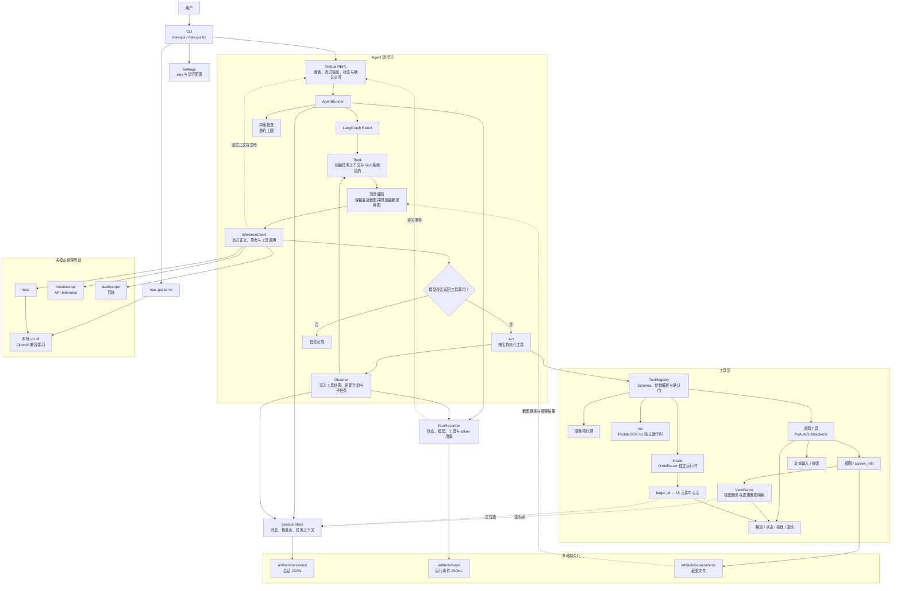

# 第三周周报

**周期：** 2026-08-17 至 2026-08-23  
**项目：** 基于多模态大模型的桌面 GUI 智能体开发与优化  
**本周结论：** 已完成公开 GUI 数据集处理方案与基础多模态 Agent 框架搭建，形成了可运行的端到端桌面 GUI 智能体原型，并完成定位、坐标核验、运行日志与 token 可观测性等配套能力建设。

## 一、本周目标与完成情况

| 大纲第三周目标                    | 完成状态             | 实际成果                                                                                                      |
| --------------------------------- | -------------------- | ------------------------------------------------------------------------------------------------------------- |
| 调研、下载并预处理公开 GUI 数据集 | 已完成调研与处理方案 | 完成 ScreenAgent的数据形态、用途及统一 JSONL 格式设计。                                                       |
| 搭建基础多模态 Agent 框架         | 已完成               | 已落地 LangGraph ReAct 循环，覆盖 Think → Act → Observe；具备中断、最大迭代限制、会话恢复与简单任务规划。     |
| 实现简单任务拆解与规划            | 已完成并增强         | 系统状态维护 `plan` 与 `current_subtask`；每轮模型调用注入中文 GUI 操作契约，要求先观察、再执行、动作后核验。 |
| 支持本地部署与 API 调用           | 已完成               | 支持本地 vLLM、魔搭 API-Inference 与阿里云百炼 DashScope 三类后端，并统一通过工具调用协议驱动桌面操作。       |

## 二、已完成的系统能力

### 1. 端到端 GUI Agent 闭环

用户指令已可进入“屏幕感知 → 规划 → 工具调用 → 新截图反馈 → 下一轮决策”的闭环，而非只停留在基础框架或独立脚本层面。

- Textual REPL 提供交互入口，支持新建会话、会话切换、附图与中断。
- LangGraph 负责固定的 ReAct 执行流；模型返回工具调用时进入执行与观察，返回正文时结束。
- 截图及动作后的新截图会回注到下一轮多模态推理，使模型能依据最新界面继续判断。
- 真实桌面控制基于 PyAutoGUI，支持移动、点击、拖拽、滚轮、输入与组合按键。

### 2. 感知、定位与坐标安全机制

- 支持全屏或区域截图，并将模型看到的视图像素映射回 macOS 逻辑像素，避免 Retina 缩放造成误点。
- 整图 OCR 用于文字读取；OmniParser用于UI识别，为 UI 元素绘制编号框，模型可通过 `target_id` 选择控件。
- 鼠标移动后必须查看带红色光标的回注截图，再进行点击或拖拽；成功全屏截图会清空旧定位结果，避免在界面变化后使用过期编号。
- 系统提示显式注入真实操作系统及快捷键约定；macOS 下拒绝 `windows` 键并提示使用 `command`。

### 3. 运行可观测性与可复盘能力

- 每次用户任务生成独立 `run_id`，在 `artifacts/runs/` 以 JSONL 记录状态流转、模型调用、工具调用、耗时和运行结果。
- TUI 默认显示运行监控面板，可查看当前轮次、子任务、活动模型或工具、累计耗时及成功/失败统计。
- 支持记录并展示模型输入、输出与总 token 用量；后端未返回用量时明确显示“未知”，不以 0 替代。
- 会话快照、运行事件和截图分别保存，运行日志不重复写入推理正文、键盘输入或截图字节，降低本地排障记录的敏感信息冗余。

## 三、当前架构概览

该架构已经实现“模型感知界面并通过真实键鼠执行”的核心链路。

## 四、下周计划

1. **执行 LoRA 微调任务**：基于已完成的数据集处理方案准备训练与验证数据，按 LoRA 微调规格运行训练流程，并完成模型加载验证。
2. **设计系统评测**：设计覆盖基础桌面操作、任务规划、UI 定位与结果核验的测试任务集，定义任务成功率、动作格式合规率、定位准确性与推理开销等评测指标。
3. **进一步优化系统**：结合真实桌面任务的运行记录，优化提示词、任务拆解、定位结果使用和异常处理流程，提升任务执行稳定性。
4. **项目收尾**：整理代码、文档、配置说明、测试结果与演示材料，形成可复现的项目交付内容。

## 五、阶段性结论

第三周已完成公开 GUI 数据集处理方案、基础 Agent 框架、端到端桌面执行闭环、UI 定位与 OCR、坐标核验、会话与运行日志持久化，以及推理 token 用量展示等工作，形成了完整的桌面 GUI 智能体基础能力。
