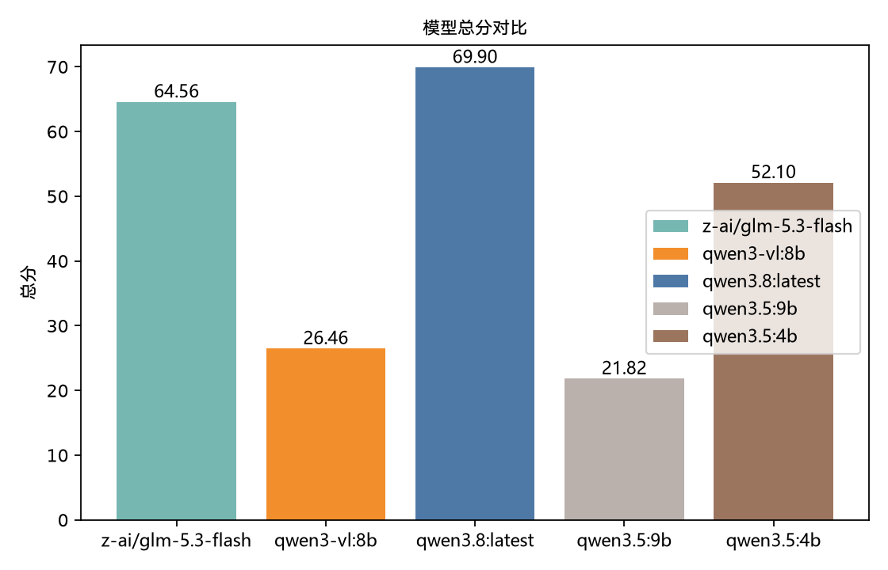
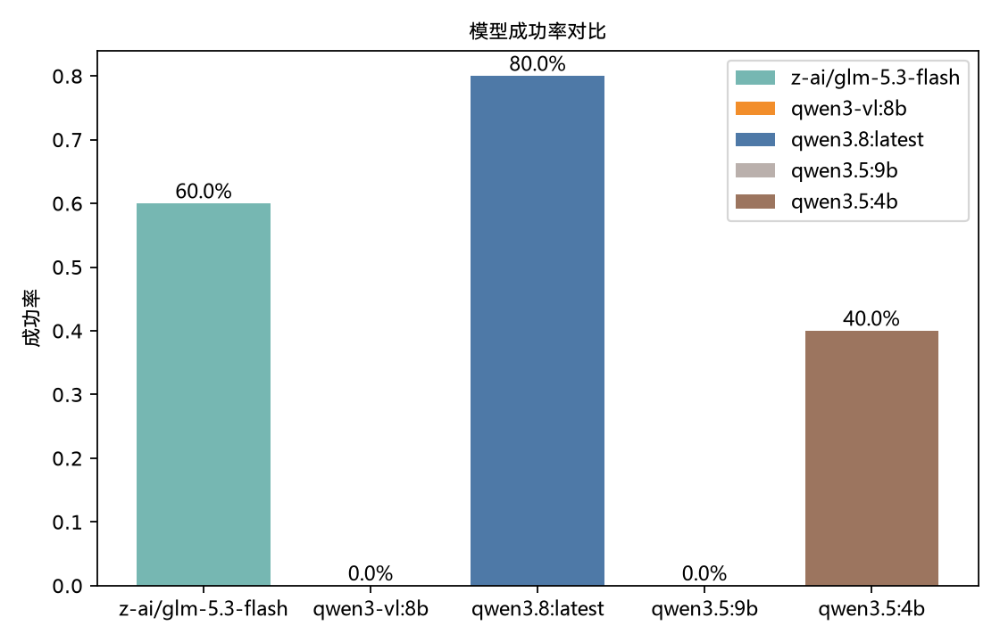
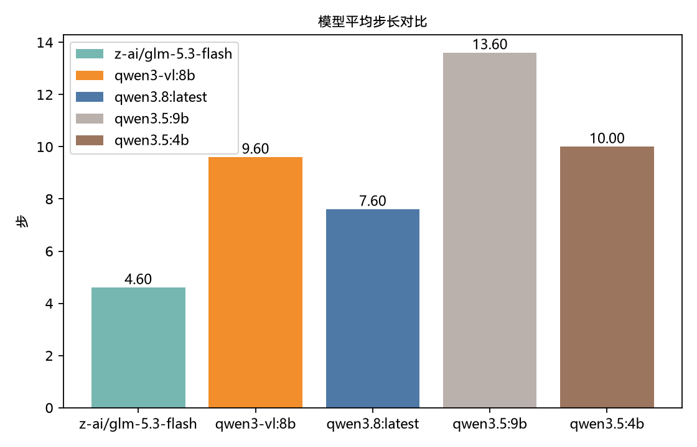
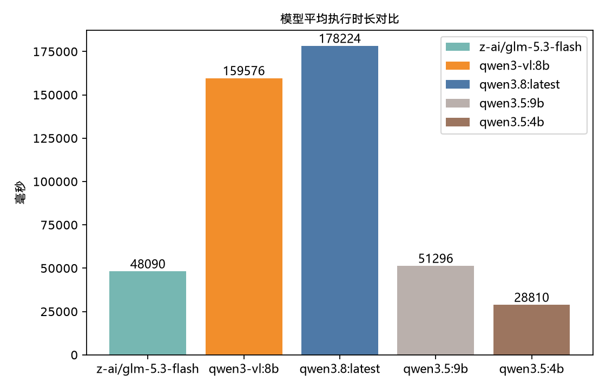
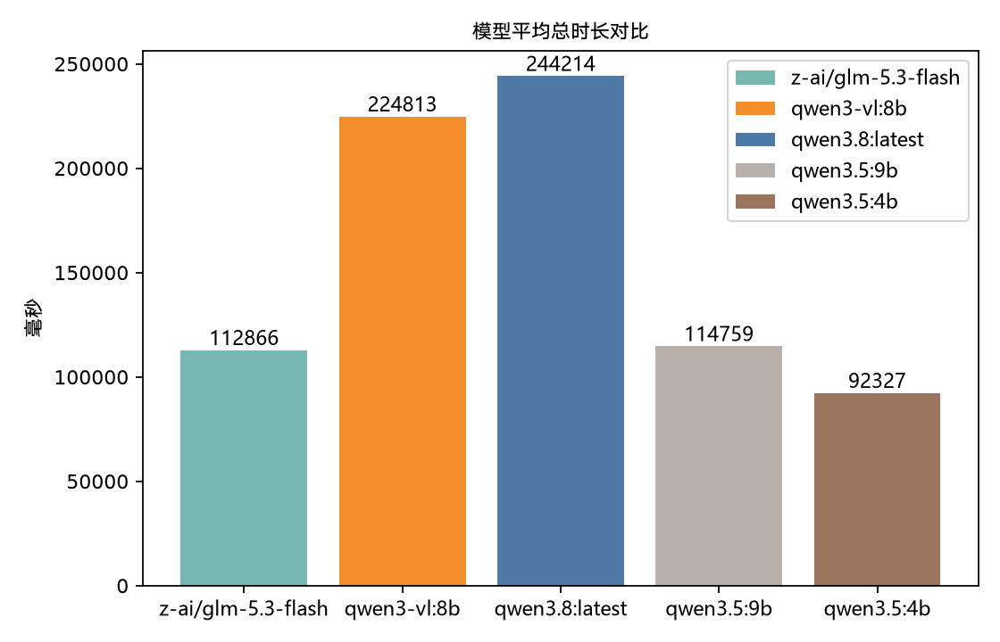
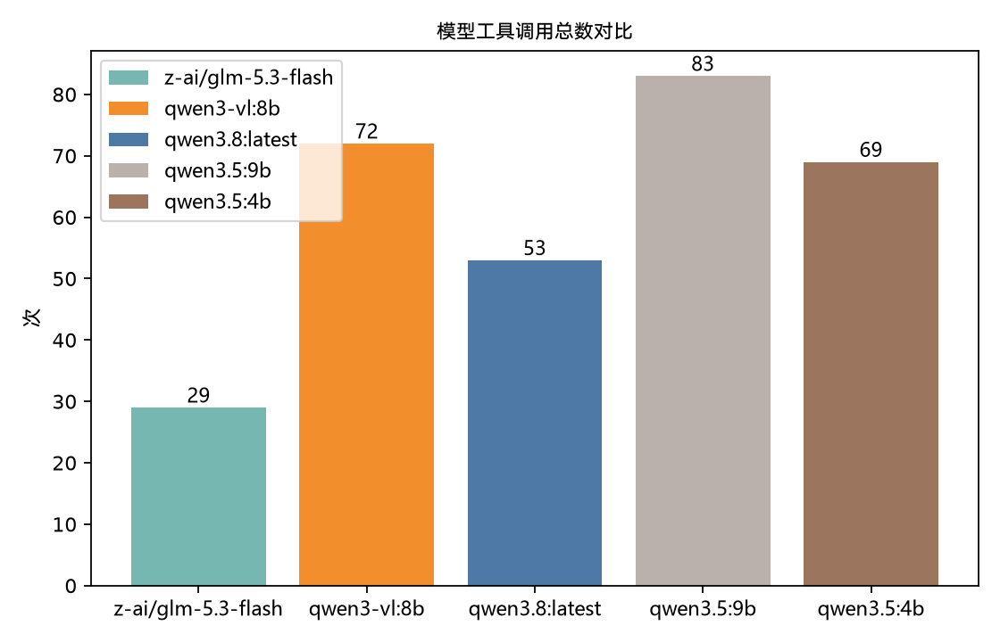
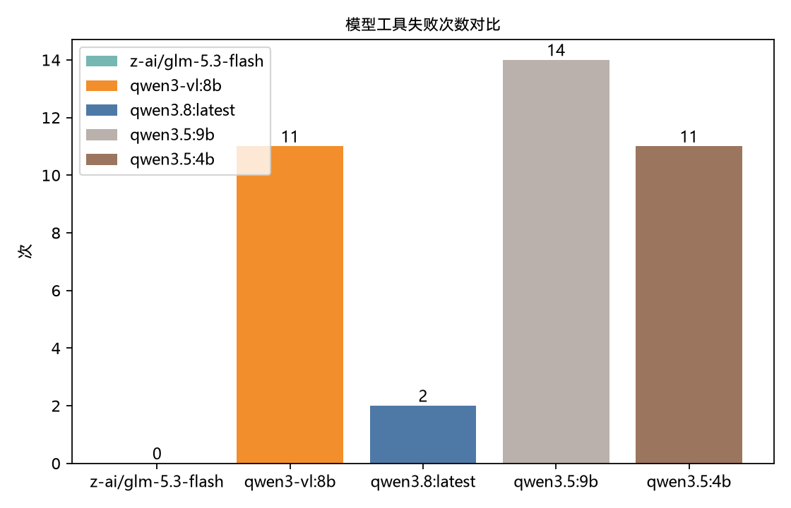
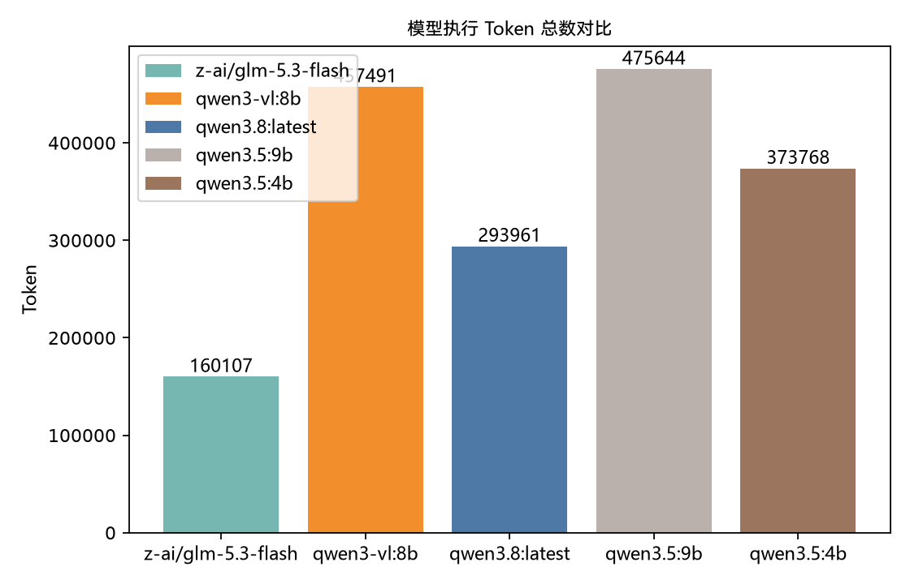

# 基于多模态大模型的桌面 GUI 智能体开发与优化：基准评测报告

评测日期：2026 年 8 月 31 日

## 一、结论摘要

本报告评估模型驱动 MAX GUI Agent 在真实 macOS 桌面上观察界面、调用工具、完成任务并留下可见结果的能力。评测使用 5 个执行模型，每个模型运行同一组 5 项任务，共得到 25 个“模型 × 任务”样本；本批次 25 项前置检查均通过，没有环境阻断或安全阻断，评分覆盖率为 100%。

本批次的独立截图评审结果为 9 项 `pass`、12 项 `fail`、4 项 `indeterminate`，没有评审服务错误，整体任务成功率为 36.0%。本次量化记录中，`qwen3.8:latest` 以 80.0% 的成功率和 69.90 的平均总分排名第一；`z-ai/glm-5.3-flash` 通过 3 项，成功率 60.0%，平均总分 64.56；`qwen3.5:4b` 通过 2 项，成功率 40.0%。`qwen3-vl:8b` 与 `qwen3.5:9b` 在本轮均未获得 `pass`。

这里的“成功”只表示最终截图中的可见证据满足该题验收规则。模型自行声明完成、Agent 执行终态和截图验收是三类不同信息：即使执行终态为 `agent_error`、`model_limit` 或 `timeout`，只要终态截图已经呈现正确结果，仍可判为成功；反过来，即使 Agent 正常结束并声明完成，只要截图不能证明结果，也不计成功。

## 二、评测目标与适用范围

该基准用于回答三个问题：

1. GUI Agent 能否在真实桌面环境中完成一组基础的观察、输入和应用操作任务。
2. 最终桌面状态是否提供了足以独立验收的可见证据。
3. 在效果之外，不同执行模型的耗时、动作、工具调用、工具失败和 Token 成本有何差异。

评测覆盖浏览器、Terminal、Calculator、Reminders 和 WeChat 五类常见桌面场景，同时包含只读任务与个人写入任务。它适合比较当前任务集和当前桌面条件下的模型表现，不用于证明模型具备通用桌面自动化能力，也不用于单独评估视觉定位、点击精度或每一步动作的原子正确率。

本批次比较的执行配置如下：

| 执行推理服务 | 执行模型 | 独立评审服务 | 独立评审模型 | 轮次 | 单题模型调用上限 | 单题执行时限 |
| --- | --- | --- | --- | ---: | ---: | ---: |
| 在线推理服务 | `z-ai/glm-5.3-flash` | 在线推理服务 | `z-ai/glm-5.3-flash` | 1 | 20 | 300 秒 |
| 本地Ollama推理服务 | `qwen3-vl:8b` | 在线推理服务 | `z-ai/glm-5.3-flash` | 1 | 20 | 300 秒 |
| 本地Ollama推理服务 | `qwen3.8:latest` | 在线推理服务 | `z-ai/glm-5.3-flash` | 1 | 20 | 300 秒 |
| 本地Ollama推理服务 | `qwen3.5:9b` | 在线推理服务 | `z-ai/glm-5.3-flash` | 1 | 20 | 300 秒 |
| 本地Ollama推理服务 | `qwen3.5:4b` | 在线推理服务 | `z-ai/glm-5.3-flash` | 1 | 20 | 300 秒 |

测试时确保各模型面对的窗口布局完全一致、鼠标焦点保持一致，鼠标起始位置也大致一致，以尽量减少环境差异对坐标判断和操作路径的影响。

## 三、五项任务定义与验收标准

每项任务都由“前置条件、发送给 Agent 的任务提示、风险级别、截图验收规则和 300 秒时限”组成。下表给出了阅读和复现本评测所需的完整任务定义。

| 任务 | 风险 | 前置条件 | Agent 必须完成的操作 | 独立截图验收方式 |
| --- | --- | --- | --- | --- |
| `weather` | 只读 | 网络可用；浏览器可启动；不得登录或提交表单 | 在浏览器中搜索北京天气；必须依据搜索结果中的可见信息汇报，不得凭记忆回答；查看最终截图后结束任务 | 截图必须清楚显示北京的天气预报信息；信息不可见或被遮挡时判为 `indeterminate` |
| `terminal` | 只读 | Terminal 可启动 | 仅运行 `whoami`；观察输出精确为 `flkbme` 后结束任务；不得输入其他命令 | 截图必须同时显示 Terminal、命令 `whoami` 和精确输出 `flkbme`，否则判为 `fail` 或 `indeterminate` |
| `calculator` | 只读 | Calculator 可启动 | 在 Calculator 中完成 `1+1=2`；仅在最终截图清楚显示结果 `2` 后结束任务 | 截图必须显示 Calculator 和结果 `2`；数字无法辨认时判为 `indeterminate` |
| `reminders` | 个人写入 | Reminders 可启动；用户授权创建一条个人提醒 | 新建标题为“你好我是MAX”的提醒；确认最终截图显示完整标题后结束任务 | 截图必须显示 Reminders 中完整提醒标题“你好我是MAX”，否则判为 `fail` 或 `indeterminate` |
| `wechat` | 个人写入 | WeChat 已登录；用户已手动打开文件传输助手 | 在文件传输助手中发送“你好我是MAX”；最终截图可见该文本后结束任务 | 截图必须同时显示文件传输助手和完整文本“你好我是MAX”；无法确认收件人或文本时判为 `indeterminate` 
## 四、运行环境与启动前提

评测只能在 macOS 上执行。运行终端需要获得屏幕录制和辅助功能权限，系统中需要安装并能够打开 Google Chrome、Terminal、Calculator、Reminders 和 WeChat。天气任务依赖网络；WeChat 必须已经登录，并由用户提前打开文件传输助手。

独立截图评审固定使用在线推理服务提供的 `z-ai/glm-5.3-flash`，因此运行前必须提供有效的服务密钥。执行 Agent 可以使用其他推理服务和模型，但切换执行模型不会改变评审模型。

每道题启动前，CLI 会提示用户把对应窗口切到前台并再次确认前置条件。用户按任意键后才开始执行；按 `Esc` 会跳过当前题。程序自身的自动预检只验证当前系统是否为 macOS，以及个人写入是否得到授权；它不会读取应用数据库、账号、联系人或其他个人数据，因此应用是否已启动、账号是否登录、窗口是否正确均由用户确认和最终截图共同负责。

## 五、一次任务如何执行

每个模型按照 `weather → terminal → calculator → reminders → wechat` 的固定顺序运行。单题流程如下：

1. 读取版本化任务定义，为当前轮次生成唯一标识，并显示任务前置条件、执行模型、模型调用上限和时限。
2. 等待用户把目标窗口前置并确认；用户拒绝或按 `Esc` 时不调用模型，直接记为安全阻断。
3. 检查 macOS 和个人写入预算；检查未通过时记为环境阻断或安全阻断，不进入模型失败率。
4. 创建新的 Agent 会话，向 Agent 发送该题完整提示词。Agent 可以使用键鼠操作工具、截图工具和OCR工具；动作工具、参数校验、确认门和 Agent 通用约束继续生效。
5. Agent 执行到正常结束、出现错误、达到 20 次逻辑模型调用或达到 300 秒，以先发生者为准。推理服务在一次逻辑调用内部的重试不额外占用 20 次额度。
6. 达到 300 秒时先请求 Agent 温和中断；5 秒内仍未收尾则强制取消。对应执行终态分别记录为 `timeout` 或 `timeout_forced`。达到模型调用上限记录为 `model_limit`。
7. 执行终止后重新截取当前桌面，优先把这张 `post_termination_snapshot` 作为终态证据；如果截取失败，才回退到 Agent 最后一张有效观察截图。
8. 等待 60 秒冷却后，把单张终态截图、执行日期和该题专用验收规则发送给独立评审模型。评审模型不获得工具，也看不到 Agent 的完成声明，只能依据截图中的可见内容判断。
9. 保存执行状态、评审结论、截图来源、运行日志、耗时、动作、模型调用、工具调用、工具失败、执行 Token、评审 Token 和评分分项，最终生成一份原子 JSON 运行记录。

## 六、独立验收与成功判定

评审模型必须且只能返回以下三个结论之一：

- `pass`：截图中存在足以确认任务目标已经完成的可见证据。
- `fail`：截图中的可见状态不满足任务目标，或能够确认结果错误。
- `indeterminate`：截图缺失、被遮挡、模糊，或无法确认目标窗口、收件人、文本等关键证据。

评审输出采用严格 JSON，字段固定为 `verdict`、`visible_evidence` 和 `reason`；额外字段、Markdown 代码围栏或非法值都会被视为评审格式错误。评审请求最多总尝试三次，仅对尚未产生流式输出的可重试错误进行指数退避。全部尝试失败时记录原始 `review_error`，不会伪造成截图验收失败。

单题成功条件为：

```text
success = 前置检查为 ready 且 review_verdict == pass
```

实际实现中，只有进入执行阶段的 `ready` 任务才进入成功率分母；环境阻断和安全阻断不算模型失败。`agent_claimed_complete` 仅用于诊断，不是成功门槛。执行终态也不直接决定成功，因此“Agent 正常结束”不等于“任务成功”，“Agent 执行报错”也不必然等于“任务失败”。

## 七、总分如何计算

本报告采用一套固定的 0–100 分评分规则，当前规则由六个分项相加：

| 分项 | 权重 | 计算方式 |
| --- | ---: | --- |
| 效果 | 70 | `pass` 得 70 分；`indeterminate` 得 35 分；`fail`、无截图或评审错误得 0 分 |
| 执行时间 | 10 | `10 × clamp(1 - 执行毫秒数 / 300000)` |
| 动作步长 | 5 | `5 × clamp(1 - 动作数 / 10)` |
| 工具调用 | 5 | `5 × clamp(1 - 工具调用数 / 15)` |
| 工具可靠性 | 5 | `5 × clamp(1 - 工具失败数 / max(工具调用数, 1))` |
| 执行 Token | 5 | `5 × clamp(1 - 执行 Token / 100000)` |

其中 `clamp` 会把结果限制在 0–1。耗时、动作、工具调用和 Token 越少，效率分越高；超过参考值后对应分项最低为 0，不产生负分。

总分与成功率表达不同含义：成功率是严格的任务通过比例，只有 `pass` 才算成功；总分允许 `indeterminate` 获得 35 分效果分，并继续累计效率分。因此不能用“总分大于某个值”替代任务成功判定。任一必需效率指标缺失时，单题总分保持 `null`；只有同一批次全部任务都有完整总分时，才计算模型平均总分。本批次五个模型的评分覆盖率均为 100%。

## 八、五模型总体结果

| 模型 | 总分 | 成功率 | 通过任务数 | 平均步长 | 平均执行时长（毫秒） | 平均总时长（毫秒） | 工具调用总数 | 工具失败次数 | 执行 Token 总数 |
| --- | ---: | ---: | ---: | ---: | ---: | ---: | ---: | ---: | ---: |
| `z-ai/glm-5.3-flash` | 64.56 | 60.0% | 3/5 | 4.60 | 48090 | 112866 | 29 | 0 | 160107 |
| `qwen3-vl:8b` | 26.46 | 0.0% | 0/5 | 9.60 | 159576 | 224813 | 72 | 11 | 457491 |
| `qwen3.8:latest` | 69.90 | 80.0% | 4/5 | 7.60 | 178224 | 244214 | 53 | 2 | 293961 |
| `qwen3.5:9b` | 21.82 | 0.0% | 0/5 | 13.60 | 51296 | 114759 | 83 | 14 | 475644 |
| `qwen3.5:4b` | 52.10 | 40.0% | 2/5 | 10.00 | 28810 | 92327 | 69 | 11 | 373768 |

本次保存的量化结果中，`qwen3.8:latest` 的成功率和总分均为最高；它通过天气、Terminal、Calculator 和 WeChat，仅 Reminders 在达到 300 秒后验收失败。`qwen3.5:4b` 通过 Terminal 和 Calculator；另外两个本地模型没有通过任务。本轮的结果大体上符合单独调试时的效果。

但从模型能力、服务形态和实际运行观感综合判断，`z-ai/glm-5.3-flash` 在服务稳定时理论上应获得最高分，并成为综合表现最好的模型。在线推理服务的速度和模型智能水平预期都优于受本机算力约束的本地模型；实际操作过程中，它对界面的理解、工具选择和坐标定位也是最稳定、最正确的。其本次总分只有 64.56，主要不是因为操作能力不足，而是在线推理服务的免费资源存在限流和可用性波动：5 项执行中有 4 项记录为 `agent_error`，运行日志显示多次 HTTP 429。系统已经针对推理服务失败设计了最多三次请求的指数级退避重试，但重试耗尽后仍会中断当前 Agent，因此同一模型在不同运行时可能得到不同结果。

本次没有对每个模型重复多轮后取平均。在线模型受免费资源限流影响，一轮任务可能多次等待退避并最终失败，重复整套测试会耗费大量时间；本地模型虽然不受云端限流影响，但多模态推理速度较慢，多轮运行同样将耗费大量时间。

在本地模型中，`qwen3.8:latest` 是能力更强的模型，视觉理解、任务规划和工具选择明显优于其余本地模型。它的成功率达到 80.0%，工具调用总数为 53 次、工具失败仅 2 次，说明完成任务所需的决策更有效；代价是推理速率更慢，平均执行时长达到 178.22 秒，为五个模型中最长。这里的“效率更高”主要指更高的任务完成效率和更少的无效工具行为，不代表单位时间推理更快。

`qwen3.5:4b` 本次获得 40.0% 的成功率，但这好于它在多数实际运行中的常态表现。其中一个关键偶然因素是：它在难度较高的 Calculator 任务中选择了键盘操作完成 `1+1=2`，规避了通过视觉坐标逐个点击计算器按键时较高的定位失败率，因此成功通过验收。这次成功说明更合适的交互路径能够降低 grounding 压力，但不能据此认为 4B 模型稳定优于 9B 模型。结合其他运行观感，`qwen3.5:4b` 与 `qwen3.5:9b` 通常表现相近，两者都容易在纯视觉定位、工具选择和错误恢复上失去稳定性；本次 4B 的较高分数应视为特定操作路径带来的单轮结果。

本地模型的典型失败模式是未能可靠理解截图中的控件与空间关系，轨迹表现为近似“胡乱调用工具”和乱猜坐标：它们会反复调用不合适的工具，在错误操作后继续试探，最终达到 20 次模型调用上限。`qwen3-vl:8b`、`qwen3.5:9b` 和 `qwen3.5:4b` 的 15 个任务中共有 9 个以 `model_limit` 结束；它们分别记录 11、14 和 11 次工具失败。这说明限制它们的并不只是执行速度，而是纯视觉 GUI 环境中的观察、定位与动作决策没有稳定闭环。

25 项执行终态中，10 项为 `completed`、9 项达到 `model_limit`、5 项为 `agent_error`、1 项达到 `timeout`。这组分布说明本批次不仅存在截图效果差异，也存在明显的执行收敛和运行稳定性差异：在线模型主要受服务可用性影响，较弱的本地模型则主要受视觉定位和工具决策能力影响。

## 九、指标对比图与解读

以下图表均比较同一批次的 5 个模型，因此统一使用从零开始的柱状图。颜色只用于区分模型，精确值以柱顶标签和总体结果表为准。

### 总分

`qwen3.8:latest` 以 69.90 排名第一，`z-ai/glm-5.3-flash` 以 64.56 排名第二；由于 `indeterminate` 仍可获得部分效果分，总分排名不能替代严格成功率。



### 成功率

成功率只统计 5 个已测量任务中的 `pass`。`qwen3.8:latest` 为 4/5，`z-ai/glm-5.3-flash` 为 3/5，`qwen3.5:4b` 为 2/5；其余两个模型为 0/5。



### 平均步长

平均步长统计动作工具调用数量，越低只表示执行动作更少，不代表任务一定完成。`z-ai/glm-5.3-flash` 平均 4.60 步最低，`qwen3.5:9b` 平均 13.60 步最高。



### 平均执行时长

平均执行时长仅反映 Agent 执行阶段。`qwen3.5:4b` 最短，为 28.81 秒；`qwen3.8:latest` 最长，为 178.22 秒。低耗时可能来自快速完成（glm-3.5-flash），也可能来自计算速率更快但实际效果并不好（qwen3.5:9b, 4b）。



### 平均总时长

平均总时长从单题开始计到独立评审结束，包含 60 秒评审冷却、截图评审和可能的中断收尾，不是纯执行耗时。`qwen3.5:4b` 平均 92.33 秒最低，`qwen3.8:latest` 平均 244.21 秒最高。这个结果符合本地部署计算速率的预期。



### 工具调用总数

工具调用总数覆盖 5 项任务。`z-ai/glm-5.3-flash` 共 29 次最低，`qwen3.5:9b` 共 83 次最高；调用更少只有在任务通过时才代表更高效率。



### 工具失败次数

`z-ai/glm-5.3-flash` 没有记录工具失败，`qwen3.8:latest` 记录 2 次；`qwen3.5:9b` 的 14 次工具失败为本批次最高。该指标描述工具层可靠性，这三种本地模型的工具失败大多数为鼠标移动工具（mouse_move），多次重试移动鼠标到无效的地方。



### 执行 Token 总数

执行 Token 不包含独立评审 Token。`z-ai/glm-5.3-flash` 为 160107，最低；`qwen3.5:9b` 为 475644，最高。不同模型和推理服务的分词方式可能不同，但是基本符合模型在完成任务时的轮次，`glm-5.3-flash`和`qwen3.8:latest`较稳定地在数轮次中较为准确地完成任务，而另外三个模型则存在大量的无效重试。



## 十、限制与不确定性

- 没有实行多轮取平均，是因为在线推理服务的免费资源会出现限流和退避等待，而本地模型的多模态计算速度较慢，重复整套测试所需时间过高。
- 在线推理服务与本地Ollama推理服务的运行环境不同，模型规模、量化方式和 Token 统计口径也可能不同，因此耗时与 Token 差异不能完全归因于模型架构。
- 总分中的 300 秒、10 个动作、15 次工具调用和 100000 Token 是版本化参考值，不是通过真实用户研究得到的自然阈值。总分适合本版本内比较，不应跨评分版本直接对比。
- 当前验收只检查单张终态截图，不验证完整轨迹中的误点击、绕路、潜在副作用或中间状态。
- Reminders 和 WeChat 是真实个人写入任务，系统不自动清理其副作用；实际复现前必须手动确认环境可行。

## 十一、最终结论

在本次单轮真实 macOS 测试和固定截图评审条件下，`qwen3.8:latest` 获得最高量化成绩，成功率为 80.0%，平均总分为 69.90；但结合在线与本地推理条件、HTTP 429 限流证据和实际操作观感，服务稳定时 `z-ai/glm-5.3-flash` 理论上仍应具有最高的综合表现。本次记录更准确地反映了“模型能力 × 推理服务稳定性 × 本地计算速度”的共同结果，而不是单纯的模型排行榜。

更重要的结论是，模型能力会大幅影响纯视觉 GUI 操作环境中的 grounding 能力。更强的模型能够从截图中理解控件语义和空间关系，把目标映射到更可靠的坐标与工具调用，并在界面变化后及时修正动作；较弱模型则更容易猜测坐标、误用工具并陷入无效循环。即使窗口布局、鼠标焦点和起始位置已尽量保持一致，这种差异仍然明显，说明纯视觉 GUI Agent 的最终效果高度依赖底层模型的视觉理解、空间定位、规划和错误恢复能力。
