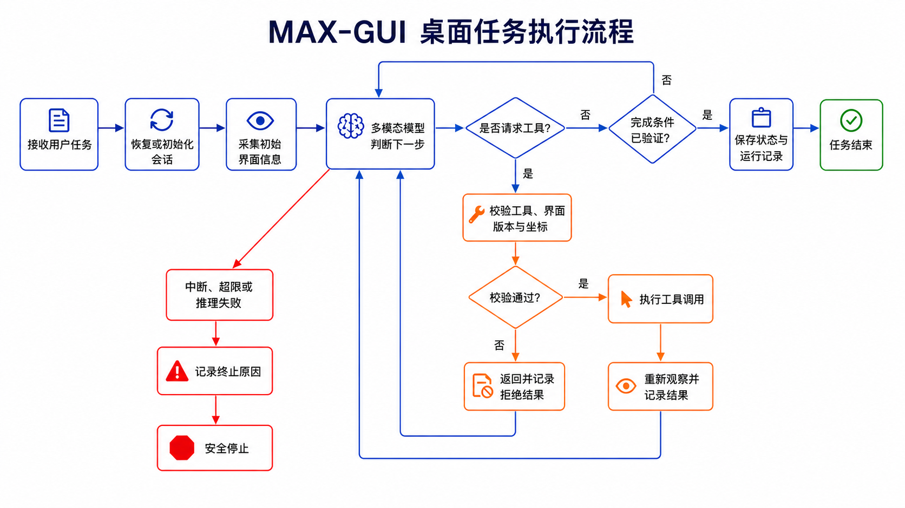
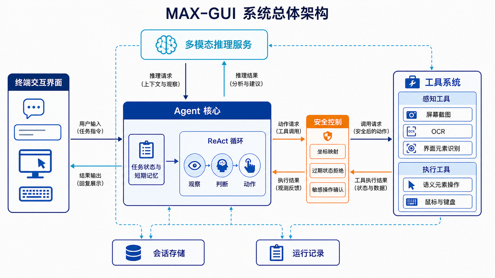

# 基于多模态大模型的桌面 GUI 智能体开发与优化：项目最终报告

> 报告日期：2026 年 9 月 1 日
> 项目定位：能够观察屏幕、理解任务并通过键盘和鼠标操作 macOS 桌面的 GUI 智能体原型

## 技术总结

本项目围绕“让大模型像人一样观察并操作图形界面”完成了一套可运行的桌面 GUI 智能体原型。用户只需用自然语言描述目标，系统就会截取当前屏幕，将任务和截图交给能够同时理解文字与图像的多模态大模型分析，再调用受控的鼠标、键盘、截图和界面定位工具执行操作。每次动作之后，系统会重新观察界面并判断是否继续，而不是一次性生成整段固定脚本。

项目现阶段最完整的成果集中在桌面感知与控制、模型驱动的任务循环、多种推理服务接入、操作安全、运行记录和真实桌面基准评测。最新基准评测在相同窗口布局和操作条件下，让 5 个模型分别执行天气查询、终端命令、计算器、提醒事项和微信消息 5 项任务。单轮量化结果中，`qwen3.8:27b` 以 80.0% 的成功率和 69.90 分排名第一。但结合服务形态和实际操作观感，在线的 `glm-5.3-flash` 在推理服务稳定时应具有更好的综合表现。

本次项目也验证了一个关键结论：在主要依靠截图和坐标完成操作的环境中，模型能力会显著影响 GUI grounding。这里的 grounding 是指模型能否把“点击发送按钮”这样的语言目标，准确对应到屏幕上的实际控件和位置。能力较强的模型更容易理解控件语义、选择合适工具并在错误后修正。能力较弱的模型则常常猜测坐标、重复调用错误工具，最终达到调用上限。

## 1. 项目目标与应用场景

传统自动化脚本通常依赖固定坐标、固定页面结构或预先写好的流程，一旦窗口位置、按钮样式或页面状态发生变化，就容易失效。GUI 智能体希望解决的是更一般的问题：让模型直接理解当前屏幕，根据用户目标临时规划操作，并在界面变化后继续完成任务。

本项目的目标是实现一个端到端原型，使系统具备以下完整链路：



这类系统可用于办公自动化、软件测试、无障碍交互和重复性桌面操作。项目首先保证基础闭环真实可运行，再通过安全约束、运行记录和评测机制分析其可靠性。

## 2. 系统如何工作

系统主体使用 Python 实现，并提供终端交互界面。核心执行方式采用 ReAct 循环，即模型在每一轮先根据任务和屏幕状态进行判断，再选择一个动作，观察动作结果后进入下一轮。与一次性生成完整操作序列相比，这种方式能够适应窗口弹出、页面加载和控件位置变化。



模型推理采用统一的对话生成接口，因此同一套 Agent 逻辑可以接入多种OpenAI兼容格式的推理服务。不同服务的模型能力、速度、限流和工具调用兼容性不同，这些差异会直接影响任务表现。

### 2.1 主要执行流程

系统的主要执行逻辑如下所示。这是对实际实现的流程抽象，其中的函数名用于表达职责，不与源码接口一一对应。模型输出、工具结果、截图坐标系和任务上下文会在检查点持久化，用于中断恢复和失败复盘。

```python
async def max_gui_agent(user_task, session):
    """执行桌面任务，返回终态。"""
    # 恢复中断任务，或初始化新会话和首张界面截图。
    state = restore_checkpoint(session) or initialize_state(user_task)
    recorder = create_run_recorder(session)
    state.observation = await observe_desktop()

    while True:
        # 每轮推理前先检查中断信号和迭代上限。
        stop_reason = check_interrupt_or_iteration_limit(state)
        if stop_reason:
            recorder.record_stop(stop_reason)
            return save_checkpoint(state, status="stopped")

        # 组装任务、当前界面和历史结果，让模型决定下一步。
        context = build_context(user_task, state)
        try:
            decision = await infer_next_step(context)
        except InferenceError as error:
            recorder.record_error(error)
            return save_checkpoint(state, status="error")

        # 没有工具调用时，只有通过完成验证才能结束。
        if not decision.tool_calls:
            if state.completion_required and not completion_verified(state):
                save_checkpoint(state, status="thinking")
                continue
            return save_checkpoint(state, status="done")

        # 依次校验工具请求，并阻止同轮重复执行副作用动作。
        tool_results = []
        for tool_call in decision.tool_calls:
            if already_executed_side_effect(tool_results, tool_call):
                result = reject_repeated_side_effect(tool_call)
            else:
                error = validate_tool_call(tool_call, state.observation)
                result = reject(error) if error else await execute(tool_call)
                if result.ok and tool_call.changes_ui:
                    # 界面改变后重新观察，为下轮判断提供最新证据。
                    state.observation = await observe_desktop()
            tool_results.append(result)
            recorder.record_tool_call(tool_call, result)

        # 写回本轮结果并保存检查点，然后进入下一轮。
        state.history.extend(tool_results)
        state.iteration += 1
        save_checkpoint(state, status="thinking")
```

## 3. 已形成的核心能力

### 3.1 屏幕感知与界面理解

系统能够截取全屏或指定区域，并把截图作为模型的视觉输入。除整张截图外，还支持两类补充信息：文字识别用于查找屏幕上的文本，界面解析用于识别按钮、输入框等可交互元素。macOS上还可以读取系统辅助功能接口提供的结构化界面信息，例如控件名称、类型、位置和是否可点击。

这些信息并不互相替代。文字识别适合有明确标签的控件，结构化界面信息适合标准原生组件，而网页自行绘制的控件、自绘图标和部分嵌入式网页界面仍需要依赖截图理解。

### 3.2 键盘、鼠标与语义操作

系统支持鼠标移动、单击、拖拽、滚动、文本输入和组合按键，能够覆盖多数基础桌面操作。对于能够从系统界面信息中识别的控件，模型可以使用“点击某个元素”或“向某个输入框输入文本”这样的语义动作。只有缺少可靠元素信息时，才退回到视觉坐标操作。

语义动作将“模型想做什么”和“屏幕上具体点哪里”分开。模型先表达目标，界面定位层再把目标映射到当前控件，工具层最后执行点击或输入。这一分层减少了模型直接猜测像素坐标的压力，也便于在界面已经变化时拒绝使用旧位置。

### 3.3 多步任务规划与状态管理

系统会保存当前任务、子目标、最近动作、工具结果、可见界面和已经确认的进度，并在每一轮只要求模型选择下一步。任务结束不能只依赖模型自己说“完成了”，还要结合最新屏幕状态和后置证据判断。

为避免长任务不断累积无关上下文，系统会压缩和筛选历史信息，只保留对当前决策有价值的状态。运行可被用户中断，也可以在达到模型调用限制、时间限制或发生不可恢复错误时收尾，并保留终止原因。

### 3.4 坐标安全与错误恢复

macOS Retina 屏幕可能同时存在截图像素和系统逻辑坐标，两者比例不一致会导致模型看对位置却点错地方。系统保存两种坐标之间的映射，并拒绝执行超出当前屏幕范围的点位。点击或拖拽前先移动鼠标，随后利用带光标标记的截图检查位置。界面变化后，旧的元素编号和定位结果会失效。

模型或推理服务出现暂时性失败时，系统使用指数级退避重试，即每次失败后逐渐增加等待时间再重试，避免立即连续请求进一步触发限流。对于已经产生部分输出、可能带来重复副作用的请求，不会盲目重放。

### 3.5 可观测性与故障复盘

每次运行会记录用户任务、模型输出、工具名称与参数、执行结果、截图、耗时、Token 用量和最终状态。这些记录可以区分模型推理失败、工具调用失败、达到调用上限、超时和正常结束，也能发现“状态显示已结束，但最终文本实际被截断”这类仅看界面难以判断的问题。

可观测性解决的是“发生了什么”，并不自动等于“为什么失败”。因此评测还需要把最终任务结果与过程指标结合起来，避免只用模型的完成声明或单一成功率解释所有问题。

## 4. 当前基准评测：五项真实 macOS 桌面任务

### 4.1 评测要回答什么

当前主要评测用于比较不同多模态模型在真实桌面中的任务完成能力和操作效率。每个模型都在 macOS 上执行同一组 5 项任务，测试时保证窗口布局完全一致、鼠标焦点保持一致，鼠标和界面的起始位置大致一致，以减少环境差异对结果的影响。

评测不把“Agent 正常退出”或“Agent 自己声称完成”当作成功。每项任务结束后，系统重新截取终态屏幕，再由一个不参与操作、也看不到 Agent 完成声明的独立模型只根据截图进行验收。截图明确满足目标时记为通过，明确不满足时记为失败，截图模糊、遮挡或证据不足时记为无法确定。

### 4.2 任务定义与验收方式

| 任务     | Agent 需要完成的操作                                 | 截图中的通过条件                   |
| -------- | ---------------------------------------------------- | ---------------------------------- |
| 天气     | 定位聚焦浏览器后搜索北京天气，并依据可见结果完成任务 | 清楚显示北京天气预报信息           |
| 终端     | 定位聚焦后在 Terminal 运行 `whoami`                  | 同时显示命令和精确输出 `flkbme`    |
| 计算器   | 定位聚焦后在 Calculator 中完成 `1+1`                 | 清楚显示结果 `2`                   |
| 提醒事项 | 定位聚焦提醒事项后新建标题为“你好我是MAX”的提醒      | Reminders 中显示完整标题           |
| 微信     | 定位聚焦已经打开的文件传输助手并发送“你好我是MAX”    | 同时显示文件传输助手和完整消息文本 |

这些都属于比较初级的任务，理论上10步以内即可完成，因此每项任务最多允许 20 次逻辑模型调用或 300 秒执行时间，以先发生者为准。

### 4.3 成功率和总分的含义

成功率是 5 项任务中被独立截图验收为“通过”的比例。总分为 0–100 分，其中 70 分来自终态效果，其余 30 分综合考虑执行时间、动作数量、工具调用数量、工具失败率和执行 Token。效果得分占绝对多数，因此效率较高但任务失败的模型不会获得高分。

总分主要用于同一批次内部比较，不代表通用能力排名。不同模型的分词方式、本地硬件条件和在线服务状态不同，耗时与 Token 不宜完全归因于模型本身。单轮结果也不等同于多次重复实验的均值。

### 4.4 五模型结果

| 模型            | 推理方式           |  总分 | 成功率 | 通过任务 | 平均动作数 | 工具调用总数 | 工具失败次数 |
| --------------- | ------------------ | ----: | -----: | -------: | ---------: | -----------: | -----------: |
| `qwen3.8:27b`   | 本地Ollama推理服务 | 69.90 |  80.0% |      4/5 |       7.60 |           53 |            2 |
| `glm-5.3-flash` | 在线推理服务       | 64.56 |  60.0% |      3/5 |       4.60 |           29 |            0 |
| `qwen3.5:4b`    | 本地Ollama推理服务 | 52.10 |  40.0% |      2/5 |      10.00 |           69 |           11 |
| `qwen3-vl:8b`   | 本地Ollama推理服务 | 26.46 |   0.0% |      0/5 |       9.60 |           72 |           11 |
| `qwen3.5:9b`    | 本地Ollama推理服务 | 21.82 |   0.0% |      0/5 |      13.60 |           83 |           14 |

本次保存的量化结果中，`qwen3.8:27b` 通过天气、终端、计算器和微信任务，仅提醒事项未通过。它是本轮更新且尺寸更大的本地模型，视觉理解、工具选择和任务收敛能力明显更好，工具失败只有 2 次。代价是本地推理较慢，平均执行时间约为 178.22 秒。这里的“效率更高”是指更少的无效工具行为和更高的完成率，并不表示生成速度更快。

`glm-5.3-flash` 的本轮分数低于 `qwen3.8:27b`，但理论上它应当是综合表现最好的模型。它通过在线服务运行，速度和智能水平通常优于本地模型，实际操作观感也是五个模型中最稳定、最正确的。本轮 5 项执行中有 4 项出现执行错误，日志多次记录 HTTP 429，也就是在线服务因请求过多而拒绝当前调用。即使系统进行了指数级退避重试，免费资源的不稳定仍会使任务提前中断。因此，这个分数同时反映了模型能力和服务可用性，不应简单解释为模型本身较弱。

`qwen3.5:4b` 本轮通过了终端和计算器，表现好于它在多数实际运行中的常态。其中计算器任务采用键盘完成，避开了逐个猜测按键坐标的高失败路径。这个结果说明交互路径会显著影响任务难度，但不足以说明 4B 模型稳定优于 9B 模型。通常情况下，`qwen3.5:4b` 与 `qwen3.5:9b` 的整体表现相近，都会在纯视觉定位、工具选择和错误恢复上出现明显波动。

其余较弱本地模型的常见失败不是单纯“速度慢”，而是无法形成稳定的观察—决策—验证闭环。典型轨迹表现为反复调用不合适的工具、乱猜坐标、错误后继续试探，最终达到 20 次模型调用上限。`qwen3-vl:8b`、`qwen3.5:9b` 和 `qwen3.5:4b` 共执行 15 项任务，其中 9 项因达到调用上限结束，三者分别记录 11、14 和 11 次工具失败。

### 4.5 结果应如何理解

本次没有对每个模型重复多轮后取平均。在线推理服务使用免费资源，限流后需要等待退避且仍可能失败。本地多模态模型则受到计算速度限制，单项任务可能运行数分钟。重复完整批次需要大量时间，在当前项目周期内不可行。因此，这组结果是一轮严格控制环境后的工程快照，虽然大体上符合常规表现，但不是具有统计显著性的模型排行榜。

尽管如此，结果仍然清楚地显示：模型能力会大幅影响纯视觉 GUI 环境中的 grounding 能力。更强的模型能够把截图中的控件语义和空间关系转化为更可靠的动作，并在界面变化后修正策略。较弱模型更容易把不确定性转化为猜测式点击。窗口布局、鼠标焦点和起始位置已经尽量统一后，这种差异仍然存在，说明底层模型的视觉理解、空间定位、规划和错误恢复能力是系统效果的重要上限。

## 5. 自研 Web 评测与 Online-Mind2Web 验证

项目还建设了本地 Web GUI 评测场，并接入了用于真实网站任务验证的第三方 Online-Mind2Web。两类评测目前仍属于验证阶段，没有完成充分适配与调试，未能产出有效结果。

项目周期内没有足够精力和时间继续完善这两类评测，而且由于在线模型容易受到限流、额度和服务波动影响，本地模型执行多模态长任务又过于缓慢，大批次的测试以现有条件难以实现。因此，当前项目结论以 5 项真实 macOS 基准任务为主要评测依据。

## 6. 工程验证与当前边界

项目为 Agent 循环、推理接口、桌面工具、坐标映射、任务状态、会话存储、评测和报告等模块建立了自动化测试。当前共 326 项自动化测试覆盖的功能行为全部通过验证。

代码测试验证的是函数、接口和受控流程是否符合预期，与真实模型在真实桌面上的任务成功率属于两种证据。单轮桌面任务失败也不直接表示某个代码模块存在缺陷，它还可能来自模型能力、推理服务、界面状态或操作策略。

## 7. 关键技术难点与阶段性认识

### 7.1 GUI 操作不是简单的坐标预测

一次点击实际包含视觉识别、控件语义理解、任务规划、目标定位、坐标转换和操作后验证。任一环节出现小误差，最终动作都可能失败。Retina 缩放、小图标、无文字按钮、截图压缩和窗口变化会进一步放大误差。

项目中的坐标映射、过期定位拒绝和点击前核验主要解决“坐标换算错误”和“使用旧界面位置”的问题，控件含义仍需要模型理解。因此，更合理的架构不是让模型直接承担所有像素定位，而是让模型表达语义目标，由界面定位层完成 grounding，再由工具层执行动作。

### 7.2 不确定时重新观察比继续点击更重要

较弱模型常把“每轮都要有动作”理解为必须点击或输入，即使没有可靠识别目标也会继续尝试。对于 GUI Agent，重新截图、读取界面元素、放大局部区域或等待界面稳定都应当是合法决策。系统可靠性不仅体现在能够执行动作，也体现在目标不清楚时能够停止猜测。

### 7.3 多步任务会放大单步误差

如果一个十步任务中每一步正确率都是 90%，完整成功概率只有约 `0.9^10 = 34.9%`。单步正确率提高到 98% 时，完整成功概率才约为 `0.98^10 = 81.7%`。因此，小模型在定位、动作格式或状态判断上的少量误差，会在长轨迹中迅速累积为任务失败。

这也说明最终成功率只能回答“任务是否完成”，不能精确指出失败发生在哪一层。后续如果要指导模型优化，还需要分别测量界面元素是否被看见、目标元素是否选对、动作类型是否正确、点击是否落在可操作区域，以及错误后是否能够恢复。

### 7.4 模型、服务和硬件共同决定实际体验

本地模型便于控制调用成本和数据边界，但模型规模与计算速度受硬件限制。在线模型通常能力更强，却存在限流、额度、网络和接口兼容问题。流式输出、图片输入、工具参数、终止原因和 Token 统计中的任何不兼容，都可能使 Agent 在真正操作桌面前中止。

因此，GUI Agent 的最终表现不是单一模型分数，而是模型能力、推理服务稳定性、界面感知质量、工具协议、执行安全和任务环境共同作用的系统结果。评测时必须同时保留终态效果和过程记录，才能避免把服务错误误判为模型错误，或把偶然成功误判为稳定能力。

## 8. 项目成果与价值

项目已经形成一套从自然语言任务到真实桌面操作的完整原型，而不是彼此孤立的截图、识别或键鼠脚本。它将屏幕感知、多模态推理、任务状态、受控工具、后置观察和结果验收连接为闭环，并通过真实应用任务验证这套链路可以被不同模型驱动。

工程上的主要价值包括：

- 建立了统一的多模型推理接口，可以在本地推理和在线推理之间切换。
- 建立了视觉坐标、文字定位和系统界面元素相结合的操作方式。
- 针对屏幕缩放、过期界面、误点、敏感写入和服务限流加入了明确约束。
- 保存完整运行轨迹，使超时、截断、工具失败和模型调用上限可被区分。
- 建立了独立终态验收的真实桌面基准，避免用 Agent 自我声明替代成功证据。

这些成果覆盖了桌面感知与控制、基础 Agent 框架和端到端任务执行三个核心环节，也为后续模型优化和更严格评测提供了可复用的执行与记录基础。

## 9. 局限与未来规划

当前项目仍是研究与工程原型。后续可继续优化的工作主要包括：

- **完成 LoRA 微调任务。** 当前没有完成微调模型训练、稳定推理链路和同条件微调前后对比，也没有有效的微调效果结论。
- **建立更细粒度的 grounding 评测。** 将“是否看见元素、是否选对元素、动作是否正确、点击是否命中、失败是否恢复”分别测量，减少只看最终成功率造成的归因困难。
- **在资源允许时扩展重复测试。** 对在线服务需要更稳定的配额，对本地模型需要更高推理吞吐，之后才能通过多轮均值和界面变体评估稳定性。
- **继续适配 Web 与第三方评测。** 在不影响主要桌面基准的前提下，利用现有较为成熟的评测体系进行更加完善的评测。
- **补充跨平台与公开演示验证。** Windows、Linux 和更多桌面应用仍需真实端到端测试，公开演示也应明确模型、环境和成功条件。

## 10. 最终结论

本项目完成了一个能够观察屏幕、调用多模态模型、规划下一步并通过键鼠操作真实 macOS 应用的 GUI 智能体原型。系统已经具备屏幕感知、语义与坐标定位、ReAct 多步执行、模型服务切换、操作安全、运行记录和独立截图验收等关键能力，并通过 5 个模型、每个模型 5 项任务的真实桌面基准形成了当前最有代表性的评测结果。

本轮量化结果由 `qwen3.8:27b` 获得最高分，但结果分析需要同时考虑推理服务稳定性和本地计算速度。在线 `glm-5.3-flash` 的实际操作最稳定，却受到免费服务限流影响。较弱本地模型则普遍出现工具误用、坐标猜测和调用不收敛。由此可以确认，纯视觉 GUI Agent 的核心瓶颈不仅是能否调用鼠标键盘，更是模型能否把语言目标稳定 grounding 到当前界面，并在多步操作中持续验证和修正。

当前成果证明了完整技术路线的可行性，也明确暴露了模型能力、评测成本和失败归因方面的边界。

## 11. 资料引用

1. **UI-TARS: Pioneering Automated GUI Interaction with Native Agents.**
   [https://arxiv.org/abs/2501.12326](https://arxiv.org/abs/2501.12326)
2. **Claude Computer Use 技术文档。**
   [https://claude.cn.com/docs/source-analysis/computer-use/](https://claude.cn.com/docs/source-analysis/computer-use/)
3. **ScreenAgent: A Multimodal Agent for Screen Understanding and Control.**
   [https://github.com/niuzaisheng/ScreenAgent](https://github.com/niuzaisheng/ScreenAgent)
4. **WebArena: A Realistic Web Environment for Building Autonomous Agents.**
   [https://arxiv.org/abs/2307.13854](https://arxiv.org/abs/2307.13854)
5. **Mind2Web: Towards a Generalist Agent for the Web.**
   [https://github.com/OSU-NLP-Group/Mind2Web](https://github.com/OSU-NLP-Group/Mind2Web)
6. **Online-Mind2Web Benchmark.**
   [https://github.com/OSU-NLP-Group/Online-Mind2Web](https://github.com/OSU-NLP-Group/Online-Mind2Web)
7. **Qwen3.5 多模态模型。**
   [https://qwen.ai/blog?id=qwen3.5](https://qwen.ai/blog?id=qwen3.5)
8. **Qwen3.8 多模态模型。**
   [https://qwen.ai/blog?id=qwen3.8](https://qwen.ai/blog?id=qwen3.8)
9. **GLM-5.3-flash 多模态模型**
   https://docs.bigmodel.cn/cn/guide/models/vlm/glm-5.3-flash

## 12. AI 声明

本项目在开发过程中使用 Codex 作为 AI 辅助开发工具，主要使用 `gpt-5.6-sol` 与 `gpt-5.6-terra` 模型参与代码分析、方案设计、实现辅助、测试补充、问题诊断和文档整理。两个模型根据任务复杂度与所需推理深度配合使用，但不以模型生成结果直接替代代码审查、自动化测试和真实桌面验收。

开发流程采用 OpenSpec 支持的 SDD（Specification-Driven Development，规格驱动开发）方式。对新功能、行为变更和架构调整，先在 `openspec/changes/` 中形成提案、设计、规格和任务拆分，再依据已确认的任务逐项实现与验证。完成后保留变更记录并同步项目说明，使需求、设计、代码、测试和文档之间保持可追溯性。

AI 的主要介入范围包括：

- 检索和解释现有代码，辅助定位跨模块调用关系与失败原因。
- 根据已确认的 OpenSpec 产物辅助编写代码、测试和中文技术文档。
- 执行格式化、静态检查和自动化测试，并帮助分析失败证据。
- 辅助整理评测数据、运行记录、架构图、流程图和项目报告。

项目的需求范围、技术路线、验收标准和最终取舍由开发者确认。
