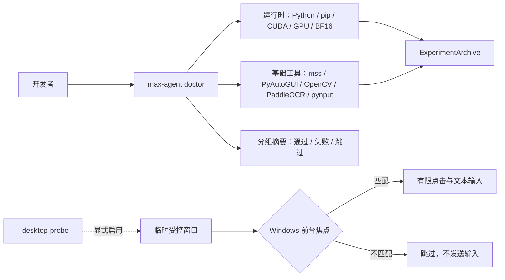
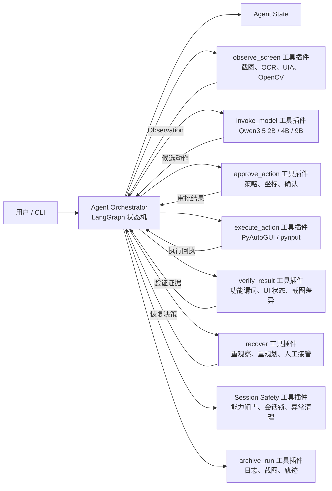
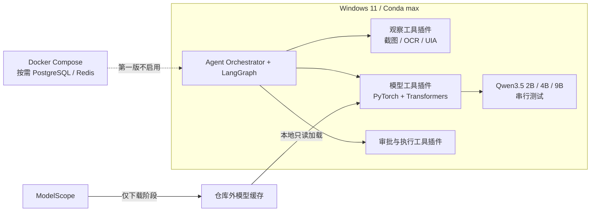
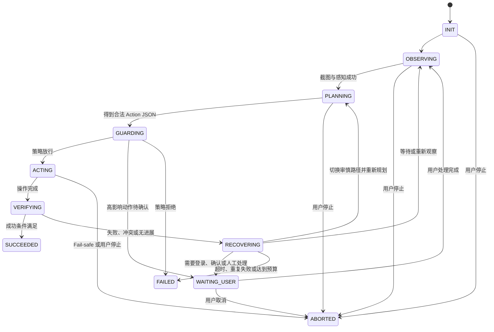

# 基于多模态大模型的桌面 GUI 智能体：系统技术设计报告

**版本：** v1.5.0  
**日期：** 2026-08-07  
**目标平台：** Windows 11、NVIDIA RTX 5070 Ti、32 GB DDR5-6400 内存  
**编排框架：** LangChain（LCEL + LangGraph 状态机）  
**模型部署：** Windows Conda Python 3.12 + PyTorch/Transformers 单进程本地推理

## 当前实现基线（2026-08-07）

本报告后续章节保留第 1～8 周的目标架构、接口契约和路线图，其中部分组件尚未实现。当前仓库已实现的代码边界如下；除非本节明确说明，不得将后文的设计当作已交付功能。

| 已实现模块 | 当前行为 | 明确边界 |
| --- | --- | --- |
| `max-agent doctor`、`--doctor`、`/doctor` | 统一环境核验入口，替代已移除的 `diagnose`/`/diagnose`；CLI 输出按“通过 / 失败 / 跳过”分组 | 不启动聊天模型，不执行通用桌面任务 |
| Doctor 运行时检查 | 检查 Python、`pip check`、CUDA、GPU 名称与 BF16 CUDA 张量运算 | 证据不记录模型型号、目录、远程修订或文件集合身份 |
| Doctor 基础工具检查 | 默认无输入地验证 mss 内存截图、PyAutoGUI 屏幕尺寸、OpenCV 合成图像处理、PaddleOCR 可用性与 pynput 导入 | 默认不发送鼠标或键盘事件；PaddleOCR 默认不执行会隐式下载资源的完整识别 |
| `doctor --desktop-probe` | 显式创建临时 Tk 测试窗口，并有限请求该窗口成为 Windows 前台窗口；只有句柄确认成功时，才执行受控点击和文本输入 | 前台焦点不可得时标记为跳过，明确未执行输入测试并在任何输入前停止；不操作真实业务窗口 |
| `ExperimentArchive` | 每次 Doctor 在 Git 忽略的 `artifacts/` 下写入 `config.yaml`、`environment.json`、`trajectory.jsonl`、`result.json` | 不归档真实截图、令牌、密钥或模型身份信息 |
| 聊天控制台 | Textual 与 Prompt Toolkit 前端将 `/doctor` 分发为本地检查，普通消息只返回未配置后端提示 | 不提供模型驱动聊天 |
| 本地辅助命令 | 保留下载、元数据校验和单图基准命令的现有实现 | 它们与 Doctor 证据隔离，Doctor 不依赖或识别模型 |

当前 `src/max_agent/` 仅包含归档、诊断、CLI、控制台分发、运行配置与本地辅助命令等基础模块。后文描述的 `Orchestrator`、`Perception`、`Planner`、`Safety Guard`、`Desktop Controller`、`Verifier`、`Recovery` 和 `Session Safety` 仍是待实现设计，不能据此推断仓库已经具备端到端 GUI Agent 能力。未来感知实现的唯一位置为 `src/max_agent/tools/perception/`；当前没有感知模块需要移动，也不为此创建空包。

### 当前 Doctor 工作流



运行 Doctor 的推荐命令为：

```powershell
conda activate max
max-agent doctor --artifact-root artifacts
```

在已授权且可交互的 Windows 会话中，才可额外执行：

```powershell
max-agent doctor --artifact-root artifacts --desktop-probe
```

## 后续设计与路线图说明

以下章节保留原始技术设计，用于约束后续实现。章节中使用“必须”“应当”等措辞时，除当前实现基线明确覆盖的内容外，均表示计划中的目标契约，而非当前命令已经提供的能力。

## 1. 目标、范围与约束

本系统实现一个可复现的桌面 GUI 智能体原型：接收自然语言任务，观察当前屏幕，生成并执行受约束的鼠标键盘操作，验证每一步结果，并输出完整审计记录。其核心闭环为：

```text
用户指令 → 屏幕感知 → 任务规划 → 动作校验与执行 → 屏幕复核 → 结果反馈
```

第一阶段覆盖项目计划第 1～4 周：环境与技术验证、感知/控制模块、数据和基础 Agent、端到端集成。命令行是唯一交互入口；不在本阶段开发桌面前端、浏览器扩展、长期记忆或模型微调，也不引入多 Agent 协作、在线自训练、向量数据库或 MCP 服务。只有当单进程 CLI 原型稳定且出现明确的外部复用需求后，才评估这些扩展。

系统仅在授权的本机测试账户、模拟应用或专用测试窗口中运行。涉及发送消息的测试只能面向测试对象；不得读取、上传或操作个人敏感数据，也不得对未经授权的软件执行不可逆操作。

## 2. 技术路线与关键取舍

### 2.1 方案选择

采用“Agent Orchestrator 为核心 + 能力工具/插件为边界”的分层方案。编排器拥有任务状态、轮次预算、工具选择、错误传播和终止决策；屏幕感知、模型调用、动作审批、桌面输入、结果验证、恢复与归档均以显式工具契约接入。这样不会让模型、控制器或任一框架反向主导工作流，并可独立替换、测试和限权每项能力。

LangGraph 仅用于实现编排器的显式状态图，LangChain 仅用于提示词与模型工具适配。任何高风险执行逻辑都不得藏在自由循环的 Agent Executor 内部；编排器必须经由工具注册表调用能力，并根据每次工具回执决定下一状态。

### 2.1.1 编排器与工具/插件契约

`Agent Orchestrator` 是唯一能够推进任务状态的核心组件。每个工具/插件声明名称、输入 schema、输出 schema、权限级别、超时和可恢复错误码；编排器只消费结构化回执，不直接调用操作系统、OCR 库或模型 SDK。首批工具包括 `observe_screen`、`recognize_text`、`invoke_model`、`approve_action`、`execute_action`、`verify_result`、`recover` 与 `archive_run`。Doctor 作为独立的环境诊断工具，不参与任务执行闭环。

工具注册表必须支持替换同一能力的实现，例如以 UI Automation、OCR 或视觉模型提供不同的观察工具；模型 Provider 也只是 `invoke_model` 工具的一个插件。插件不得持有全局任务循环、不得绕过审批工具、不得直接触发另一插件的高风险副作用。

本设计吸收以下已有方案中可在四周内验证的思想：

| 参考方案 | 吸收的设计 | 本项目中的简化实现 |
| --- | --- | --- |
| ScreenAgent | Planning–Acting–Reflecting 闭环、结构化动作、失败后重试或重规划 | 一个 LangGraph 状态机驱动六个节点，不拆成多个 Agent |
| UI-TARS | 多源感知、归一化坐标、统一动作空间、快慢推理、状态变化识别 | 截图 + OCR + 可选 UI Automation；模型只生成单个原子动作 |
| WebArena | 可复现环境、功能性结果验证、不可完成任务 | 使用本地测试窗口与任务检查器，不要求复现固定点击轨迹 |
| Computer Use 工程实践 | 能力闸门、会话锁、宿主隔离和异常清理 | CLI 显式开关、单任务锁、窗口白名单、输入状态释放 |

### 2.2 本地模型部署策略

以 RTX 5070 Ti 的 16 GB 显存为设计基线。第一版不使用 vLLM、不部署独立推理服务，LangChain/LangGraph、桌面感知控制与 PyTorch/Transformers 模型推理全部运行在 Windows Conda `max`（Python 3.12）中。单进程方案减少 WSL、HTTP 序列化和服务生命周期管理成本，适合单用户、单模型、单并发原型。

启动时必须记录 `nvidia-smi`、Python、PyTorch、CUDA 构建、GPU 名称、计算能力和可用显存，并执行一次 BF16 GPU 张量运算。加载模型后再执行一张受控图片的结构化动作推理。任一检查失败时进入 `MODEL_UNAVAILABLE`，不得自动执行桌面动作。

| 角色 | 首选 | 量化与运行方式 | 设计用途 |
| --- | --- | --- | --- |
| 快速冒烟 | Qwen3.5-2B | PyTorch/Transformers、单实例单并发 | 验证工具链、提示词和结构化动作契约 |
| 默认基线 | Qwen3.5-4B | PyTorch BF16、单实例单并发 | 作为主要桌面任务测试配置 |
| 质量对照 | Qwen3.5-9B | 仅在显存实测满足条件时加载 | 与 2B、4B 在同一夹具下比较质量、延迟与显存 |
| 云端/API 适配 | 任一兼容视觉 API | 仅作为 `invoke_model` 工具插件启用 | 后续隔离实验；不传输含敏感信息的截图 |
| 文字识别 | PaddleOCR | CPU 优先，必要时启用 GPU | 提供文字、置信度和屏幕坐标，减少视觉模型对小字号文字的压力 |

Qwen3.5 的 2B、4B、9B 测试必须串行进行，同一时刻只允许一个模型实例驻留。模型由 `invoke_model` 工具插件加载；下载、缓存和本地推理实现不得取得任务编排或桌面输入权限。推理阶段只读本地文件，不允许 Transformers 隐式访问其他模型仓库：

```python
from modelscope import snapshot_download
from transformers import AutoModelForMultimodalLM, AutoProcessor
import torch

processor = AutoProcessor.from_pretrained(model_dir, local_files_only=True)
model = AutoModelForMultimodalLM.from_pretrained(
    model_dir,
    torch_dtype=torch.bfloat16,
    device_map="auto",
    attn_implementation="sdpa",
    local_files_only=True,
).eval()
```

默认运行预算为：每轮一张预处理截图，长边不超过 1280 px；最多生成 256 token；每轮只生成一个动作；任务最多 12 轮；同一时刻只允许一个推理请求。第一版使用 eager inference、`torch.inference_mode()`、BF16 和 SDPA，不启用 `torch.compile`、FlashAttention 源码编译、AWQ 或多模型常驻。每步推理后保留模型但释放不再引用的输入/输出张量；不得每轮重新加载模型或无条件调用 `empty_cache()`。

LangChain 不使用 `ChatOpenAI`。`invoke_model` 工具插件将标准化观察转换为 Qwen3.5 chat template，调用 `generate()`，记录预处理、GPU 推理、解码耗时与显存峰值，再用 Pydantic 校验动作 JSON。模型权重、处理器和设备只在插件初始化时加载一次。

推理采用轻量的快慢路由，但不同时驻留两套模型。默认“快速路径”让当前模型基于明确目标直接生成一条原子动作；当目标存在多个候选、任务需要跨应用、连续两轮无进展或验证工具返回冲突证据时，编排器再次调用同一 `invoke_model` 工具并附加失败证据与里程碑信息。2B、4B、9B 是实验配置而不是运行时多模型路由。

### 2.3 部署依据与兼容性边界

- PyTorch 官方支持 Windows 与 Python 3.12；本机实测固定使用 `torch==2.13.0+cu130` 和 `torchvision==0.28.0+cu130`，必须从官方 CUDA 13.0 wheel 索引安装：[PyTorch Start Locally](https://pytorch.org/get-started/locally/)。默认 PyPI 曾解析到 CPU 构建，因此验收不能只检查版本号，必须检查 `torch.version.cuda` 和真实 CUDA 运算。
- Qwen3.5 的 2B、4B、9B 具体加载类和本地目录以所选发布版本的官方文档为准；`invoke_model` 插件不得用远端模型 ID 调用 `from_pretrained()`。
- 本机实测 RTX 5070 Ti 计算能力为 12.0，PyTorch CUDA 13.0 构建可执行 BF16 矩阵运算。该结果只证明 CUDA 基础链路，不等于完整 3B 模型已经完成显存和延迟验收。
- vLLM 保留为后续吞吐量或服务化需求出现后的候选，不属于第一版安装、启动或验收范围。

## 3. 总体架构



第一版运行边界如下：



模块边界如下：

| 模块 | 职责 | 依赖 | 不负责的事 |
| --- | --- | --- | --- |
| CLI | 接收任务、显示进度和最终结果 | Agent Orchestrator | 不直接访问鼠标键盘 |
| Agent Orchestrator | 唯一维护任务状态、预算与状态转换；选择并调用工具插件 | LangGraph、工具注册表 | 不实现 OCR、推理、坐标换算或输入细节 |
| 观察工具插件 | 截图、显示器/缩放信息、OCR、UI Automation、状态变化检测 | mss、OpenCV、PaddleOCR、pywinauto | 不执行动作、不推进任务状态 |
| `invoke_model` 工具插件 | 串行加载一个 Qwen3.5 测试配置，完成预处理、推理、解码与结构化输出 | torch、transformers | 不接触桌面控制器、不持有任务循环 |
| `approve_action` 工具插件 | 对动作、坐标、目标窗口、频率、轮数实施策略 | 配置、当前状态 | 不调用模型做安全放行 |
| `execute_action` 工具插件 | 受控点击、输入、滚动、拖拽、停止 | PyAutoGUI、pynput | 不判断任务是否成功、不跳过审批 |
| `verify_result` 工具插件 | 以屏幕变化、OCR 文字和规则验证动作结果 | 观察工具插件 | 不重试或自行执行 |
| `recover` 工具插件 | 根据失败证据给出等待、重观察、重规划或人工接管建议 | 验证证据、AgentState | 不绕过审批工具 |
| `archive_run` 工具插件 | 按任务保存 JSONL 轨迹、截图及环境元数据 | 文件系统、logging | 不保存密钥或原始敏感内容 |
| Infrastructure | 仅在确有跨进程查询、并发写或队列需求时提供有状态服务 | Docker Compose、命名卷 | 第一版不引入数据库；不在宿主机安装 PostgreSQL/Redis |

## 4. 核心数据契约

模型与数据层使用范围为 `[0.0, 1.0]` 的归一化坐标；执行层使用 Windows 虚拟桌面物理像素坐标。`ScreenMeta` 必须记录目标显示器在虚拟桌面中的矩形，因而允许 `left/top` 为负值；归一化坐标相对该显示器的捕获矩形计算。进程在首次截图或输入前设置 DPI awareness，`mss` 截图、UIA 边界框与 PyAutoGUI 输入统一以物理像素表示。模型可以输出元素 ID 或归一化坐标，但只有 Guard 能完成物理像素转换并生成 `ApprovedAction`。

```python
from typing import Literal, Optional
from pydantic import BaseModel, Field

class ScreenMeta(BaseModel):
    virtual_rect: tuple[int, int, int, int]  # left, top, right, bottom
    width_px: int
    height_px: int
    dpi_scale: float = Field(gt=0)
    monitor_id: int = 0
    captured_at_ms: int
    active_window_title: str
    active_window_rect: tuple[int, int, int, int]

class TargetPoint(BaseModel):
    normalized_x: float = Field(ge=0, le=1)
    normalized_y: float = Field(ge=0, le=1)
    physical_x: Optional[int] = None  # 仅 Guard 写入
    physical_y: Optional[int] = None

class UIElement(BaseModel):
    text: str
    confidence: float = Field(ge=0, le=1)
    bbox: tuple[int, int, int, int]  # left, top, right, bottom
    element_id: str
    source: Literal["uia", "ocr", "template", "model"]

class Observation(BaseModel):
    screenshot_ref: str
    screen: ScreenMeta
    elements: list[UIElement]
    changed_regions: list[tuple[int, int, int, int]] = []
    state_fingerprint: str

class DesktopAction(BaseModel):
    kind: Literal["click", "double_click", "type_text", "scroll", "drag", "wait", "finish", "call_user"]
    target_element_id: Optional[str] = None
    target_point: Optional[TargetPoint] = None
    text: Optional[str] = None
    drag_to: Optional[TargetPoint] = None
    delta: Optional[int] = None  # scroll：正数向上，负数向下，单位为滚轮 notch
    wait_ms: Optional[int] = None
    target_description: str
    expected_observation: str
    requires_confirmation: bool = False

class ApprovedAction(BaseModel):
    action: DesktopAction
    window_handle: int
    process_id: int
    physical_target: Optional[tuple[int, int]] = None
    physical_drag_to: Optional[tuple[int, int]] = None
    approval_hash: str
    approved_at_ms: int

class ExecutionReceipt(BaseModel):
    action_hash: str
    started_at_ms: int
    finished_at_ms: int
    before_screenshot_ref: str
    after_screenshot_ref: str
    cursor_before: tuple[int, int]
    cursor_after: tuple[int, int]
    outcome: Literal["executed", "aborted", "error"]
    error_code: Optional[str] = None

class StepRecord(BaseModel):
    before_observation: Observation
    candidate_action: DesktopAction
    guard_decision: Literal["approved", "denied", "confirmation_required"]
    execution_receipt: Optional[ExecutionReceipt] = None
    verification_evidence: list[str] = []

class AgentState(BaseModel):
    task_id: str
    user_goal: str
    step_index: int = 0
    max_steps: int = 12
    screen: Optional[ScreenMeta] = None
    elements: list[UIElement] = []
    candidate_action: Optional[DesktopAction] = None
    history: list[dict] = []
    no_progress_count: int = 0
    replan_count: int = 0
    reasoning_mode: Literal["fast", "deliberate"] = "fast"
    status: Literal["INIT", "OBSERVING", "PLANNING", "GUARDING", "ACTING", "VERIFYING", "RECOVERING", "WAITING_USER", "SUCCEEDED", "FAILED", "ABORTED"] = "INIT"
```

字段组合也必须校验：`click`/`double_click`/`type_text` 只能指定一个元素或一个坐标；`drag` 必须同时提供起点和终点；`scroll` 必须提供非零 `delta`；`wait` 只能提供 `wait_ms`（100–5,000 ms）；`type_text` 必须提供非空文本；`finish` 与 `call_user` 不得包含坐标或输入文本。`target_element_id` 解析后必须仍位于已授权窗口中，否则视为 `INVALID_ACTION`。

模型输出必须通过 Pydantic schema 与上述组合校验。解析失败时，Orchestrator 可请求模型以相同 schema 重答一次；第二次失败即终止任务并记录原始响应摘要，绝不以自然语言猜测鼠标动作。

### 4.1 窗口授权、确认与时序契约

授权窗口以 `HWND + PID + 已解析进程路径` 三元组标识；窗口标题仅作可读日志和二次匹配，不能单独作为放行依据。Guard 在生成 `ApprovedAction` 前及 Controller 实际输入前各验证一次三元组、窗口前台状态和元素/坐标有效性；两次校验任一不符即重新观察，不复用旧坐标。

高影响动作进入 `WAITING_USER`：Guard 对规范化动作、窗口三元组、目标坐标、文本摘要和当前 `state_fingerprint` 计算 `approval_hash`，CLI 展示摘要并等待本地显式确认。确认仅对同一 `approval_hash` 有效，有效期 60 秒；确认后重新截图并再次执行 Guard，画面或窗口变化即失效。拒绝或超时不执行输入，分别记录 `POLICY_DENIED` 或 `TIMEOUT`。

默认参数写入 `configs/default.yaml`：最小动作间隔 200 ms、`step_timeout_s=20`、`task_timeout_s=300`、`max_steps=12`、相邻两帧状态指纹相同且变化区域占比小于 1% 时记为无进展。连续两次无进展依次触发重新观察和一次审慎重规划；第三次转 `WAITING_USER`，无人处理则失败。所有阈值均随轨迹归档。

## 5. 执行工作流与状态机

每个任务按下列状态推进，任何异常均落到可审计的终态：



1. CLI 创建唯一 `task_id`，记录启动环境、模型配置和任务文本。
2. Perception 用 `mss` 捕获指定显示器并生成缩放后的模型图像，合并 PaddleOCR、可选 Windows UI Automation 和 OpenCV 结果；只有元素密集或定位歧义时才生成 Set-of-Mark 标注图。
3. Perception 根据窗口标题、关键 OCR/UIA 状态和截图感知哈希计算 `state_fingerprint`，并输出相对上一帧的变化区域。
4. Planner 使用“当前观察 + 精简历史 + 用户目标”生成**仅一个** `DesktopAction`。快速路径不展开长推理；存在歧义或恢复失败时才使用审慎路径。提示词要求优先引用元素 ID，其次使用归一化坐标，不允许编造不可见元素。
5. Guard 检查动作种类、目标窗口、元素是否仍存在、坐标转换、黑名单区域、最小动作间隔、最大步数和确认要求。
6. Controller 执行动作；每个动作前后写入时间戳、鼠标位置和截图引用。输入文本不写入明文日志，改记长度和 SHA-256 摘要。
7. Verifier 按“任务专用功能谓词 → 窗口/UIA 状态 → OCR 目标文字 → 局部截图变化 → VLM 兜底”的顺序验证，不要求执行固定的标准动作序列。
8. 若动作相同且连续两轮 `state_fingerprint` 基本不变，则进入 Recovery：第一次重新观察，第二次切换审慎路径重规划，第三次请求用户或失败退出。恢复动作仍须重新通过 Guard。
9. 成功、失败或中止均生成 `result.json`，包括结果、验证证据、耗时、步数、失败码、截图索引和可复现实验配置。

## 6. 安全与故障控制

### 6.1 默认策略

- 可执行动作白名单仅包含 `click`、`double_click`、`type_text`、`scroll`、`drag`、`wait`、`finish`；`call_user` 只允许进入人工处理状态，绝不调用桌面控制器。不提供命令行、文件删除、注册表、进程管理或网络请求工具。
- 默认只允许配置的测试应用进程/窗口标题；焦点窗口变化后重新观察并重新规划。
- 坐标必须落在目标显示器边界且不得位于配置的禁用区域；点击前移动鼠标并保留 200 ms 以上间隔。
- PyAutoGUI `FAILSAFE=True`；鼠标移至屏幕角落或 Ctrl+Alt+Esc 触发 `ABORTED`。中止后立即释放按键和鼠标按键，不再重试。
- “发送”“提交”“支付”“删除”“关闭未保存内容”等高影响动作标记 `requires_confirmation=True`，CLI 显示动作摘要并等待明确的本地确认；没有确认即拒绝执行。
- 截图、OCR 文本与日志仅保存在本地任务目录；日志字段进行脱敏，禁止写入 API Key、Cookie、剪贴板内容或完整密码文本。
- 真实桌面控制必须同时满足配置总开关和 CLI `--enable-desktop-control` 参数；默认模式只观察并输出候选动作。
- `DesktopSessionLock` 保证同一时刻只有一个任务控制真实桌面，并排除当前 CLI/终端窗口，防止 Agent 点击自己的宿主界面。
- `InputStateCleanup` 在成功、失败、热键中止、异常和进程退出路径中统一释放鼠标按键与 Ctrl/Alt/Shift 等修饰键；清理失败写入独立高优先级日志。

### 6.2 失败分类

| 失败码 | 触发条件 | 系统行为 |
| --- | --- | --- |
| `MODEL_UNAVAILABLE` | 模型加载、CUDA 或调用失败 | 不执行动作，结束任务 |
| `INVALID_ACTION` | schema、坐标或必填字段不合法 | 一次格式重试，仍失败则结束 |
| `POLICY_DENIED` | 白名单、窗口、风险策略不允许 | 结束任务并提示人工处理 |
| `ACTION_ERROR` | 自动化库抛错、焦点丢失 | 截图、释放输入状态、结束 |
| `VERIFY_FAILED` | 成功条件不满足或无界面进展 | 在步数预算内回到观察，否则结束 |
| `NO_PROGRESS` | 连续两轮状态指纹基本不变或重复同一失败动作 | 进入分级恢复，最多一次重新规划 |
| `SESSION_BUSY` | 已有桌面控制会话持有锁 | 不启动第二个任务，不抢占现有会话 |
| `TIMEOUT` | 单步或任务超时 | 中止当前输入状态并结束 |

## 7. 模型与提示词设计

LangChain 的 `ChatPromptTemplate` 由系统规则、任务目标、标准化观察和最近三步摘要组成。提示词禁止模型输出 Markdown、解释性文本或多动作列表，输出必须匹配 `DesktopAction` JSON schema。图片输入为当前截图；OCR 结果按置信度排序后截取，避免上下文膨胀。

规划策略遵循以下优先级：

1. 若成功条件已满足，输出 `finish`；
2. 若 OCR/模板匹配可唯一定位目标，使用其边界框中心；
3. 若目标不确定，输出 `wait` 或说明不可安全执行，不允许猜测点击；
4. 同一失败动作不重复超过一次；
5. 每轮只产生一项原子动作。

模型工具插件的配置需暴露：`model_id`、不可变 `revision`、`model_cache_dir`、`torch_dtype`、`device`、`attn_implementation`、`max_new_tokens`、`temperature`、`image_max_side`、`max_steps` 和 `step_timeout_s`。默认测试基线为 `model_id=Qwen/Qwen3.5-4B`、`torch_dtype=bfloat16`、`device=cuda:0`、`attn_implementation=sdpa`、`temperature=0.1`、`max_new_tokens=256`、`image_max_side=1280`、`max_steps=12`；Qwen3.5-2B 与 Qwen3.5-9B 使用相同夹具进行串行对照。模型实验归档与 Doctor 环境证据严格隔离。

快慢推理共享同一 `invoke_model` 工具插件：快速路径只使用当前观察、目标和最近三步摘要；审慎路径额外加入失败证据、已完成里程碑和禁止重复的动作。审慎路径最多触发一次。任务需要登录、验证码、身份确认或超出授权边界时，模型必须输出 `call_user`，由编排器转入人工处理状态。

第 1–4 周仅启用本地 Qwen3.5 `invoke_model` 工具插件。API Provider 保留为第 5 周后的隔离实验插件，默认关闭；启用前需单独配置出站许可、截图脱敏规则和审计策略。本项目的默认评测与真实桌面控制不向外传输截图、OCR 文本或轨迹。

## 8. 项目目录与接口组织

建议代码按职责组织，避免 Agent 编排与设备操作互相耦合：

```text
src/gui_agent/
  cli.py                    # 命令行入口
  orchestration/graph.py    # LangGraph 状态图与节点装配
  schemas.py                # Pydantic 数据契约
  perception/screen.py      # mss 截图与 DPI 元数据
  perception/ocr.py         # PaddleOCR 适配
  perception/uia.py         # Windows UI Automation 可选适配
  perception/vision.py      # OpenCV 预处理与模板匹配
  perception/som.py         # 按需生成 Set-of-Mark 标注图
  planning/prompts.py       # LangChain 提示词
  planning/planner.py       # 结构化动作生成
  tools/base.py             # 工具/插件抽象接口
  tools/registry.py         # 工具注册表；编排器的唯一能力调用入口
  tools/perception/screen.py # mss 截图与 DPI 元数据
  tools/perception/ocr.py   # PaddleOCR 适配
  tools/perception/uia.py   # Windows UI Automation 可选适配
  tools/perception/vision.py # OpenCV 预处理与模板匹配
  tools/perception/som.py   # 按需生成 Set-of-Mark 标注图
  tools/model/invoke_qwen.py # PyTorch/Transformers Qwen3.5 模型工具插件
  tools/safety/approve_action.py # 动作审批工具
  tools/desktop/execute_action.py # PyAutoGUI/pynput 执行工具
  tools/verification/verify_result.py # 结果验证工具
  tools/recovery/recover.py # 恢复工具
  tools/archive/archive_run.py # 归档工具
  models/download.py        # ModelScope 快照下载与完整性记录
  control/guard.py          # 安全策略与校验
  control/desktop.py        # PyAutoGUI/pynput 执行器
  control/session.py        # 能力开关、会话锁与输入状态清理
  verification/verifier.py  # 结果判定
  verification/predicates.py# 任务专用功能性检查器
  recovery/policy.py        # 无进展检测与有限恢复策略
  storage/artifacts.py      # 日志、截图和结果归档
  data/manifest.py          # 数据集版本、许可证与数据划分清单
  training/dataset.py       # 第 5 周训练样本构建，仅消费脱敏公开数据
  training/lora.py          # PEFT LoRA 训练与检查点归档
  evaluation/benchmark.py   # 20 任务分层评测与统计
configs/default.yaml         # 可调整运行策略，禁止存放密钥
requirements/base.txt        # 主程序锁定依赖
requirements/torch-cu130.txt # PyTorch CUDA 13.0 精确版本与索引说明
deploy/compose.yaml           # 有明确需求后才加入数据库/Redis 服务
tests/                       # 单元、集成和受控端到端测试
artifacts/<task_id>/         # 运行期产物；加入 .gitignore
```

工具/插件的稳定接口为 `invoke(input: ToolInput, context: AgentState) -> ToolReceipt`；其中 `invoke_model` 的输入包括观察、目标和历史，输出候选 `DesktopAction`。Qwen3.5 工具插件只负责加载 2B、4B 或 9B 的一个本地测试配置、构造多模态输入、调用 `generate()`、记录耗时/显存并解析响应；它不得下载模型、读取实时屏幕、推进任务状态或执行动作。`execute_action` 工具的稳定接口为 `execute(action: ApprovedAction) -> ExecutionReceipt`。所有领域工具只能经由 Agent Orchestrator 交互。

## 9. 数据处理与评测设计

第三周的数据适配层将 ScreenAgent、Mind2Web、WebArena 等公开样例映射为统一字段：`instruction`、`screenshot_ref`、`action_type`、`action_args`、`precondition`、`expected_result`、`source`、`license`。原始数据不混入人工测试轨迹；处理脚本可重复运行，并输出数据版本、输入哈希、丢弃记录和许可证信息。

本项目采用结果导向的评测方式：同一任务允许多条正确路径，验收以最终窗口、文件、页面或测试应用状态为准，而不是把预测动作与一条固定轨迹逐项比较。测试集中至少包含一个不可完成任务，要求系统返回明确原因并停止，不能编造完成结果。

每一步轨迹统一记录 `before_observation`、候选动作、Guard 决策、`execution_receipt`、`after_observation`、验证证据和可选人工纠正。成功轨迹、失败轨迹与人工纠正轨迹分开标记；前四周只完成可审计采集，不启动 LoRA、DPO 或在线自训练。

端到端验收设置五个受控任务：打开测试浏览器、搜索指定内容、打开指定测试文件、向测试联系人发送预设消息、关闭测试应用。每个任务夹具必须版本化定义初始窗口、允许进程/路径、显示器与 DPI、测试数据、成功谓词和 `reset()` 步骤；消息任务只能使用预置测试联系人，且发送前必须触发本地确认。每项任务至少执行 5 次，记录：

- 任务成功率、平均/中位耗时、平均步数；
- 感知、推理、控制和验证各阶段耗时；
- `INVALID_ACTION`、`POLICY_DENIED`、`VERIFY_FAILED` 等失败码分布；
- 分辨率/DPI、模型版本、量化模式和配置哈希。

基础验收目标是每项任务都有可复现轨迹和失败样例；不以隐藏失败或一次性演示代替评测。性能结论以实测为准：报告中必须分别列出 Qwen3.5-2B、Qwen3.5-4B、Qwen3.5-9B 的首次加载时间、稳态单步延迟、峰值显存和成功率，不能用主观描述替代数据。

第 5 周开始的训练数据只使用许可证允许教学/研究用途的公开样本，按任务来源和模板去重后固定 train/validation/test 划分；测试集严禁进入训练或提示词示例。LoRA 实验至少比较“基线模型 + 固定提示词”“基线模型 + 优化提示词”“LoRA 模型 + 固定提示词”三组，统一模型快照、图像尺寸、随机种子和任务夹具。每个适配器归档基座快照摘要、数据清单哈希、训练参数、检查点哈希与验证结果；不得使用真实桌面截图或个人数据训练。

第 7 周的正式评测扩展为 20 个任务，按 5 个基础任务类别、2 个难度层级和至少 2 种受控分辨率/DPI 条件分层，并保留不可完成任务。每个“模型版本 × 任务 × 环境”组合重复 5 次，报告成功率及 Wilson 95% 置信区间、平均/中位耗时、平均步数、失败码分布和安全拒绝正确率；Ui-TARS、Claude Computer Use 仅依据公开可比结果作定性差距分析，不把无法同环境复现的数字并入同一排行榜。

## 10. 测试策略

| 层级 | 核心验证 | 例子 |
| --- | --- | --- |
| 单元测试 | 坐标、schema、策略、OCR/UIA 结果转换 | 归一化坐标正确转换；越界点击被拒绝 |
| 合约测试 | 模块接口与模型结构化输出 | 非法 JSON 不进入控制器；Provider 可替换为 mock |
| 模型测试 | PyTorch CUDA、ModelScope 快照、本地单图推理 | BF16 GPU 运算成功；仅从本地快照生成有效动作 JSON |
| 集成测试 | 截图→OCR、Guard→Controller、Verifier | 在受控窗口点击指定按钮后识别“完成”文字 |
| 端到端测试 | 完整状态机、功能性验证、恢复和中止 | 重复动作触发恢复；热键中止后没有遗留按键状态 |
| 安全测试 | 能力闸门、会话锁、窗口隔离和清理 | 默认不能控制桌面；并发任务不能获得第二把锁 |
| 性能测试 | GPU/内存/延迟与稳定性 | 连续执行 10 个受控任务，无显存单调增长 |

测试默认使用 mock Provider 和模拟/专用窗口；真实鼠标键盘集成测试须显式加 `--enable-desktop-control` 标志，CI 不执行真实桌面控制。

## 11. 八周实施映射

| 周次 | 主要实现 | 可验收产物 |
| --- | --- | --- |
| 第 1 周 | Python 3.12 与 GPU 验证、Qwen3.5 模型工具链测试、依赖锁定、工具/插件接口草案 | 调研报告、环境文档、模型测试记录、架构图 |
| 第 2 周 | 截图、OCR、可选 UIA、坐标转换、控制器、Guard、会话锁与单测 | 感知控制模块、测试报告、受控窗口演示 |
| 第 3 周 | 数据适配、`ModelProvider`、快慢提示词、LangGraph 基础图、轨迹 schema | 预处理脚本、基础 Agent、结构化计划样例 |
| 第 4 周 | 状态机集成、功能性 Verifier、有限恢复、CLI、日志与五任务测试 | v1.0 原型、运行说明、执行轨迹和基础任务测试报告 |
| 第 5 周 | 固定公开数据许可与划分、构造训练/验证集、PEFT LoRA、提示词对照实验 | 适配器权重、可复现训练配置、微调效果对比报告 |
| 第 6 周 | 复杂任务分解、错误检测与有限重试、感知优化、实时任务状态与日志 | v2.0 系统、鲁棒性测试报告 |
| 第 7 周 | 设计并执行 20 任务分层评测，分析应用与分辨率差异 | 系统全面评估报告、性能分析图表 |
| 第 8 周 | 整理代码、复现实验、技术报告与演示 | 完整仓库、技术报告、系统演示视频 |

## 12. 风险与缓解

| 风险 | 影响 | 缓解措施 |
| --- | --- | --- |
| PyTorch 默认索引安装到 CPU 构建 | GPU 不可用但安装表面成功 | 固定官方 CUDA 13.0 索引；启动时同时验证 `torch.version.cuda` 与真实 BF16 CUDA 运算 |
| Blackwell 与 PyTorch/算子组合异常 | 模型启动或推理失败 | 固定已实测的 `torch==2.13.0+cu130`；第一版使用 BF16 + SDPA eager，不源码编译 FlashAttention |
| Qwen3.5-9B 显存或延迟超预算 | 交互不可用、OOM | 先用 2B、4B 完成工具链测试；降低图像边长和输出长度、缩短历史、单并发；以实测峰值决定是否量化 |
| ModelScope 快照漂移或下载中断 | 结果不可复现、文件不完整 | 固定 revision/文件摘要；下载与推理解耦；Provider 仅允许本地路径和 `local_files_only=True` |
| 模型缓存写入 Git 或系统盘 | 仓库膨胀、磁盘压力 | 固定仓库外 `F:\AI\models\modelscope`；启动时拒绝位于仓库内的模型目录 |
| Windows DPI、多显示器坐标偏移 | 误点击 | 物理像素统一、每轮记录 DPI/显示器、受控分辨率测试、Guard 边界检查 |
| OCR 小字或主题变化误识别 | 规划错误 | 置信度阈值、图像预处理、模型视觉复核、低置信度拒绝猜测 |
| 模型幻觉或输出不规范 | 危险/无效动作 | Pydantic schema、原子动作、白名单、窗口限制、一次重试上限 |
| Agent 忽略历史状态并重复动作 | 无效循环、误操作 | 状态指纹、重复动作检测、一次审慎重规划和明确停止预算 |
| UI Automation 对非标准控件不可用 | 感知信息缺失 | UIA 仅作为增强信号，截图 + OCR + VLM 始终保留 |
| PyTorch 与 PaddleOCR 的 Windows DLL 加载顺序 | 先加载 PaddleOCR 时可能导致后续 Torch DLL 加载失败 | 应用启动先导入/初始化 PyTorch 与 ModelScope，再初始化 PaddleOCR；若运行期仍冲突才拆为独立 OCR 子进程 |
| 宿主机安装数据库/Redis 污染环境 | 端口、服务和数据目录难清理 | 第一版不用数据库；未来只能用 Docker Compose、命名卷、健康检查和回环端口 |
| 异常退出遗留输入状态 | 键盘或鼠标持续按下 | 单会话锁、统一 finally 清理、进程退出钩子和急停测试 |
| 外部副作用或隐私泄露 | 合规风险 | 测试账号、敏感动作确认、本地脱敏日志、禁止上传截图作为默认策略 |
| LoRA 数据泄漏或许可不兼容 | 合规风险、评测失真 | 数据清单记录来源/许可证/哈希；训练前做许可审查、去重和测试集隔离 |
| 微调收益不可复现 | 无法判断投入价值 | 固定基座快照、随机种子、训练配置、数据划分和对照组；只比较相同夹具下的结果 |
| 20 任务评测样本不足 | 结论偶然或偏置 | 按任务类别、难度、DPI 分层，每个组合重复 5 次并报告置信区间 |

## 13. 运行与交付要求

Windows 主环境固定为 Conda `max`（Python 3.12.13）。第一版已锁定的核心版本为 `torch==2.13.0+cu130`、`torchvision==0.28.0+cu130`、`transformers==5.14.1`、`modelscope==1.39.1`、`langchain==1.3.14` 和 `langgraph==1.2.10`。PyTorch/TorchVision 必须从 `https://download.pytorch.org/whl/cu130` 安装，其他包从常规 PyPI 安装；最终交付需生成带哈希的锁定文件。

PaddlePaddle 3.3.1 与 PaddleOCR 3.7.0 已能在 Python 3.12 中安装。实测必须先初始化 PyTorch/ModelScope，再初始化 PaddleOCR；逆序曾触发 Torch DLL 加载失败。第一版先用明确的启动顺序控制复杂度，只有该问题在实际 OCR 推理中复现时才拆分 OCR 子进程。

模型、Paddle、ModelScope、COM 生成代码和运行产物必须使用显式缓存路径且不进入 Git。建议模型根目录为 `F:\AI\models\modelscope`，运行产物留在仓库的 ignored `artifacts/`；不得让 `comtypes` 在仓库根目录生成 `Python/` 缓存。

PostgreSQL、Redis、消息队列等会注册服务、占用端口或持久化数据的基础设施不得直接安装到 Windows。只有业务需求明确后才加入 `compose.yaml`，镜像固定版本/摘要，端口默认只绑定 `127.0.0.1`，数据写入命名卷并提供健康检查。第一版 JSONL Artifact Store 已满足单用户审计需求，因此不启动数据库容器。当前机器已安装并启动用户级 Docker Desktop；其 CLI 位于 `C:\Users\admin\AppData\Local\Programs\DockerDesktop\resources\bin\docker.exe`。自动化检查若运行在受限沙箱中，必须区分“无权执行用户目录中的 CLI”与“Docker 未安装”。

环境文档必须提供 Python、GPU、PyTorch CUDA/BF16、ModelScope 小文件下载、本地单图推理、截图、OCR/UIA 和受控点击的验证命令。模型权重、缓存、截图和运行产物不提交 Git；配置中不包含真实密钥。

每次实验至少归档 `config.yaml` 副本、`environment.json`、`trajectory.jsonl`、关键截图、`result.json`。最终 README 要能让新环境按步骤安装、选择本地 3B 模型、启动安全模式，并复现至少一个无副作用任务。

第 5–8 周的额外交付也必须可复现：训练阶段归档 `dataset_manifest.json`、数据划分哈希、训练配置、随机种子、基座与 LoRA 检查点哈希；评测阶段归档任务夹具版本、逐次结果、聚合统计与生成图表脚本。第 8 周交付的仓库不得包含模型权重、个人数据、真实截图、令牌或未获许可的数据；技术报告须区分已实测结果、对照实验结论与后续假设。

### 13.1 开发开始前的机器准备

1. 使用 `conda activate max`，确认 Python 为 3.12.x，解释器位于 `F:\Software\Miniconda3\envs\max`。
2. 用 `nvidia-smi` 确认 RTX 5070 Ti 和可用显存；运行 PyTorch CUDA/BF16 张量自检，不能只依据驱动显示的 CUDA 版本判断。
3. 在 `F:\AI\models\modelscope` 至少预留 20 GB，并确保该目录不位于 Git 仓库中；用 ModelScope 先下载 `config.json` 验证网络，再下载完整模型。
4. 依次加载 Qwen3.5-2B、Qwen3.5-4B、Qwen3.5-9B 的单个测试配置，记录首次加载时间、空闲/峰值显存和单图推理延迟；若 OOM，先降低图像尺寸和上下文，不能直接切换多种量化库。
5. 关闭游戏、视频增强、其他 CUDA 程序和不必要的 GPU Overlay，为 Windows 桌面保留显存。
6. 固定首轮测试的显示器、分辨率和 Windows 缩放比例，并准备专用测试目录、测试浏览器配置和测试联系人，不使用真实个人数据。
7. 在交互式本机 PowerShell 中验证 `mss` 截图、UIA 窗口枚举、PaddleOCR 最小识别和急停热键；Codex 的非交互桌面会话不能替代该项。
8. Docker Desktop 已安装；仅当项目确需数据库/Redis 时创建 Compose 配置，并在首次使用前验证 `docker version`、`docker compose version`、镜像拉取和一个带健康检查的临时容器。
9. 准备五个验收任务对应的初始状态和结果谓词；每次测试前能够恢复到相同初始状态。

### 13.2 2026-08-06 基础环境核验结果

| 检查项 | 当前结果 | 是否可用 / 后续动作 |
| --- | --- | --- |
| Windows Conda | Conda 26.5.3，环境路径 `F:\Software\Miniconda3\envs\max` | 可用 |
| Windows Python | `max` 中为 Python 3.12.13，pip 26.1.2；SSL、SQLite 自检正常 | 可用 |
| Git | 2.55.0.windows.3 | 可用 |
| Windows GPU | RTX 5070 Ti，16,303 MiB，驱动 610.88 | 可用 |
| PyTorch GPU | `torch 2.13.0+cu130`、CUDA 13.0、计算能力 12.0；BF16 矩阵运算成功 | 可用 |
| Qwen3.5/Transformers | Qwen3.5-2B、Qwen3.5-4B、Qwen3.5-9B 将通过统一 `invoke_model` 工具插件测试 | 具体加载类与完整模型测试待按所选发布版本执行 |
| 模型下载工具 | 本地模型下载与离线加载命令已存在 | 2B、4B、9B 的完整权重测试待依次执行 |
| LangChain/LangGraph | 1.3.14 / 1.2.10，导入成功 | 可用；自定义 Provider 尚待编码 |
| 视觉与桌面依赖 | OpenCV 4.10.0、mss、PyAutoGUI、pynput、pywinauto 均导入成功；屏幕尺寸读取为 1920×1080 | 依赖可用；非交互会话 BitBlt 截图失败，需本机交互式终端复验 |
| PaddleOCR | PaddlePaddle 3.3.1、PaddleOCR 3.7.0；Paddle CPU 张量与正确导入顺序通过 | 基础运行可用；OCR 模型下载和最小识别待验证 |
| Python 依赖一致性 | `pip check` 返回 `No broken requirements found` | 可用 |
| Docker | Docker 29.6.2、Compose v5.3.1、Docker Desktop 4.85.0；Linux Engine 29.6.2 可连接 | 可用；尚未拉取测试镜像或验证项目级 Compose 健康检查 |

当前结论是：Python 3.12、PyTorch CUDA、ModelScope 小文件下载、核心 Python 依赖、基础 OCR 运行时和 Docker Engine 已验证。正式模型编码前仍应完成三项机器侧验收：下载完整 Qwen 3B 权重并执行单图结构化推理；在交互式 PowerShell 中验证真实截图/UIA/急停；运行一次 PaddleOCR 最小文字识别。项目首次引入数据库、Redis 或队列时，再补充镜像拉取与 Compose 健康检查。

## 14. 设计结论

本设计以轻量 LangChain/LangGraph 编排、Windows Python 3.12、PyTorch/Transformers、ModelScope 模型快照和确定性安全控制层为主线，匹配 RTX 5070 Ti 与 32 GB 内存。第 1–4 周采用单进程、单模型、单并发，不引入 vLLM 或数据库，优先交付一个可验证、可中止、可复现的 Windows GUI 执行闭环。第 5–8 周以该稳定接口为基础，依次引入受许可数据上的 LoRA 对照实验、有限鲁棒性优化、20 任务分层评测和可复现作品集；训练和评测均不越过 Guard/Controller 边界。更大模型、vLLM、长期记忆和跨平台兼容性只有在主线指标显示明确收益后才进入后续迭代。
